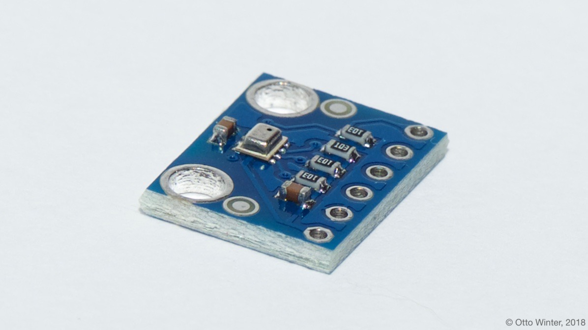

BMP280 Temperature+Pressure Sensor
==================================

.. seo::
    :description: Instructions for setting up BMP280 temperature and pressure sensors with ESPHome
    :image: bmp280.jpg
    :keywords: BMP280

The ``bmp280`` sensor platform allows you to use your BMP280
(`datasheet <https://cdn-shop.adafruit.com/datasheets/BST-BMP280-DS001-11.pdf>`__,
`Adafruit`_) temperature and pressure sensors with ESPHome. The :ref:`I²C <i2c>` is
required to be set up in your configuration for this sensor to work.

    BMP280 Temperature and Pressure Sensor.

.. _Adafruit: https://www.adafruit.com/product/2651

.. code-block:: yaml

    # Example configuration entry
    sensor:
      - platform: bmp280
        temperature:
          name: "Outside Temperature"
          oversampling: 16x
        pressure:
          name: "Outside Pressure"
        address: 0x77
        update_interval: 60s

Configuration variables:
------------------------

- **temperature** (*Optional*): The information for the temperature.
  sensor

  - **name** (**Required**, string): The name for the temperature
    sensor.
  - **oversampling** (*Optional*): The oversampling parameter for the temperature sensor.
    See :ref:`Oversampling Options <bmp280-oversampling>`.
  - **id** (*Optional*, :ref:`config-id`): Set the ID of this sensor for use in lambdas.
  - All other options from :ref:`Sensor <config-sensor>`.

- **pressure** (*Optional*): The information for the pressure sensor.

  - **name** (**Required**, string): The name for the pressure sensor.
  - **oversampling** (*Optional*): The oversampling parameter for the temperature sensor.
    See :ref:`Oversampling Options <bmp280-oversampling>`.
  - **id** (*Optional*, :ref:`config-id`): Set the ID of this sensor for use in lambdas.
  - All other options from :ref:`Sensor <config-sensor>`.

- **address** (*Optional*, int): Manually specify the I²C address of
  the sensor. Defaults to ``0x77``. Another address can be ``0x76``.
- **iir_filter** (*Optional*): Set up an Infinite Impulse Response filter to increase accuracy. One of
  ``OFF``, ``2x``, ``4x``, ``16x``. Defaults to ``OFF``.
- **update_interval** (*Optional*, :ref:`config-time`): The interval to check the
  sensor. Defaults to ``60s``.

    Pins on the BMP280. Only VCC, GND, SCL, and SDA need to be connected.

.. _bmp280-oversampling:

Oversampling Options
--------------------

By default, the BMP280 sensor measures each value 16 times when requesting a new value. You can, however,
configure this amount. Possible oversampling values:

-  ``NONE`` (value is skipped)
-  ``1x``
-  ``2x``
-  ``4x``
-  ``8x``
-  ``16x`` (default)

See Also
--------

- :ref:`sensor-filters`
- :doc:`bme280`
- :doc:`bme680`
- :doc:`bmp085`
- :apiref:`bmp280/bmp280.h`
- `BMP280 Library <https://github.com/adafruit/Adafruit_BMP280_Library>`__ by `Adafruit <https://www.adafruit.com/>`__
- :ghedit:`Edit`
