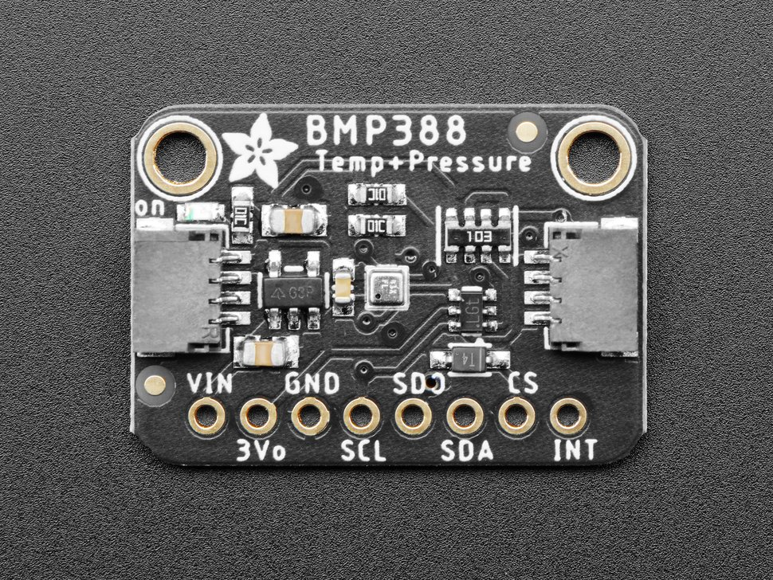

BMP388 / BMP390 Temperature+Pressure Sensor
===========================================

.. seo::
    :description: Instructions for setting up BMP388 or BMP390 temperature and pressure sensors with ESPHome
    :image: bmp388.jpg
    :keywords: BMP388 BMP390

The ``bmp3xx`` sensor platform allows you to use your BMP388 or BMP390 
(`datasheet <https://www.bosch-sensortec.com/media/boschsensortec/downloads/datasheets/bst-bmp390-ds002.pdf>`__, `BMP390 product page <https://www.bosch-sensortec.com/products/environmental-sensors/pressure-sensors/bmp390/>`__) temperature and pressure sensors with ESPHome. 
Either :ref:`I²C <i2c>` bus or :ref:`SPI <spi>` bus is required to be set up in your configuration for this sensor to work.

    BMP388/BMP390 Temperature and Pressure Sensor.

Over I²C
--------
The ``bmp3xx_i2c`` component allows you to use the device over :ref:`I²C <i2c>` interface.

.. code-block:: yaml

    # Example configuration entry for I2C connection
    sensor:
      - platform: bmp3xx_i2c
        temperature:
          name: "Outside Temperature"
          oversampling: 16x
        pressure:
          name: "Outside Pressure"
        address: 0x77
        update_interval: 60s

Configuration variables:
************************

- **address** (*Optional*, int): Manually specify the I²C address of  the sensor. Defaults to ``0x77``. 
  Another address can be ``0x76``.
- **temperature** (*Optional*): The information for the temperature sensor.

  - **oversampling** (*Optional*): The oversampling parameter for the temperature sensor.
    See :ref:`Oversampling Options <bmp3xx-oversampling>`.
  - All other options from :ref:`Sensor <config-sensor>`.

- **pressure** (*Optional*): The information for the pressure sensor.

  - **oversampling** (*Optional*): The oversampling parameter for the temperature sensor.
    See :ref:`Oversampling Options <bmp3xx-oversampling>`.
  - All other options from :ref:`Sensor <config-sensor>`.

- **iir_filter** (*Optional*): Set up an Infinite Impulse Response filter to increase accuracy. One of
  ``OFF``, ``2x``, ``4x``, ``16x``, ``32``, ``64x``, ``128x``. Defaults to ``OFF``.
- **update_interval** (*Optional*, :ref:`config-time`): The interval to check the
  sensor. Defaults to ``60s``.

Over SPI
--------
The ``bmp3xx_spi`` component allows you to use the device over :ref:`SPI <spi>` interface.

.. code-block:: yaml

    # Example configuration entry for SPI connection
    sensor:
      - platform: bmp3xx_spi
        temperature:
          name: "Outside Temperature"
          oversampling: 16x
        pressure:
          name: "Outside Pressure"
        cs_pin: 13
        update_interval: 60s

Configuration variables:
************************

- **cs_pin** (**Required**, :ref:`Pin Schema <config-pin_schema>`): The Chip Select (CS) pin.
- **temperature** (*Optional*): The information for the temperature sensor.

  - **oversampling** (*Optional*): The oversampling parameter for the temperature sensor.
    See :ref:`Oversampling Options <bmp3xx-oversampling>`.
  - All other options from :ref:`Sensor <config-sensor>`.

- **pressure** (*Optional*): The information for the pressure sensor.

  - **oversampling** (*Optional*): The oversampling parameter for the temperature sensor.
    See :ref:`Oversampling Options <bmp3xx-oversampling>`.
  - All other options from :ref:`Sensor <config-sensor>`.

- **iir_filter** (*Optional*): Set up an Infinite Impulse Response filter to increase accuracy. One of
  ``OFF``, ``2x``, ``4x``, ``16x``, ``32``, ``64x``, ``128x``. Defaults to ``OFF``.
- **address** (*Optional*, int): *I2C* only. Manually specify the I²C address of
  the sensor. Defaults to ``0x77``. Another address can be ``0x76``.
- **update_interval** (*Optional*, :ref:`config-time`): The interval to check the
  sensor. Defaults to ``60s``.

.. _bmp3xx-oversampling:

Oversampling Options
--------------------

By default, the BMP3xx sensor measures pressure 16 times and temperature 2 times when requesting a new value. You can, however,
configure this amount. Possible oversampling values:

-  ``NONE`` (value is skipped)
-  ``2x``
-  ``4x``
-  ``8x``
-  ``16x`` (default)
-  ``32x``

See Also
--------

- :ref:`sensor-filters`
- :doc:`bme280`
- :doc:`bmp280`
- :doc:`bme680`
- :doc:`bmp085`
- :apiref:`bmp3xx_base/bmp3xx_base.h`
- `BMP3 sensor API <https://github.com/BoschSensortec/BMP3-Sensor-API>`__
- `BMP388/BMP390 Library <https://github.com/MartinL1/BMP388_DEV>`__ by  Martin Lindupp
- :ghedit:`Edit`
