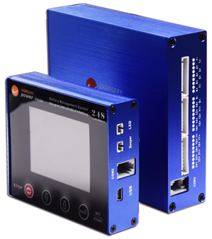
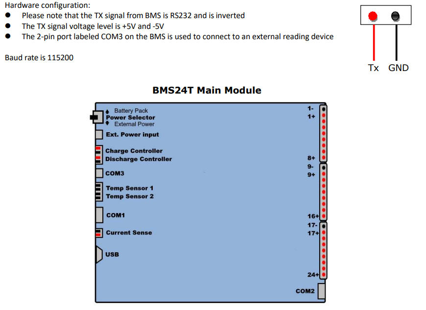

Chargery BMS Sensor
===================

.. seo::
    :description: Instructions for setting up a Chargery BMS8T, BMS16T and BMS24T
    :image: chargery_BMS24DT.jpg

The ``chargery_bms`` sensor platform allows you to use a Chargery BMS8T, BMS16T and BMS24T
(`more info <http://www.chargery.com/BMS16Pro.asp>`__)
with ESPHome.

The BMS communicates via :ref:`UART <uart>`.

.. code-block:: yaml

    # Example configuration entry (ESP8266)
    uart:
      tx_pin: GPIO1
      rx_pin: GPIO3
      baud_rate: 115200

    chargery_bms:
      num_cells: 4

    sensor:
      - platform: chargery_bms
        voltage:
          name: "Battery Voltage"
        current:
          name: "Battery Current"
        battery_level:
          name: "Battery Level"
        max_cell_voltage:
          name: "Max Cell Voltage"
        max_cell_voltage_number:
          name: "Max Cell Voltage Number"
        min_cell_voltage:
          name: "Min Cell Voltage"
        min_cell_voltage_number:
          name: "Min Cell Voltage Number"
        max_temperature:
          name: "Max Temperature"
        max_temperature_probe_number:
          name: "Max Temperature Probe Number"
        min_temperature:
          name: "Min Temperature"
        min_temperature_probe_number:
          name: "Min Temperature Probe Number"
        remaining_capacity_ah:
          name: "Remaining Capacity Ah"
        remaining_capacity_wh:
          name: "Remaining Capacity Wh"
        temperature_1:
          name: "Temperature 1"
        temperature_2:
          name: "Temperature 2"
        cell_1_voltage:
          name: "Cell 1 Voltage"
        cell_2_voltage:
          name: "Cell 2 Voltage"
        cell_3_voltage:
          name: "Cell 3 Voltage"
        cell_4_voltage:
          name: "Cell 4 Voltage"
        cell_1_impedance:
          name: "Cell 1 Impedance"
        cell_2_impedance:
          name: "Cell 2 Impedance"
        cell_3_impedance:
          name: "Cell 3 Impedance"
        cell_4_impedance:
          name: "Cell 4 Impedance"

    text_sensor:
      - platform: chargery_bms
        current_mode:
          name: "Current Mode"

Component/Hub
-------------

Configuration variables:
************************

- **num_cells** (*Optional*, int): Number of cells in battery - need to be set to min_cell_voltage work properly.

Sensor
------

A sensor platform to read BMS data

Configuration variables:
************************

- **voltage** (*Optional*): Voltage of the battery pack connected to Chargery BMS.

  - **name** (**Required**, string): The name for the voltage sensor.
  - **id** (*Optional*, :ref:`config-id`): Set the ID of this sensor for use in lambdas.
  - All other options from :ref:`Sensor <config-sensor>`.

- **current** (*Optional*): Current flowing trough the BMS (input or output from batttery).

  - **name** (**Required**, string): The name for the current sensor.
  - **id** (*Optional*, :ref:`config-id`): Set the ID of this sensor for use in lambdas.
  - All other options from :ref:`Sensor <config-sensor>`.

- **current1** (*Optional*): Current flowing trough the BMS when cell impedance was measured (input or output from batttery).

  - **name** (**Required**, string): The name for the current sensor.
  - **id** (*Optional*, :ref:`config-id`): Set the ID of this sensor for use in lambdas.
  - All other options from :ref:`Sensor <config-sensor>`.

- **battery_level** (*Optional*): Battery level in % (SoC).

  - **name** (**Required**, string): The name for the SoC sensor.
  - **id** (*Optional*, :ref:`config-id`): Set the ID of this sensor for use in lambdas.
  - All other options from :ref:`Sensor <config-sensor>`.

- **max_cell_voltage** (*Optional*): The cell of the battery with the higher voltage.

  - **name** (**Required**, string): The name for the Max Cell Voltage sensor.
  - **id** (*Optional*, :ref:`config-id`): Set the ID of this sensor for use in lambdas.
  - All other options from :ref:`Sensor <config-sensor>`.

- **max_cell_voltage_number** (*Optional*): The cell number of the battery with the higher voltage.

  - **name** (**Required**, string): The name for the Max Cell Voltage Number sensor.
  - **id** (*Optional*, :ref:`config-id`): Set the ID of this sensor for use in lambdas.
  - All other options from :ref:`Sensor <config-sensor>`.

- **min_cell_voltage** (*Optional*): The cell of the battery with the lower voltage.

  - **name** (**Required**, string): The name for the Min Cell Voltage sensor.
  - **id** (*Optional*, :ref:`config-id`): Set the ID of this sensor for use in lambdas.
  - All other options from :ref:`Sensor <config-sensor>`.

- **min_cell_voltage_number** (*Optional*): The cell number of the battery with the lower voltage.

  - **name** (**Required**, string): The name for the Min Cell Voltage Number sensor.
  - **id** (*Optional*, :ref:`config-id`): Set the ID of this sensor for use in lambdas.
  - All other options from :ref:`Sensor <config-sensor>`.

- **max_temperature** (*Optional*): The higher temperature measured from the temperature sensors.

  - **name** (**Required**, string): The name for the Max Temperature sensor.
  - **id** (*Optional*, :ref:`config-id`): Set the ID of this sensor for use in lambdas.
  - All other options from :ref:`Sensor <config-sensor>`.

- **max_temperature_probe_number** (*Optional*): The sensor number which has measured the higher temperature.

  - **name** (**Required**, string): The name for the Max Temperature Probe Number sensor.
  - **id** (*Optional*, :ref:`config-id`): Set the ID of this sensor for use in lambdas.
  - All other options from :ref:`Sensor <config-sensor>`.

- **min_temperature** (*Optional*): The lower temperature measured from the temperature sensors.

  - **name** (**Required**, string): The name for the Min Temperature sensor.
  - **id** (*Optional*, :ref:`config-id`): Set the ID of this sensor for use in lambdas.
  - All other options from :ref:`Sensor <config-sensor>`.

- **min_temperature_probe_number** (*Optional*): The sensor number which has measured the lower temperature.

  - **name** (**Required**, string): The name for the Min Temperature Probe Number sensor.
  - **id** (*Optional*, :ref:`config-id`): Set the ID of this sensor for use in lambdas.
  - All other options from :ref:`Sensor <config-sensor>`.

- **remaining_capacity_ah** (*Optional*): The capacity in Ah left in the battery.

  - **name** (**Required**, string): The name for the Remaining Capacity sensor.
  - **id** (*Optional*, :ref:`config-id`): Set the ID of this sensor for use in lambdas.
  - All other options from :ref:`Sensor <config-sensor>`.

- **remaining_capacity_wh** (*Optional*): The capacity in Wh left in the battery.

  - **name** (**Required**, string): The name for the Remaining Capacity sensor.
  - **id** (*Optional*, :ref:`config-id`): Set the ID of this sensor for use in lambdas.
  - All other options from :ref:`Sensor <config-sensor>`.

- **temperature_1** (*Optional*): The first temperature sensor.

  - **name** (**Required**, string): The name for the first temperature sensor.
  - **id** (*Optional*, :ref:`config-id`): Set the ID of this sensor for use in lambdas.
  - All other options from :ref:`Sensor <config-sensor>`.

- **temperature_2** (*Optional*): The second temperature sensor.

  - **name** (**Required**, string): The name for the second temperature sensor.
  - **id** (*Optional*, :ref:`config-id`): Set the ID of this sensor for use in lambdas.
  - All other options from :ref:`Sensor <config-sensor>`.

- **cell_1_voltage** (*Optional*): The voltage of cell number 1. Cell number can be from 1 to 24.

  - **name** (**Required**, string): The name for the cell voltage sensor.
  - **id** (*Optional*, :ref:`config-id`): Set the ID of this sensor for use in lambdas.
  - All other options from :ref:`Sensor <config-sensor>`.

- **cell_1_impedance** (*Optional*): The impedance of cell number 1. Cell number can be from 1 to 24.

  - **name** (**Required**, string): The name for the cell impedance sensor.
  - **id** (*Optional*, :ref:`config-id`): Set the ID of this sensor for use in lambdas.
  - All other options from :ref:`Sensor <config-sensor>`.

Text Sensor
-----------

Text sensor that indicates the status of BMS.

Configuration variables:
************************

- **current_mode** (*Optional*): The BMS Status (Charge, Discharge, Storage).

  - **name** (**Required**, string): The name for the BMS current_mode text sensor.
  - **id** (*Optional*, :ref:`config-id`): Set the ID of this sensor for use in lambdas.
  - All other options from :ref:`Text Sensor <config-text_sensor>`.

- **current1_mode** (*Optional*): The BMS Status (Charge, Discharge) wile impedance measurement.

  - **name** (**Required**, string): The name for the BMS current1_mode text sensor.
  - **id** (*Optional*, :ref:`config-id`): Set the ID of this sensor for use in lambdas.
  - All other options from :ref:`Text Sensor <config-text_sensor>`.

UART Connection
---------------

Connect TX from BMS to RX in ESP board through RS232->TTL level shifter.

    Uart Pinout.
    
See Also
--------

- :ref:`sensor-filters`
- :apiref:`chargery_bms/chargery_bms.h`
- :ghedit:`Edit`
