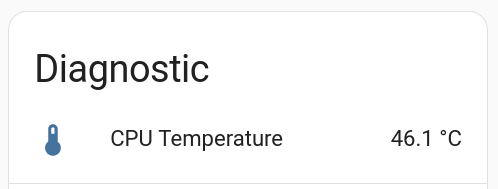

CPU Temperature Sensor
======================

.. seo::
    :description: Instructions for setting up the integrated temperature sensor of the ESP32 and RP2040.
    :image: thermometer.svg
    :keywords: esp32, rp2040, cpu, internal, temperature

The ``cpu_temperature`` sensor platform allows you to use the integrated
temperature sensor of the ESP32 and RP2040 chip.

.. note::

    Some ESP32 variants return a large amount of invalid temperature
    values. Invalid measurements are ignored by this component.

.. code-block:: yaml

    # Example configuration entry
    sensor:
      - platform: cpu_temperature
        name: "CPU Temperature"

Configuration variables:
------------------------

- **name** (**Required**, string): The name of the temperature sensor.
- **update_interval** (*Optional*, :ref:`config-time`): The interval
  to check the sensor. Defaults to ``60s``.
- **id** (*Optional*, :ref:`config-id`): Manually specify the ID used for code generation.
- All other options from :ref:`Sensor <config-sensor>`.

See Also
--------

- :ref:`sensor-filters`
- :ghedit:`Edit`
