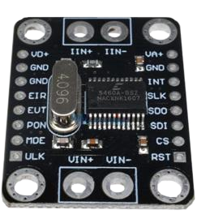

CS5460A Power Sensor
====================

.. seo::
    :description: CS5460A component configuration
    :image: cs5460a.png
    :keywords: cs5460a

The ``cs5460a`` sensor platform allows you to use a CS5460A AC voltage, current and power meter
chip (`datasheet <https://statics.cirrus.com/pubs/proDatasheet/CS5460A_F5.pdf>`__) with ESPHome.
The chip is usually sold on a breakout board with a 4.096 MHz crystal.  However it requires a few
extra components, specifically a current sensing circuit and a voltage sensing circuit.

    CS5460A Single-Phase Power/Energy IC module

.. warning::

    Do not work near live mains connections and only modify existing electrical installations if
    you're qualified.

Configuration:
--------------

Your device communicates with the CS5460A over SPI so you need to have an :ref:`SPI bus <spi>` in
your configuration with the pin numbers set for the ``MOSI``, ``MISO`` and ``CLK`` lines.  These
connect to the ``SDI``, ``SDO`` and ``SCLK`` pins on the CS5460A respectively.  The ``CS``
(chip-select) pin of the CS5460A can be driven by any GPIO you have available or wired to ground
if the CS5460A is the only device connected to your device's SPI bus.  The RESET pin can also be
driven by a GPIO or wired to VCC.

.. code-block:: yaml

    # Example configuration entry
    sensor:
      - platform: cs5460a
        current:
          name: "Kitchen current (RMS)"
          filters:
            delta: 0.1
        power:
          name: "Kitchen power"
          filters:
            delta: 5
        voltage:
          name: "Mains voltage (RMS)"
          filters:
            delta: 5
        samples: 1600
        current_gain: 0.01
        voltage_gain: 0.000573
        pulse_energy: 1 Wh
        cs_pin: GPIOXX

Configuration variables:
------------------------

- **current** (*Optional*): The sensor subcomponent that will report RMS current values in Amperes.
  All options from :ref:`Sensor <config-sensor>`.  See note below about throttling.
- **voltage** (*Optional*): The sensor subcomponent that will report RMS voltage values in Volts.
  All options from :ref:`Sensor <config-sensor>`.  See note below about throttling.
- **power** (*Optional*): The sensor subcomponent that will report the power readings in Watts.
  All options from :ref:`Sensor <config-sensor>`.  See note below about throttling.
- **samples** (*Optional*): The number of samples that go into each reading -- determines that
  update interval of the sensors and the accuracy of the readings.  This is the number N from the
  CS5460A datasheet, defined as the number of *conversion cycles* within a *computation cycle*.  The
  component reports data at the end of each *computation cycle*.  With the standard 4.096MHz clock
  rate, each *conversion* takes 0.25ms so setting this to 2000 means 0.5s update interval, 40000
  means 10s update interval and so on, similarly for other clock-rates.  It is recommended that
  the interval be an integer number of the mains AC cycles, so for the 50 Hz AC frequency countries
  the interval should be a multiple of 20ms, for the 60 Hz countries a multiple of 16.66 ms.
  Defaults to ``4000`` (1 second at 4.096MHz).  Admits values from 1 to 16777215.
- **pga_gain** (*Optional*): If set to ``10X`` (default), the differential voltage at the current
  inputs must be between -250mV and +250mV.  If set to ``50X`` it must be within -100mV to +100mV.
- **current_gain** (*Optional*): Set this to the ratio of the differential voltage at the current
  inputs (in Volts) vs. the actual line current to be calculated (in Amperes).  When using a shunt
  resistor as the current sensing element, this is going to simply equal the resistance since
  the differential voltage is the line current multiplied by the resistance.  When using a current
  transformer, the value is going to be the burden resistor's value divided by the number of turns
  of the transformer winding.  For a 2000 turn current transformer clamp and a 2 Ohm burden
  resistor this works out to 0.001 (the default if **current_gain** is not specified).
- **voltage_gain** (*Optional*): Set this to the ratio of the voltage at the voltage input pins
  of CS5460A to the line voltage.  When using a simple voltage divider, this is the divider's ratio.
  When using a voltage transformer this is the secondary turns to primary turns ratio.  When using a
  current transformer (such as the ZMPT101B) this is equals
  ``(secondary turns * burden resistor value) / (primary turns * limiting resistor value)``, and
  similarly for combinations of transfomers and voltage dividers.  Defaults to ``0.001``.  Must be
  a positive number.
- **phase_offset** (*Optional*): This can be used to account for a phase offset between the voltage
  sensing circuit and the current sensing circuit to improve power measurement accuracy.  Admits
  integer values between -64 to 63, which should be offset by 0.5 and multiplied by about 8.2
  CS5460A clock intervals to get the resulting time offset.  With the typical 4.096 MHz clocking
  this scales to a range of -128 μs to 128 μs, or -2.3º to 2.3º phase offset at 50Hz and a -2.8º to
  2.8º phase offset at 60Hz.  Defaults to ``0`` (i.e. time offset of 4.1 MCLK cycles).  An easy way
  to find the correct value is to plug in a resisitve load such as an incandescent light-bulb and
  find the ``phase_offset`` value that results in the highest power reported by the sensor.
- **pulse_energy** (*Optional*): Sets the energy (in Watt-hours) per individual pulse on the
  CS5460A's EOUT pin that can be used to driver external counters / meters or a LED.  The allowed
  range depends on the gain parameters, defaults to ``10 Wh``.
- **current_hpf** (*Optional*): Enables and disables the High-pass Filter on the current processing
  path in the CS5460A.  Defaults to ``true`` (enabled).
- **voltage_hpf** (*Optional*): Enables and disables the High-pass Filter on the voltage processing
  path in the CS5460A.  Defaults to ``true`` (enabled).

.. note:: Negative values

    Since the current and voltage values reported are the RMS values, they're absolute numbers
    and are always positive.  However the power measurement is signed depending on the direction
    in which energy is being transmitted through the shunt resistor or the current transformer.
    In other words if the sensor is installed between two circuits (e.g. the power grid and a
    household) the sign informs which side is producing and which side is consuming energy in
    the last *computation cycle*.  If the power values are inverted compared to what you expect
    to see, set a negative ``current_gain`` value.

.. note:: Throttling sensors

    If ``samples`` is set to a low value, e.g. in the range of a few seconds per sample or
    shorter, consider :ref:`filtering <sensor-filters>` the measurements if you have a Home
    Assistant instance to avoid filling the logs with too much data.  The ``throttle`` and
    ``sliding_window_moving_average`` filters are some options.  Additionally the ``delta``
    filter is almost always a good idea for all numeric sensors regardless of Home Assistant.

.. _cs5460a-restart_action:

``cs5460a.restart`` Action
---------------------------------

This action can be used in automations to interrupt the current *computation cycle* and start a
new one.  This is useful if you're measuring multiple current/power values using a single
CS5460A chip and a signal multiplexer.  As an example you can measure the power usage on up to
wall sockets in a house by using one voltage transformer and 16 current transformers, each on
the cable leading to the corresponding wall socket.  One side of all the current transformers
connects directly to your CS5460A current input terminal (plus any filtering and protection
circuitry as recommended in the datasheet), while the other side each connects to one channel
of a CD74HC4067 analog multiplexer.  The multiplexer's single signal pin then connects to the
CS5460A's second current input terminal.  Every time the CS5460A sensor publishes a new power
value, an automation can switch the multiplexer to the next channel but it needs to interrupt
the *computation cycle* automatically started when the previous one ended, and start a new
cycle that uses current samples only from the new CD74HC4067 multiplexer channel.

See Also
--------

- :ref:`sensor-filters`
- :apiref:`cs5460a/cs5460a.h`
- :ghedit:`Edit`
