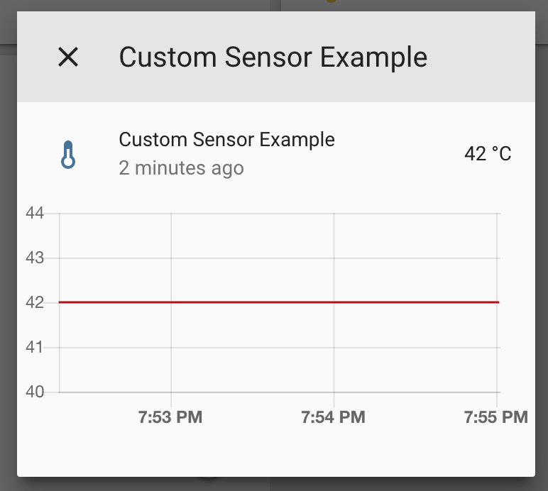

Custom Sensor Component
=======================

.. seo::
    :description: Instructions for setting up Custom C++ sensors with ESPHome.
    :image: language-cpp.svg
    :keywords: C++, Custom

.. warning::

    Custom components are deprecated, not recommended for new configurations and will be removed from ESPHome in a
    future release. Please look at creating a real ESPHome component and "importing" it into your configuration with
    :doc:`/components/external_components`.

    You can find some basic documentation on creating your own components at :ref:`contributing_to_esphome`.

.. warning::

    While we try to keep the ESPHome YAML configuration options as stable as possible, the ESPHome API is less
    stable. If something in the APIs needs to be changed in order for something else to work, we will do so.

So, you just set up ESPHome for your ESP32/ESP8266, but sadly ESPHome is missing a sensor component
you'd really like to have 😕. It's pretty much impossible to support every single sensor, as there are simply too many.
That's why ESPHome has a really simple API for you to create your own **custom sensors** 🎉

In this guide, we will go through creating a custom sensor component for the
`BMP180 <https://www.adafruit.com/product/1603>`__ pressure sensor (we will only do the pressure part,
temperature is more or less the same). During this guide, you will learn how to 1. define a custom sensor
ESPHome can use 2. go over how to register the sensor so that it will be shown inside Home Assistant and
3. leverage an existing Arduino library for the BMP180 with ESPHome.

.. note::

    Since the creation of this guide, the BMP180 has been officially supported by the :doc:`BMP085 component
    <bmp085>`. The code still applies though.

This guide will require at least a bit of knowledge of C++, so be prepared for that. If you've already written
code for an Arduino, you have already written C++ code :) (Arduino uses a slightly customized version of C++).
If you have any problems, I'm here to help: https://discord.gg/KhAMKrd

Step 1: Custom Sensor Definition
--------------------------------

To create your own custom sensor, you just have to create your own C++ class. If you've never heard of that
before, don't worry, at the end of this guide you can just copy the example source code and modify it to your needs
- learning the intricacies of C++ classes won't be required.

Before you can create your own custom sensors, let's first take a look at the basics: How sensors (and components)
are structured in the ESPHome ecosystem.

In ESPHome, a **sensor** is some hardware device (like a BMP180) that periodically
sends out numbers, for example a temperature sensor that periodically publishes its temperature **state**.

Another important abstraction in ESPHome is the concept of a **component**. In ESPHome,
a **component** is an object with a *lifecycle* managed by the :apiclass:`Application` class.
What does this mean? Well if you've coded in Arduino before you might know the two special methods
``setup()`` and ``loop()``. ``setup()`` is called one time when the node boots up and ``loop()`` is called
very often and this is where you can do things like read out sensors etc.

Components have something similar to that: They also have ``setup()`` and ``loop()`` methods which will be
called by the application kind of like the Arduino functions.

So, let's now take a look at some code: This is an example of a custom component class (called ``MyCustomSensor`` here):

.. code-block:: cpp

    #include "esphome.h"

    class MyCustomSensor : public Component, public Sensor {
     public:
      void setup() override {
        // This will be called by App.setup()
      }
      void loop() override {
        // This will be called by App.loop()
      }
    };

In the first two lines, we're importing ESPHome so you can use the APIs via the ``#include``
statement.

Let's now also take a closer look at this line, which you might not be too used to when writing Arduino code:

.. code-block:: cpp

    class MyCustomSensor : public Component, public Sensor {

What this line is essentially saying is that we're defining our own class that's called ``MyCustomSensor``
which is also a subclass of :apiclass:`Component` and :apiclass:`Sensor <sensor::Sensor>`.
As described before, these two "parent" classes have special semantics that we will make use of.

We *could* go implement our own sensor code now by replacing the contents of ``setup()`` and ``loop()``.
In ``setup()`` we would initialize the sensor and in ``loop()`` we would read out the sensor and publish
the latest values.

However, there's a small problem with that approach: ``loop()`` gets called very often (about 60 times per second).
If we would publish a new state each time that method is called we would quickly make the node unresponsive.

So lets fix this, we will use an alternative class to :apiclass:`Component`: :apiclass:`PollingComponent`.
This class is for situations where you have something that should get called repeatedly with some **update interval**.
In the code above, we can simply replace :apiclass:`Component` by :apiclass:`PollingComponent` and
``loop()`` by a special method ``update()`` which will be called with an interval we can specify.

.. code-block:: cpp

    class MyCustomSensor : public PollingComponent, public Sensor {
     public:
      // constructor
      MyCustomSensor() : PollingComponent(15000) {}

      void setup() override {
        // This will be called by App.setup()
      }
      void update() override {
        // This will be called every "update_interval" milliseconds.
      }
    };

Our code has slightly changed, as explained above we're now inheriting from :apiclass:`PollingComponent` instead of
just :apiclass:`Component`. Additionally, we now have a new line: the constructor. You also don't really need to
know much about constructors here, so to simplify let's just say this is where we "initialize" the custom sensor.

In this constructor we're telling the compiler that we want :apiclass:`PollingComponent` to be instantiated with an
*update interval* of 15s, or 15000 milliseconds (ESPHome uses milliseconds internally).

Let's also now make our sensor actually publish values in the ``update()`` method:

.. code-block:: cpp

    // class MyCustomSensor ...
      // ... previous code
      void update() override {
        publish_state(42.0);
      }
    };

Every time ``update`` is called we will now **publish** a new value to the frontend.
The rest of ESPHome will then take care of processing this value and ultimately publishing it
to the outside world (for example using MQTT).

One last thing. Some sensors, such as the BMP180 were are going to explain later, require some other component before they can be used. Remember how we talked about the ``setup()`` method? Well just like when writing in the Arduino IDE, components need to be set up in the right order. For that ESPHome introduces another method in the :apiclass:`Component` class.

.. code-block:: cpp

    float get_setup_priority() const override { return esphome::setup_priority::HARDWARE; }

Where HARDWARE can be any of:

.. code-block:: cpp

    /// For communication buses like i2c/spi
    extern const float BUS;
    /// For components that represent GPIO pins like PCF8573
    extern const float IO;
    /// For components that deal with hardware and are very important like GPIO switch
    extern const float HARDWARE;
    /// For components that import data from directly connected sensors like DHT.
    extern const float DATA;
    /// Alias for DATA (here for compatibility reasons)
    extern const float HARDWARE_LATE;
    /// For components that use data from sensors like displays
    extern const float PROCESSOR;
    extern const float WIFI;
    /// For components that should be initialized after WiFi is connected.
    extern const float AFTER_WIFI;
    /// For components that should be initialized after a data connection (API/MQTT) is connected.
    extern const float AFTER_CONNECTION;
    /// For components that should be initialized at the very end of the setup process.
    extern const float LATE;

Now don't let the wording confuse you. The ``get_setup_priority()`` method is an override. Instead of fetching the setup priority setup for us, it instead fetches the setup priority for esphome, while being defined by us. The BMP180 would for instance need to be setup with a priority of IO or lower. A serial streaming (TCP) server would require a working WIFI setup and therefore get AFTER_WIFI.

This finalizes our example as:

.. code-block:: cpp

    class MyCustomSensor : public PollingComponent, public Sensor {
     public:
      // constructor
      MyCustomSensor() : PollingComponent(15000) {}

      float get_setup_priority() const override { return esphome::setup_priority::XXXX; }

      void setup() override {
        // This will be called by App.setup()
      }
      void update() override {
        // This will be called every "update_interval" milliseconds.
      }
    };

Step 2: Registering the custom sensor
-------------------------------------

Now we have our Custom Sensor set up, but unfortunately it doesn't do much right now.
Actually ... it does nothing because it's never included nor instantiated.
First, create a new file called ``my_custom_sensor.h`` in your configuration directory and copy the source code
from above into that file.

Then in the YAML config, *include* that file in the top-level ``esphome`` section like this:

.. code-block:: yaml

    esphome:
      # ... [Other options]
      includes:
        - my_custom_sensor.h

Next, create a new ``custom`` sensor platform entry like this:

.. code-block:: yaml

    # Example configuration entry
    sensor:
    - platform: custom
      lambda: |-
        auto my_sensor = new MyCustomSensor();
        App.register_component(my_sensor);
        return {my_sensor};

      sensors:
        name: "My Custom Sensor"

Let's break this down:

- First, we specify a :ref:`lambda <config-lambda>` that will be used to **instantiate** our sensor class. This will
  be called on boot to register our sensor in ESPHome.
- In this lambda, we're first creating a new instance of our custom class (``new MyCustomSensor()``) and then
  assigning it to a variable called ``my_sensor``. Note: This uses a feature in the C++ standard, ``auto``, to make our
  lives easier. We could also have written ``MyCustomSensor *my_sensor = new MyCustomSensor()``
- Next, as our custom class inherits from Component, we need to **register** it - otherwise ESPHome will not know
  about it and won't call our ``setup()`` and ``update`` methods!
- Finally, we ``return`` the custom sensor - don't worry about the curly braces ``{}``, we'll cover that later.
- After that, we just let ESPHome know about our newly created sensor too using the ``sensors:`` block. Additionally,
  here we're also assigning the sensor a name.

Now all that's left to do is upload the code and let it run :)

If you have Home Assistant MQTT discovery setup, it will even automatically show up in the frontend 🎉

Step 3: BMP180 support
----------------------

Let's finally make this custom sensor useful by adding the BMP180 aspect into it! Sure, printing ``42`` is a nice number
but it won't help with home automation :D

A great feature of ESPHome is that you don't need to code everything yourself. You can use any existing Arduino
library to do the work for you! Now for this example we'll
use the `Adafruit BMP085 Library <https://platformio.org/lib/show/525/Adafruit%20BMP085%20Library>`__
library to implement support for the BMP085 sensor. But you can find other libraries too on the
`PlatformIO library index <https://platformio.org/lib>`__

First we'll need to add the library to our project dependencies. To do so, put ``Adafruit BMP085 Library``
in your global ``libraries``:

.. code-block:: yaml

    esphome:
      includes:
        - my_custom_sensor.h
      libraries:
        - "Adafruit BMP085 Library"

Next, include the library at the top of your custom sensor file you created previously:

.. code-block:: cpp

    #include "esphome.h"
    #include "Adafruit_BMP085.h"

    // ...

Then update the sensor for BMP180 support:

.. code-block:: cpp

    // ...

    class MyCustomSensor : public PollingComponent, public Sensor {
     public:
      Adafruit_BMP085 bmp;

      MyCustomSensor() : PollingComponent(15000) { }

      void setup() override {
        bmp.begin();
      }

      void update() override {
        int pressure = bmp.readPressure(); // library returns value in in Pa, which equals 1/100 hPa
        publish_state(pressure / 100.0); // convert to hPa
      }
    };

    // ...

There's not too much going on there. First, we define the variable ``bmp`` of type ``Adafruit_BMP085``
inside our class as a class member. This is the object the Adafruit library exposes and through which
we will communicate with the sensor.

In our custom ``setup()`` function we're *initializing* the library (using ``.begin()``) and in
``update()`` we're reading the pressure and publishing it using ``publish_state``.

For ESPHome we can use the previous YAML. So now if you upload the firmware, you'll see the sensor
reporting actual pressure values! Hooray 🎉!

Step 4: Additional Overrides
----------------------------

There's a slight problem with our code: It does print the values fine, **but** if you look in Home Assistant
you'll see a) the value has no **unit** attached to it and b) the value will be rounded to the next integer.
This is because ESPHome doesn't know these infos, it's only passed a floating point value after all.

We *could* fix that in our custom sensor class (by overriding the ``unit_of_measurement`` and ``accuracy_decimals``
methods), but here we have the full power of ESPHome, so let's use that:

.. code-block:: yaml

    # Example configuration entry
    sensor:
    - platform: custom
      lambda: |-
        auto my_sensor = new MyCustomSensor();
        App.register_component(my_sensor);
        return {my_sensor};

      sensors:
        name: "My Custom Sensor"
        unit_of_measurement: hPa
        accuracy_decimals: 2

Bonus: Sensors With Multiple Output Values
------------------------------------------

The ``Sensor`` class doesn't fit every use-case. Sometimes, (as with the BMP180),
a sensor can expose multiple values (temperature *and* pressure, for example).

Doing so in ESPHome is a bit more difficult. Basically, we will have to change our sensor
model to have a **component** that reads out the values and then multiple **sensors** that represent
the individual sensor measurements.

Let's look at what that could look like in code:

.. code-block:: cpp

    class MyCustomSensor : public PollingComponent {
     public:
      Adafruit_BMP085 bmp;
      Sensor *temperature_sensor = new Sensor();
      Sensor *pressure_sensor = new Sensor();

      MyCustomSensor() : PollingComponent(15000) { }

      void setup() override {
        bmp.begin();
      }

      void update() override {
        // This is the actual sensor reading logic.
        float temperature = bmp.readTemperature();
        temperature_sensor->publish_state(temperature);

        int pressure = bmp.readPressure();
        pressure_sensor->publish_state(pressure / 100.0);
      }
    };

The code here has changed a bit:

- Because the values are no longer published by our custom class, ``MyCustomSensor`` no longer inherits
  from ``Sensor``.
- The class has two new members: ``temperature_sensor`` and ``pressure_sensor``. These will be used to
  publish the values.
- In our ``update()`` method we're now reading out the temperature *and* pressure. These values are then
  published with the temperature and pressure sensor instances we declared before.

Our YAML configuration needs an update too:

.. code-block:: yaml

    # Example configuration entry
    sensor:
    - platform: custom
      lambda: |-
        auto my_sensor = new MyCustomSensor();
        App.register_component(my_sensor);
        return {my_sensor->temperature_sensor, my_sensor->pressure_sensor};

      sensors:
      - name: "My Custom Temperature Sensor"
        unit_of_measurement: °C
        accuracy_decimals: 1
      - name: "My Custom Pressure Sensor"
        unit_of_measurement: hPa
        accuracy_decimals: 2

In ``lambda`` the return statement has changed: Because we have *two* sensors now we must tell ESPHome
about both of them. We do this by returning them as an array of values in the curly braces.

``sensors:`` has also changed a bit: Now that we have multiple sensors, each of them needs an entry here.

Note that the number of arguments you put in the curly braces *must* match the number of sensors you define in the YAML
``sensors:`` block - *and* they must be in the same order.

Configuration variables:
************************

- **lambda** (**Required**, :ref:`lambda <config-lambda>`): The lambda to run for instantiating the
  sensor(s).
- **sensors** (**Required**, list): A list of sensors to initialize. The length here
  must equal the number of items in the ``return`` statement of the ``lambda``.

  - All options from :ref:`Sensor <config-sensor>`.

Logging in Custom Components
----------------------------

It is possible to log inside of custom components too. You can use the provided ``ESP_LOGx``
functions for this.

.. code-block:: cpp

    ESP_LOGD("custom", "This is a custom debug message");
    // Levels:
    //  - ERROR: ESP_LOGE
    //  - WARNING: ESP_LOGW
    //  - INFO: ESP_LOGI
    //  - DEBUG: ESP_LOGD
    //  - VERBOSE: ESP_LOGV
    //  - VERY_VERBOSE: ESP_LOGVV

    ESP_LOGD("custom", "The value of sensor is: %f", this->state);

See :ref:`display-printf` for learning about how to use formatting in log strings.

See Also
--------

- :ghedit:`Edit`
