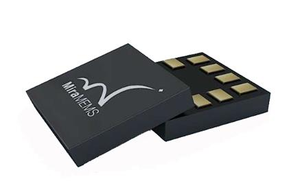

DA217 Accelerometer Sensor
======================================

.. seo::
    :description: Instructions for setting up DA217 Accelerometer sensors.
    :image: da217.png

The ``da217`` sensor platform allows you to use your DA217 Accelerometer
(`datasheet <https://uploadcdn.oneyac.com/upload/document/1638756771774_0799.pdf>`__) ESPHome.

The :ref:`I²C Bus <i2c>` is required to be set up in your configuration for this sensor to work.

    DA217 Accelerometer Sensor.

.. code-block:: yaml

    # Example configuration entry
    sensor:
      - platform: da217
        address: 0x27
        resolution: 14bits
        full_scale: 4g
        tap_quiet_duration: 30ms
        tap_shock_duration: 70ms
        double_tap_duration: 500ms
        interrupt_source: unfiltered
        enable_double_tap_interrupt: true
        map_double_tap_interrupt_to_int1: true
        tap_acceleration_threshold: 0.0625
        output_data_rate: 125Hz
        accel_x:
          name: "Acceleration X"
        accel_y:
          name: "Acceleration Y"
        accel_z:
          name: "Acceleration z"

Configuration variables:
------------------------

- **address** (*Optional*, int): Manually specify the I²C address of the sensor. Defaults to ``0x27``, may also be ``0x26``.

- **accel_x** (*Optional*): Use the X-Axis of the Accelerometer. All options from
  :ref:`Sensor <config-sensor>`.
- **accel_y** (*Optional*): Use the Y-Axis of the Accelerometer. All options from
  :ref:`Sensor <config-sensor>`.
- **accel_z** (*Optional*): Use the Z-Axis of the Accelerometer. All options from
  :ref:`Sensor <config-sensor>`.

- **enable_high_pass_filter** (*Optional*, boolean): Enable following HTTP redirects.
  Defaults to ``false``.
- **enable_watchdog** (*Optional*, boolean): Enable following HTTP redirects.
  Defaults to ``false``.
- **watchdog_time** (*Optional*, string): The time unit to integrate with, one of
  ``1ms`` or ``50ms``. Defaults to ``1ms``.
- **resolution** (*Optional*, string): Resolution of acceleration measurements.
  ``8bits``, ``10bits``, ``12bits`` or ``14bits``. Defaults to ``14bits``.
- **full_scale** (*Optional*, string): Maximum acceleration that can be measured.
  ``2g``, ``4g``, ``8g`` or ``16g``. Defaults to ``2g``.

- **enable_x_axis** (*Optional*, boolean): Enable the X-Axis.
  Defaults to ``false``.
- **enable_y_axis** (*Optional*, boolean): Enable the Y-Axis.
  Defaults to ``true``.
- **enable_z_axis** (*Optional*, boolean): Enable the Z-Axis.
  Defaults to ``true``.

- **output_data_rate** (*Optional*, string): Output rate of the accelerometer.
  ``1Hz``, ``1.95Hz``, ``3.9Hz``, ``3.9Hz``, ``7.81Hz``, ``15.63Hz``, ``31.25Hz``, ``62.5Hz``, ``125Hz``, ``250Hz`` or ``500Hz``.
- **interrupt_source** (*Optional*, string): The time unit to integrate with, one of
  ``Oversampling``, ``Unfiltered`` or ``Filtered``. Defaults to ``Oversampling``.

- **enable_single_tap_interrupt** (*Optional*, boolean): Enable single-tap detection.
  Defaults to ``false``.
- **enable_double_tap_interrupt** (*Optional*, boolean): Enable double-tap detection.
  Defaults to ``false``.
- **enable_orientation_interrupt** (*Optional*, boolean): Enable orientation detection.
  Defaults to ``false``.
- **enable_active_interrupt_x_axis** (*Optional*, boolean): Enable X-Axis detection.
  Defaults to ``false``.
- **enable_active_interrupt_y_axis** (*Optional*, boolean): Enable Y-Axis detection.
  Defaults to ``false``.
- **enable_active_interrupt_z_axis** (*Optional*, boolean): Enable Z-Axis detection.
  Defaults to ``false``.

- **map_significant_movement_interrupt_to_int1** (*Optional*, boolean): Trigger INT1 upon significant movement. Defaults to ``false``.
- **map_orientation_interrupt_to_int1** (*Optional*, boolean): Trigger INT1 upon orientation change. Defaults to ``false``.
- **map_single_tap_interrupt_to_int1** (*Optional*, boolean): Trigger INT1 upon single-tap. Defaults to ``false``.
- **map_double_tap_interrupt_to_int1** (*Optional*, boolean): Trigger INT1 upon double-tap. Defaults to ``false``.
- **map_tilt_interrupt_to_int1** (*Optional*, boolean): Trigger INT1 upon tilt. Defaults to ``false``.
- **map_active_interrupt_to_int1** (*Optional*, boolean): Trigger INT1 upon active interrupt. Defaults to ``false``.
- **map_step_counter_interrupt_to_int1** (*Optional*, boolean): Trigger INT1 upon step-counting. Defaults to ``false``.
- **map_freefall_interrupt_to_int1** (*Optional*, boolean): Trigger INT1 upon free fall. Defaults to ``false``.

- **tap_quiet_duration** (*Optional*, string): Duration of the "quiet" time that yields a tap detection.
  ``20ms`` or ``30ms``. Defaults to ``30ms``.
- **tap_shock_duration** (*Optional*, string): Duration of the "shock" time that yields a tap detection.
  ``50ms`` or ``70ms``. Defaults to ``50ms``.
- **double_tap_duration** (*Optional*, string): Duration of the time between two taps that yield a double-tap detection.
  ``50ms``, ``100ms``, ``150ms``, ``200ms``, ``250ms``, ``375ms``, ``500ms`` or ``700ms``. Defaults to ``250ms``.
- **stable_tilt_time** (*Optional*, string): Duration required to trigger a tilt detection.
  ``32_odr_periods``, ``96_odr_periods``, ``160_odr_periods`` or ``224_odr_periods``. Defaults to ``32_odr_periods``.
- **tap_acceleration_threshold** (**Optional**, number): The limit between "quiet" and "shock", as a fraction of the full acceleration range. Defaults to ``0.32``.

- **id** (*Optional*, :ref:`config-id`): Manually specify the ID used for code generation.

See Also
--------

- :ref:`sensor-filters`
- :apiref:`da217/da217.h`
- :ghedit:`Edit`
