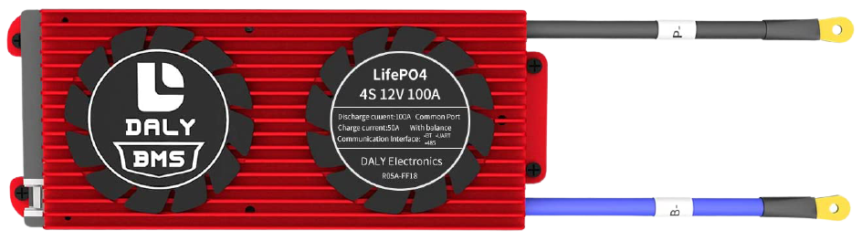
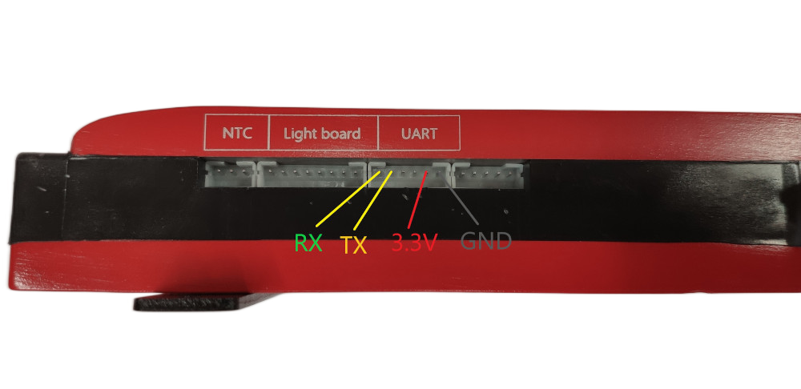

Daly BMS
========

.. seo::
    :description: Instructions for setting up a Daly Smart BMS
    :image: daly_bms.jpg

The ``daly_bms`` sensor platform allows you to use a Daly Smart BMS
(`more info <https://dalyelec.en.made-in-china.com/>`__)
with ESPHome.

The BMS communicates via :ref:`UART <uart>`.

.. code-block:: yaml

    # Example configuration entry (ESP8266)
    uart:
      tx_pin: GPIO1
      rx_pin: GPIO3
      baud_rate: 9600
      
    daly_bms:
      update_interval: 20s
      
    sensor:
      - platform: daly_bms
        voltage:
          name: "Battery Voltage"
        current:
          name: "Battery Current"
        battery_level:
          name: "Battery Level"
        max_cell_voltage:
          name: "Max Cell Voltage"
        max_cell_voltage_number:
          name: "Max Cell Voltage Number"
        min_cell_voltage:
          name: "Min Cell Voltage"
        min_cell_voltage_number:
          name: "Min Cell Voltage Number"
        max_temperature:
          name: "Max Temperature"
        max_temperature_probe_number:
          name: "Max Temperature Probe Number"
        min_temperature:
          name: "Min Temperature"
        min_temperature_probe_number:
          name: "Min Temperature Probe Number"
        remaining_capacity:
          name: "Remaining Capacity"
        cells_number:
          name: "Cells Number"
        temperature_1:
          name: "Temperature 1"
        temperature_2:
          name: "Temperature 2"

    text_sensor:
      - platform: daly_bms
        status:
          name: "BMS Status"
          
          
    binary_sensor:
      - platform: daly_bms
        charging_mos_enabled:
          name: "Charging MOS"
        discharging_mos_enabled:
          name: "Discharging MOS"

Component/Hub
-------------

- **update_interval** (*Optional*, :ref:`config-time`): Delay between data requests.

Configuration variables:
************************
Sensor:
-------
A sensor platform to read BMS data

Configuration variables:
************************

- **voltage** (*Optional*): Voltage of the battery pack connected to Daly BMS.

  - **name** (**Required**, string): The name for the voltage sensor.
  - **id** (*Optional*, :ref:`config-id`): Set the ID of this sensor for use in lambdas.
  - All other options from :ref:`Sensor <config-sensor>`.

- **current** (*Optional*): Current flowing trough the BMS (input or output from batttery).

  - **name** (**Required**, string): The name for the current sensor.
  - **id** (*Optional*, :ref:`config-id`): Set the ID of this sensor for use in lambdas.
  - All other options from :ref:`Sensor <config-sensor>`.

- **battery_level** (*Optional*): Battery level in % (SoC).

  - **name** (**Required**, string): The name for the SoC sensor.
  - **id** (*Optional*, :ref:`config-id`): Set the ID of this sensor for use in lambdas.
  - All other options from :ref:`Sensor <config-sensor>`.

- **max_cell_voltage** (*Optional*): The cell of the battery with the higher voltage.

  - **name** (**Required**, string): The name for the Max Cell Voltage sensor.
  - **id** (*Optional*, :ref:`config-id`): Set the ID of this sensor for use in lambdas.
  - All other options from :ref:`Sensor <config-sensor>`.

- **max_cell_voltage_number** (*Optional*): The cell number of the battery with the higher voltage.

  - **name** (**Required**, string): The name for the Max Cell Voltage Number sensor.
  - **id** (*Optional*, :ref:`config-id`): Set the ID of this sensor for use in lambdas.
  - All other options from :ref:`Sensor <config-sensor>`.

- **min_cell_voltage** (*Optional*): The cell of the battery with the lower voltage.

  - **name** (**Required**, string): The name for the Min Cell Voltage sensor.
  - **id** (*Optional*, :ref:`config-id`): Set the ID of this sensor for use in lambdas.
  - All other options from :ref:`Sensor <config-sensor>`.

- **min_cell_voltage_number** (*Optional*): The cell number of the battery with the lower voltage.

  - **name** (**Required**, string): The name for the Min Cell Voltage Number sensor.
  - **id** (*Optional*, :ref:`config-id`): Set the ID of this sensor for use in lambdas.
  - All other options from :ref:`Sensor <config-sensor>`.

- **max_temperature** (*Optional*): The higher temperature measured from the temperature sensors.

  - **name** (**Required**, string): The name for the Max Temperature sensor.
  - **id** (*Optional*, :ref:`config-id`): Set the ID of this sensor for use in lambdas.
  - All other options from :ref:`Sensor <config-sensor>`.

- **max_temperature_probe_number** (*Optional*): The sensor number which has measured the higher temperature.

  - **name** (**Required**, string): The name for the Max Temperature Probe Number sensor.
  - **id** (*Optional*, :ref:`config-id`): Set the ID of this sensor for use in lambdas.
  - All other options from :ref:`Sensor <config-sensor>`.

- **min_temperature** (*Optional*): The lower temperature measured from the temperature sensors.

  - **name** (**Required**, string): The name for the Min Temperature sensor.
  - **id** (*Optional*, :ref:`config-id`): Set the ID of this sensor for use in lambdas.
  - All other options from :ref:`Sensor <config-sensor>`.

- **min_temperature_probe_number** (*Optional*): The sensor number which has measured the lower temperature.

  - **name** (**Required**, string): The name for the Min Temperature Probe Number sensor.
  - **id** (*Optional*, :ref:`config-id`): Set the ID of this sensor for use in lambdas.
  - All other options from :ref:`Sensor <config-sensor>`.

- **remaining_capacity** (*Optional*): The capacity in Ah left in the battery.

  - **name** (**Required**, string): The name for the Remaining Capacity sensor.
  - **id** (*Optional*, :ref:`config-id`): Set the ID of this sensor for use in lambdas.
  - All other options from :ref:`Sensor <config-sensor>`.

- **cells_number** (*Optional*): The number of cells in series in the battery pack.

  - **name** (**Required**, string): The name for the Cells Number sensor.
  - **id** (*Optional*, :ref:`config-id`): Set the ID of this sensor for use in lambdas.
  - All other options from :ref:`Sensor <config-sensor>`.

- **temperature_1** (*Optional*): The first temperature sensor.

  - **name** (**Required**, string): The name for the first temperature sensor.
  - **id** (*Optional*, :ref:`config-id`): Set the ID of this sensor for use in lambdas.
  - All other options from :ref:`Sensor <config-sensor>`.

- **temperature_2** (*Optional*): The second temperature sensor.

  - **name** (**Required**, string): The name for the second temperature sensor.
  - **id** (*Optional*, :ref:`config-id`): Set the ID of this sensor for use in lambdas.
  - All other options from :ref:`Sensor <config-sensor>`.

Text Sensor:
------------
Text sensor that indicates the status of BMS.

Configuration variables:
************************

- **status** (*Optional*): The BMS Status (Charging, Discharging, Stationary).

  - **name** (**Required**, string): The name for the BMS status text sensor.
  - **id** (*Optional*, :ref:`config-id`): Set the ID of this sensor for use in lambdas.
  - All other options from :ref:`Text Sensor <config-text_sensor>`.

Binary Sensor:
--------------
Binary sensor that indicates the status of MOS.

Configuration variables:
************************

- **charging_mos_enabled** (*Optional*): The BMS charging MOS status to enable the recharge of the battery.

  - **name** (**Required**, string): The name for the charging MOS binary sensor.
  - **id** (*Optional*, :ref:`config-id`): Set the ID of this sensor for use in lambdas.
  - All other options from :ref:`Binary Sensor <config-binary_sensor>`.

- **discharging_mos_enabled** (*Optional*): The BMS discharging mos status to enable the load.

  - **name** (**Required**, string): The name for the discharging MOS binary sensor.
  - **id** (*Optional*, :ref:`config-id`): Set the ID of this sensor for use in lambdas.
  - All other options from :ref:`Binary Sensor <config-binary_sensor>`.

UART Connection:
----------------
Connect RX from BMS to TX in ESP board and TX from BMS to RX in ESP board

    Uart Pinout.

See Also
--------

- :ref:`sensor-filters`
- :ghsources:`esphome/components/daly_bms`
- :ghedit:`Edit`
