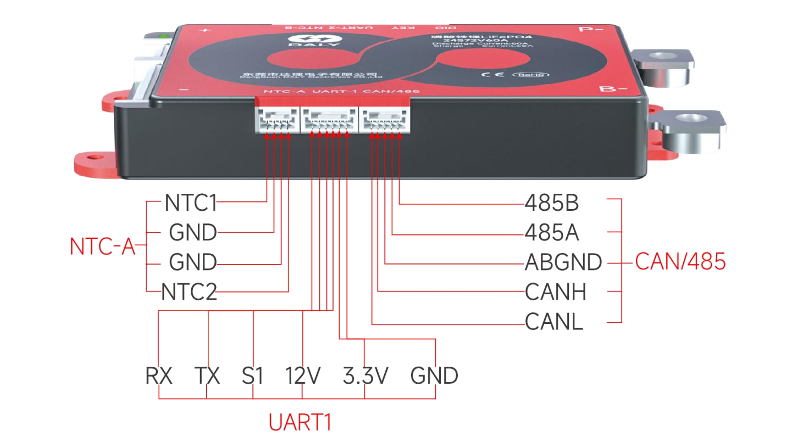

Daly H/K/M/S-Series BMS Sensor
==============================

.. seo::
    :description: Instructions for setting up a Daly H/K/M/S-Series Smart BMS
    :image: daly_bms.jpg

The ``daly_hkms_bms`` sensor platform allows you to use a Daly H/K/M/S-Series Smart BMS
(`more info <https://dalyelec.en.made-in-china.com/>`__)
with ESPHome.

Older Daly BMS use a custom UART-based protocol available via the :doc:`/components/sensor/daly_bms` component.

The communication with this component is done via a :ref:`UART <uart>` using a non-standard variation of the :ref:`Modbus protocol <modbus>`,
either using RS485 or 3.3V UART.
There may be multiple BMS on a single RS485 bus.

.. code-block:: yaml

    # Example configuration entry
    uart:
      - id: bms_uart
        baud_rate: 9600
        ...

    modbus:
      uart_id: bms_uart

    daly_hkms_bms:
      - modbus: modbus_id
        daly_address: 1
        update_interval: 10s

Configuration variables:
************************

- **modbus** (*Optional*, :ref:`config-id`): Manually specify the ID of the :ref:`Modbus Component <modbus>` if you want
  to use multiple Modbus buses.
- **daly_address** (*Optional*, int): Address to use, defaults to ``1``. Address of the BMS can be set using the DALY PC Software.
- **update_interval** (*Optional*, :ref:`config-time`): Delay between data requests, defaults to ``30s``.

Sensor
------

A sensor platform to read BMS data

.. code-block:: yaml

    sensor:
      - platform: daly_hkms_bms
        daly_hkms_bms_id: bms_id
        voltage:
          name: "Battery Voltage"
        current:
          name: "Battery Current"
        battery_level:
          name: "Battery Level"
        remaining_capacity:
          name: "Remaining Capacity"
        cycles:
          name: "Battery Cycles"
        temperature_mos:
          name: "Temperature MOS"
        max_temperature:
          name: "Temperature Max"
        min_temperature:
          name: "Temperature Min"
        max_cell_voltage:
          name: "Cell Voltage Max"
        min_cell_voltage:
          name: "Cell Voltage Min"

Configuration variables:
************************

- **daly_hkms_bms_id** (*Optional*, :ref:`config-id`): Manually specify the ID of the daly_hkms_bms hub if you want
  to use multiple BMS.

- **voltage** (*Optional*): Voltage of the battery pack connected to Daly BMS.
  All options from :ref:`Sensor <config-sensor>`.

- **current** (*Optional*): Current flowing trough the BMS (input or output from batttery).
  All options from :ref:`Sensor <config-sensor>`.

- **battery_level** (*Optional*): Battery level in % (SoC).
  All options from :ref:`Sensor <config-sensor>`.

- **remaining_capacity** (*Optional*): The capacity in Ah left in the battery.
  All options from :ref:`Sensor <config-sensor>`.

- **cycles** (*Optional*): The number of charge cycles of the battery.
  All options from :ref:`Sensor <config-sensor>`.

- **temperature_mos** (*Optional*): The BMS MOSFET temperature.
  All options from :ref:`Sensor <config-sensor>`.

- **temperature_board** (*Optional*): The BMS PCB temperature (might not be available on all models).
  All options from :ref:`Sensor <config-sensor>`.

- **temps_number** (*Optional*): The number of temperature sensors.
  All options from :ref:`Sensor <config-sensor>`.

- **max_temperature** (*Optional*): The higher temperature measured from the temperature sensors.
  All options from :ref:`Sensor <config-sensor>`.

- **max_temperature_probe_number** (*Optional*): The sensor number which has measured the higher temperature.
  All options from :ref:`Sensor <config-sensor>`.

- **min_temperature** (*Optional*): The lower temperature measured from the temperature sensors.
  All options from :ref:`Sensor <config-sensor>`.

- **min_temperature_probe_number** (*Optional*): The sensor number which has measured the lower temperature.
  All options from :ref:`Sensor <config-sensor>`.

- **temperature_1** (*Optional*): The first temperature sensor. There can be up to 8 temperature sensors.
  All options from :ref:`Sensor <config-sensor>`.

- **cells_number** (*Optional*): The number of cells in series in the battery pack.
  All options from :ref:`Sensor <config-sensor>`.

- **max_cell_voltage** (*Optional*): The cell of the battery with the highest voltage.
  All options from :ref:`Sensor <config-sensor>`.

- **max_cell_voltage_number** (*Optional*): The cell number of the battery with the highest voltage.
  All options from :ref:`Sensor <config-sensor>`.

- **min_cell_voltage** (*Optional*): The cell of the battery with the lowest voltage.
  All options from :ref:`Sensor <config-sensor>`.

- **min_cell_voltage_number** (*Optional*): The cell number of the battery with the lowest voltage.
  All options from :ref:`Sensor <config-sensor>`.

- **cell_1_voltage** (*Optional*): The voltage of cell number 1. Cell number can be from 1 to 48.
  All options from :ref:`Sensor <config-sensor>`.

Text Sensor
-----------

Text sensor that indicates the status of BMS.

.. code-block:: yaml

    text_sensor:
      - platform: daly_bms
        status:
          name: "BMS Status"

Configuration variables:
************************

- **daly_hkms_bms_id** (*Optional*, :ref:`config-id`): Manually specify the ID of the daly_hkms_bms hub if you want
  to use multiple BMS.

- **status** (*Optional*): The BMS Status (Charging, Discharging, Stationary).
  All options from :ref:`Text Sensor <config-text_sensor>`.

Binary Sensor
-------------

Binary sensor that indicates the status of MOS.

.. code-block:: yaml

    binary_sensor:
      - platform: daly_bms
        charging_mos_enabled:
          name: "Charging MOS"
        discharging_mos_enabled:
          name: "Discharging MOS"

Configuration variables:
************************

- **daly_hkms_bms_id** (*Optional*, :ref:`config-id`): Manually specify the ID of the daly_hkms_bms hub if you want
  to use multiple BMS.

- **charging_mos_enabled** (*Optional*): The BMS charging MOS status to enable the recharge of the battery.
  All options from :ref:`Binary Sensor <config-binary_sensor>`.

- **discharging_mos_enabled** (*Optional*): The BMS discharging mos status to enable the load.
  All options from :ref:`Binary Sensor <config-binary_sensor>`.

- **precharging_mos_enabled** (*Optional*): The BMS precharging mos status to precharge the load's capacitors.
  All options from :ref:`Binary Sensor <config-binary_sensor>`.

- **balancing_active** (*Optional*): Whether the BMS is currently balancing the cells.
  All options from :ref:`Binary Sensor <config-binary_sensor>`.

UART Connection
---------------

Connect RX from BMS to TX on ESP board and TX from BMS to RX on ESP board.

Alternatively, use an RS485 converter and connect A to A/+ and B to B/-.
Always connect the ground when using RS485 to avoid stray currents running through the RS485 transceivers.

Be aware that by default, the BMS goes to sleep after 1 hour and can not be woken up via RS485,
only by RX/TX UART communication, charging/discharging the battery or toggling the switch input.

The connectors are compatible with JST-GH (1.25mm pin pitch).

    UART / RS485 Pinout.

**3.3v Warning:** The UART 3.3v is designed to supply power to the Bluetooth module, not an entire ESP.
There may be WiFi connection issues (or possibly damage to the BMS) when using this 3.3V rail to power an ESP.
There is also 12V on the connector which should be able to supply more current.

See Also
--------

- :ref:`sensor-filters`
- :doc:`/components/sensor/daly_bms`
- :ref:`modbus`
- :apiref:`daly_hkms_bms/daly_hkms_bms.h`
- :ghedit:`Edit`
