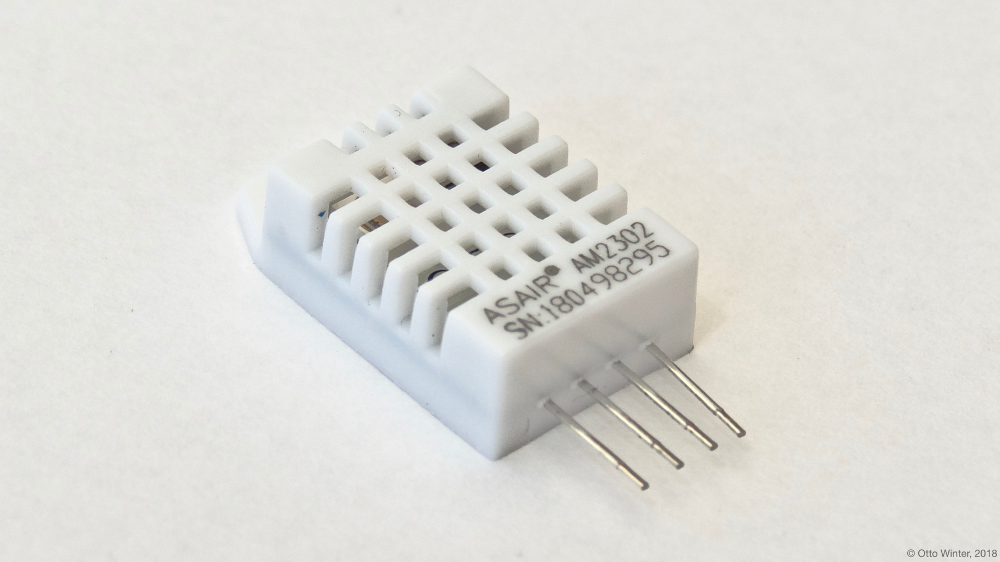

DHT Temperature+Humidity Sensor
===============================

.. seo::
    :description: Instructions for setting up DHT11 and DHT22 temperature and humidity sensors.
    :image: dht.jpg
    :keywords: DHT11, DHT21, DHT22, AMS2301, AM2302, RHT03, SI7021

The DHT Temperature+Humidity sensor allows you to use your

- DHT11 (`datasheet <https://akizukidenshi.com/download/ds/aosong/DHT11.pdf>`__, `Adafruit <https://www.adafruit.com/product/386>`__),
- DHT21/DHT22 (`datasheet <https://www.sparkfun.com/datasheets/Sensors/Temperature/DHT22.pdf>`__, `Adafruit <https://www.adafruit.com/product/385>`__),
- AMS2301/AM2302 (`datasheet <https://cdn-shop.adafruit.com/datasheets/Digital+humidity+and+temperature+sensor+AM2302.pdf>`__, `Adafruit <https://www.adafruit.com/product/393>`__),
- AM2120 (`datasheet <https://www.micros.com.pl/mediaserver/UPAM2120_0004.pdf>`__),
- RHT03 (`datasheet <https://cdn.sparkfun.com/datasheets/Sensors/Weather/RHT03.pdf>`__, `SparkFun <https://cdn.sparkfun.com/datasheets/Sensors/Weather/RHT03.pdf>`__) and
- SI7021 (one wire Sonoff version) (`datasheet <https://cdn.sparkfun.com/assets/b/1/b/8/5/Si7021-A20.pdf>`__, `SparkFun <https://cdn.sparkfun.com/assets/b/1/b/8/5/Si7021-A20.pdf>`__)

sensors with ESPHome.

    DHT22 Temperature & Humidity Sensor.

.. _Adafruit: https://www.adafruit.com/product/385

The DHT22 and DHT11 require external pull up resistors on the data line. To do this, solder
a resistor with *about* 4.7kΩ (anything in the range from 1kΩ to 10kΩ probably works fine, but
if you're having issues try the 4.7kΩ recommended by the manufacturer) between ``DATA`` and ``3.3V``.

.. figure:: images/temperature-humidity.png
    :align: center
    :width: 80.0%

.. code-block:: yaml

    # Example configuration entry
    sensor:
      - platform: dht
        pin: D2
        temperature:
          name: "Living Room Temperature"
        humidity:
          name: "Living Room Humidity"
        update_interval: 60s

Configuration variables:
------------------------

- **pin** (**Required**, :ref:`config-pin`): The pin where the DHT bus is connected.
- **temperature** (**Required**): The information for the temperature sensor.

  - **name** (**Required**, string): The name for the temperature sensor.
  - **id** (*Optional*, :ref:`config-id`): Set the ID of this sensor for use in lambdas.
  - All other options from :ref:`Sensor <config-sensor>`.

- **humidity** (**Required**): The information for the humidity sensor

  - **name** (**Required**, string): The name for the humidity sensor.
  - **id** (*Optional*, :ref:`config-id`): Set the ID of this sensor for use in lambdas.
  - All other options from :ref:`Sensor <config-sensor>`.

- **model** (*Optional*, int): Manually specify the DHT model, can be
  one of ``AUTO_DETECT``, ``DHT11``, ``DHT22``, ``DHT22_TYPE2``, ``AM2302``, ``RHT03``, ``SI7021``, ``AM2120``
  and helps with some connection issues. Defaults to ``AUTO_DETECT``.  Auto detection doesn't work for the SI7021 chip.
- **update_interval** (*Optional*, :ref:`config-time`): The interval to check the
  sensor. Defaults to ``60s``.

.. note::

    The default ``accuracy_decimals`` value of the *humidity* levels is ``0``, as the DHT11 for which this was
    originally written does not have a higher resolution. All other DHT sensors have a higher resolution, it's worth
    to configure them with ``accuracy_decimals: 1``.

    If you're seeing lots of invalid temperature/humidity warnings in the logs, try manually setting the
    DHT model with the ``model:`` configuration variable. Other problems could be wrong pull-up resistor values
    on the DATA pin or too long cables.

See Also
--------

- :ref:`sensor-filters`
- :doc:`absolute_humidity`
- :doc:`dht12`
- :doc:`hdc1080`
- :doc:`htu21d`
- :doc:`sht3xd`
- :apiref:`dht/dht.h`
- `Arduino DHTLib <https://playground.arduino.cc/Main/DHTLib>`__
- :ghedit:`Edit`
