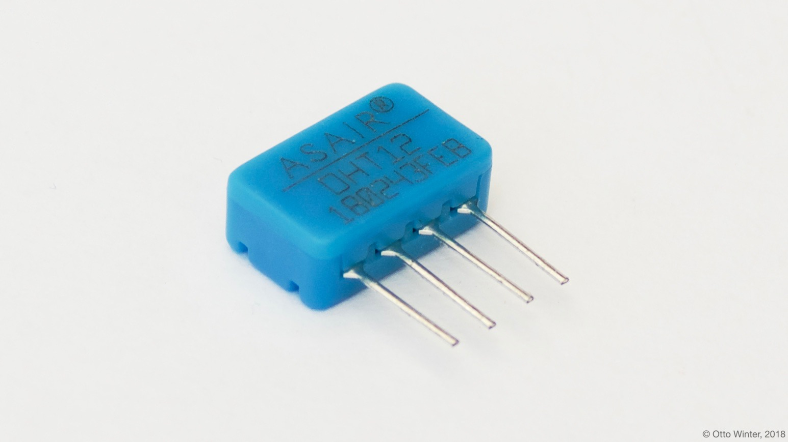

DHT12 Temperature+Humidity Sensor
=================================

.. seo::
    :description: Instructions for setting up DHT12 temperature and humidity sensors
    :image: dht12.jpg
    :keywords: dht12

The ``dht12`` Temperature+Humidity sensor allows you to use your DHT12
(`datasheet <http://www.robototehnika.ru/file/DHT12.pdf>`__,
`electrodragon`_) I²C-based sensor with ESPHome. This sensor is also called AM2320 by some sellers.

    DHT12 Temperature & Humidity Sensor.

.. _electrodragon: http://www.electrodragon.com/product/dht12/

.. figure:: images/temperature-humidity.png
    :align: center
    :width: 80.0%

.. code-block:: yaml

    # Example configuration entry
    sensor:
      - platform: dht12
        temperature:
          name: "Living Room Temperature"
        humidity:
          name: "Living Room Humidity"
        update_interval: 60s

Configuration variables:
------------------------

- **temperature** (**Required**): The information for the temperature sensor.

  - **name** (**Required**, string): The name for the temperature sensor.
  - **id** (*Optional*, :ref:`config-id`): Set the ID of this sensor for use in lambdas.
  - All other options from :ref:`Sensor <config-sensor>`.

- **humidity** (**Required**): The information for the humidity sensor

  - **name** (**Required**, string): The name for the humidity sensor.
  - **id** (*Optional*, :ref:`config-id`): Set the ID of this sensor for use in lambdas.
  - All other options from :ref:`Sensor <config-sensor>`.

- **update_interval** (*Optional*, :ref:`config-time`): The interval to check the sensor. Defaults to ``60s``.

See Also
--------

- :ref:`sensor-filters`
- :doc:`absolute_humidity`
- :doc:`dht`
- :doc:`hdc1080`
- :doc:`htu21d`
- :doc:`sht3xd`
- :apiref:`dht12/dht12.h`
- `DHT12 Library <https://github.com/dplasa/dht>`__ by `Daniel Plasa <https://github.com/dplasa>`__
- :ghedit:`Edit`
