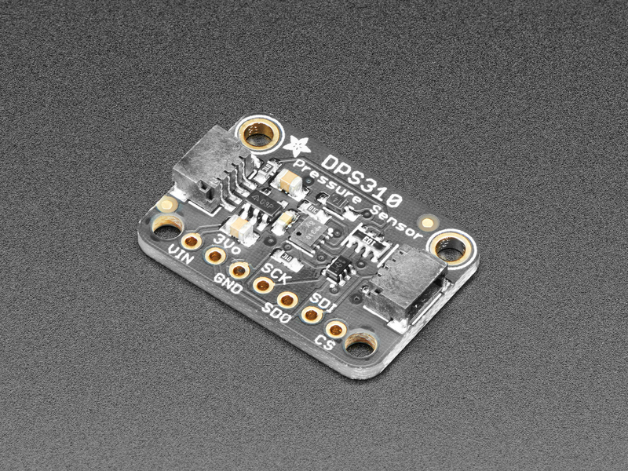

DPS310 Atmospheric Pressure Sensor
==================================

.. seo::
    :description: Instructions for setting up DPS310 atmospheric pressure sensors
    :image: dps310.jpg
    :keywords: DPS310

The ``dps310`` sensor platform allows you to use both the temperature and pressure sensors on
your DPS310 atmospheric pressure sensor (`Adafruit <https://www.adafruit.com/product/4494>`__)
with ESPHome. The :ref:`I²C <i2c>` component is required to be set up in your configuration.

    DPS310 Atmospheric Pressure Sensor board from `Adafruit <https://www.adafruit.com/product/4494>`__

.. code-block:: yaml

    # Example configuration entry
    sensor:
      - platform: dps310
        temperature:
          name: "Outside Temperature"
        pressure:
          name: "Outside Pressure"
        address: 0x77
        update_interval: 60s

Configuration variables:
------------------------

- **pressure** (**Required**): The information for the pressure sensor.

  - **name** (**Required**, string): The name for the pressure sensor.
  - **id** (*Optional*, :ref:`config-id`): Set the ID of this sensor for use in lambdas.
  - All other options from :ref:`Sensor <config-sensor>`.

- **temperature** (**Required**): The information for the temperature.
  sensor

  - **name** (**Required**, string): The name for the temperature
    sensor.
  - **id** (*Optional*, :ref:`config-id`): Set the ID of this sensor for use in lambdas.
  - All other options from :ref:`Sensor <config-sensor>`.

- **address** (*Optional*, int): Manually specify the I²C address of
  the sensor. Defaults to ``0x77``.
- **update_interval** (*Optional*, :ref:`config-time`): The interval to check the
  sensor. Defaults to ``60s``.

See Also
--------

- :ref:`sensor-filters`
- :doc:`bmp280`
- :doc:`bme680`
- :doc:`bmp085`
- :apiref:`dps310/dps310.h`
- :ghedit:`Edit`
