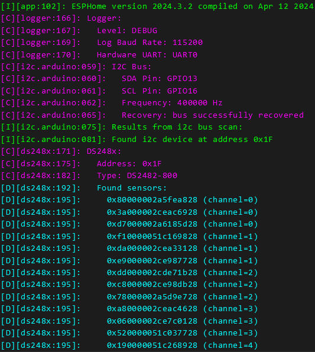

Wide 1-Wire Temperature Sensors Reliable Network
================================================

.. seo::
    :description: Instructions for setting up a wide and reliable
      temperature sensors network. For this we use components of the
      familly DS248x like DS2482-100 or DS2484 that are single channel or ds2482-800 octo channels 1-Wire Master interface
      chips over I²C.
    :keywords: ds2482-100, ds2482-800, ds2484, ds18b20, onewire

.. _ds248x-component:

Component/Hub
-------------

The ``ds248x`` component allows you to build
wide and reliable 1-Wire temperature sensors network.

It controls chips of the ds248x familly like :

- `DS2482-100 Single-Channel 1-Wire Master <https://www.artekit.eu/products/breakout-boards/io/ak-ds2482s-100/>`__
  (`datasheet <https://www.analog.com/media/en/technical-documentation/data-sheets/DS2482-100.pdf>`__)
- `DS2482-800 8-Channel 1-Wire Master <https://www.tindie.com/products/closedcube/ds2482-800-i2c-to-8-channel-1-wire-breakout-board/>`__
  (`datasheet <https://www.analog.com/media/en/technical-documentation/data-sheets/ds2482-800.pdf>`__)
- `DS2484 Single-Channel 1-Wire Master <https://www.tindie.com/products/closedcube/ds2484-i2c-to-1-channel-onewire-master-breakout/>`__
  (`datasheet <https://www.analog.com/media/en/technical-documentation/data-sheets/DS2484.pdf>`__)

To build a large and reliable 1-Wire network, a certain number of constraints must be respected.

This `document <https://www.analog.com/en/resources/technical-articles/guidelines-for-reliable-long-line-1wire-networks.html>`__ covers the subject.

My advice is as follows :

- Use category 7 network cable.
- For each 1-Wire bus, use linear network topology.
- Don't use parasite powering.
- Use 5V vcc to power the 1-Wire components.
- Use a Master 1-Wire component to fine control timings on the 1-Wire buses.

If you cannot use a linear network topology, consider user DS2482-800, so you have height 1-Wire buses to build a star + linear network topology.

If you dont use DS2484, use a level translator like
`pca9306 <https://www.dhm-online.com/fr/sparkfun/3084-sparkfun-level-translator-breakout-pca9306.html>`__
(`datasheet <https://www.ti.com/lit/ds/symlink/pca9306.pdf>`__).

First set a I²C bus:
--------------------

.. code-block:: yaml

    # I²C Bus
    i2c:
        sda: GPIO13 # set your i2c pins
        scl: GPIO16 # set your i2c pins
        frequency: 400kHz # 400 is the maximum the ds248x supports

For more informations, see :doc:`/components/i2c`.

Configure the component:
------------------------

.. code-block:: yaml

    # DS2482-100 Single-Channel 1-Wire Master
    ds248x:
        type: ds2482-100
        address: 0x18
        active_pullup: true
        strong_pullup: false
        bus_sleep: false
        update_interval: 10s

    # DS2482-800 8-Channel 1-Wire Master
    ds248x:
        type: ds2482-800
        address: 0x18
        active_pullup: true
        strong_pullup: false
        bus_sleep: false
        update_interval: 10s

    # DS2484 Single-Channel 1-Wire Master
    ds248x:
        type: ds2484
        address: 0x18
        active_pullup: true
        strong_pullup: false
        bus_sleep: false
        update_interval: 10s

Configuration variables:
************************

- **type** (**Required**, enum): Can be ``ds2482-100``, ``ds2482-800`` or ``ds2484``.
- **address** (*Optional*, int): Manually specify the I²C address of the component.
  Defaults to ``0x18``.
- **sleep_pin** (*Optional*, :ref:`Pin <config-pin>`): ``ds2484`` support Power-Saving Sleep Mode (SLPZ Pin).
  If set the ``ds248x`` sleeps when no transaction is in progress.
- **bus_sleep** (*Optional*, boolean): ``ds2484`` support 1-Wire Power Down.
  Set to true to control.
  Defaults to false.
- **hub_sleep** (*Optional*, boolean): Defaults to false.
- **active_pullup** (*Optional*, boolean): Adds an active pullup which should improve signal integrity.
  Defaults to false.
- **strong_pullup** (*Optional*, boolean): Enables a strong pullup used to provide the needed current
  for temperature reading without vcc connected (parasite powering).
  Defaults to false.
- **update_interval** (*Optional*, :ref:`config-time`): The interval that the sensors should be checked.
  Defaults to 60 seconds.
- **id** (*Optional*, :ref:`config-id`): Manually specify the ID used for code generation.

Sensors
-------

.. _ds248x-sensor:

The ``ds248x`` hub allows you to use DS18B20 and similar sensors.

To initialize a sensor, first supply either ``address`` **or** ``index`` to identify the sensor.

.. figure:: images/dallas-wired.jpg
    :align: center
    :width: 50.0%

    Wired Version of the DS18B20 1-Wire Temperature Sensor.

.. _Adafruit: https://www.adafruit.com/product/374

.. figure:: images/temperature.png
    :align: center
    :width: 80.0%

.. code-block:: yaml

    sensor:

        - platform: ds248x
          address: 0x80000002a5fea828
          channel: 0
          name: "Livingroom Temperature"
          resolution: 12

Configuration variables:
************************

- **address** (**Required**, int): The address of the sensor. Use either
  this option or index.
- **index** (**Required**, int): The index of the sensor starting with 0.
  So the first sensor will for example have index 0. :ref:`It’s recommended
  to use address instead <ds248x-getting-ids>`.
- **channel** (*Optional*, int): An optional 1-Wire channel (ds2482-800 has height channels) from 0 to 7.
  Defaults to 0.
- **resolution** (*Optional*, int): An optional resolution from 9 to
  12. Higher means more accurate. Defaults to the maximum for most Dallas temperature sensors: 12.
- **dallas_id** (*Optional*, :ref:`config-id`): The ID of the :ref:`ds248x hub <ds248x-component>`.
  Use this if you have multiple dallas hubs.
- **id** (*Optional*, :ref:`config-id`): Manually specify the ID used for code generation.
- All other options from :ref:`Sensor <config-sensor>`.

.. _ds248x-getting-ids:

Getting Sensor IDs
******************

It is highly recommended to use the ``address`` attribute for creating
ds248x sensors, because if you have multiple sensors on a bus and the
automatic sensor discovery fails, all sensors indices will be shifted by
one. In order to get the address, simply start the firmware on your
device with a configured ds248x hub and observe the log output (the :ref:`log
level <logger-log_levels>` must be set to at least
``debug``!). Note that you don't need to define the individual sensors just yet, as
the scanning will happen even with no sensors connected. For example with this configuration:

.. code-block:: yaml

    # Example without sensors
    ds248x:
        type: ds2482-800
        address: 0x1f
        active_pullup: true
        strong_pullup: false
        bus_sleep: false
        update_interval: 10s

    # Note you don't have to add any sensors at this point

You will find something like this:

Now we can add the individual sensors to our configuration:

.. code-block:: yaml

    # Example with 2 sensors from the previous list
    ds248x:
        type: ds2482-800
        address: 0x18
        active_pullup: true
        strong_pullup: false
        bus_sleep: false
        update_interval: 10s

    sensor:
      - platform: ds248x
        address: 0x80000002a5fea828
        channel: 0
        name: "Temperature #1"
      - platform: ds248x
        address: 0xf10000051c169828
        channel: 1
        name: "Temperature #2"

        # ...

Next, individually warm up or cool down the sensors and observe the log again.
You will see the outputted sensor values changing when they're being warmed.
When you're finished mapping each address to a name, just change the ``Temperature #1``
to your assigned names and you should be ready.

Multiple ds248x hubs
********************

For example, on the ds2482-800, you can set the bits ``AD0``, ``AD1`` and ``AD2`` of the address of this I²C component.
This give you height addresses from ``0x18`` to ``0X1F``.

Use this if you have multiple ds248x hubs on your I²C bus:

.. code-block:: yaml

    # Example configuration entry
    ds248x:
      - type: ds2482-800
        id: hub_1
        address: 0x18
        active_pullup: true
        strong_pullup: false
        bus_sleep: false
        update_interval: 10s

      - type: ds2482-800
        id: hub_2
        address: 0x19
        active_pullup: true
        strong_pullup: false
        bus_sleep: false
        update_interval: 10s

    sensor:
      - platform: ds248x
        dallas_id: hub_1
        # ...
      - platform: ds248x
        dallas_id: hub_2
        # ...

See Also
--------

- :ref:`sensor-filters`
- :doc:`max6675`
- `Arduino DallasTemperature library <https://github.com/milesburton/Arduino-Temperature-Control-Library>`__
  by `Miles Burton <https://github.com/milesburton>`__
- :apiref:`dallas/dallas_component.h`
- :ghedit:`Edit`
- `Guidelines for Reliable Long Line 1-Wire Networks <https://www.analog.com/en/technical-articles/guidelines-for-reliable-long-line-1wire-networks.html>`__
