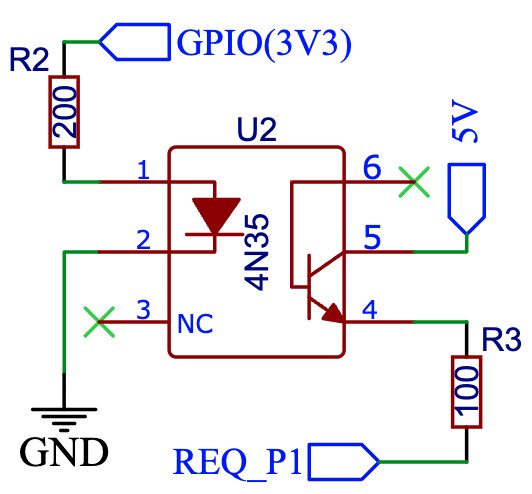

DSMR Component
==============

.. seo::
    :description: Instructions for setting up DSMR Meter component in ESPHome.
    :image: dsmr.svg

Component/Hub
-------------

The DSMR component connects to Dutch Smart Meters which comply to DSMR (Dutch Smart Meter
Requirements), also known as ‘Slimme meter’ or ‘P1 port’.

This component supports plain non encrypted telegrams and also encrypted as used in Luxembourg.
In case your equipment has encryption you must get a 32 character long encryption key from your energy company.

This component is passive, it does not transmit any data to your equipment, the equipment always transmits
data which this component decodes and updates the configured sensors at the pace the data is received.

- For official information about DSMR refer to: `DSMR Document <https://www.netbeheernederland.nl/dossiers/slimme-meter-15>`__
- For official information about the P1 port refer to: `P1 Companion Standard <https://www.netbeheernederland.nl/_upload/Files/Slimme_meter_15_a727fce1f1.pdf>`__

.. code-block:: yaml

    # Example configuration entry
    dsmr:
      decryption_key: !secret decryption_key

    sensor:
      - platform: dsmr
        energy_delivered_tariff1:
          name: Energy Consumed Tariff 1

    text_sensor:
      - platform: dsmr
        identification:
          name: "DSMR Identification"
        p1_version:
          name: "DSMR Version"

Configuration variables:

- **decryption_key** (*Optional*, string, :ref:`templatable <config-templatable>`, 32 characters, case insensitive): The key to decrypt the
  telegrams. Used in Lux only.
- **gas_mbus_id** (*Optional*, int): The id of the gas meter. Defaults to ``1``.
- **crc_check** (*Optional*, boolean): Specifies if the CRC check must be done. This is required to be set to false for
  older DSMR versions as they do not provide a CRC. Defaults to ``true``.
- **max_telegram_length** (*Optional*, integer): The size of the buffer used for reading DSMR telegrams. Increase
  if you are reading from a smart meter that sends large telegrams. Defaults to ``1500``.
- **uart_id** (*Optional*, :ref:`config-id`): Manually specify the ID of the UART hub.
- **request_pin** (*Optional*, :ref:`Pin Schema <config-pin_schema>`): The pin that can be used for controlling
  the P1 port's Data Request pin. Defaults to not using a Data Request pin.
  See :ref:`Using the P1 Data Request pin <sensor-dsmr-request_pin>`.
- **request_interval** (*Optional*, :ref:`config-time`): The minimum time between two telegram readings.
  Defaults to ``0ms``, meaning that the pace at which the smart meter sends its data determines the update frequency.
  This works best in combination with a ``request_pin``, but this option will work without one too.
- **receive_timeout** (*Optional*, :ref:`config-time`): The timeout on incoming data while reading a telegram.
  When no new data arrive within the given timeout, the device will consider the current telegram a loss and
  starts looking for the header of the next telegram. Defaults to ``200ms``.
- **id** (*Optional*, :ref:`config-id`): Manually specify the ID of the DSMR if you have multiple components.

Sensor
------

.. note:: Not all sensors are available on all devices.

Country specific sensors are listed last.

Configuration variables:

- **energy_delivered_tariff1** (*Optional*): Energy Consumed Tariff 1.

  - **name** (**Required**, string): The name for the energy_delivered_tariff1 sensor.
  - **id** (*Optional*, :ref:`config-id`): Set the ID of this sensor for use in lambdas.
  - All other options from :ref:`Sensor <config-sensor>`.

- **energy_delivered_tariff2** (*Optional*): Energy Consumed Tariff 2.

  - **name** (**Required**, string): The name for the energy_delivered_tariff2 sensor.
  - **id** (*Optional*, :ref:`config-id`): Set the ID of this sensor for use in lambdas.
  - All other options from :ref:`Sensor <config-sensor>`.

- **energy_returned_tariff1** (*Optional*): Energy Produced Tariff 1.

  - **name** (**Required**, string): The name for the energy_returned_tariff1 sensor.
  - **id** (*Optional*, :ref:`config-id`): Set the ID of this sensor for use in lambdas.
  - All other options from :ref:`Sensor <config-sensor>`.

- **energy_returned_tariff2** (*Optional*): Energy Produced Tariff 2.

  - **name** (**Required**, string): The name for the energy_returned_tariff2 sensor.
  - **id** (*Optional*, :ref:`config-id`): Set the ID of this sensor for use in lambdas.
  - All other options from :ref:`Sensor <config-sensor>`.

- **power_delivered** (*Optional*): Power Consumed.

  - **name** (**Required**, string): The name for the power_delivered sensor.
  - **id** (*Optional*, :ref:`config-id`): Set the ID of this sensor for use in lambdas.
  - All other options from :ref:`Sensor <config-sensor>`.

- **power_returned** (*Optional*): Power Produced.

  - **name** (**Required**, string): The name for the power_returned sensor.
  - **id** (*Optional*, :ref:`config-id`): Set the ID of this sensor for use in lambdas.
  - All other options from :ref:`Sensor <config-sensor>`.

- **electricity_failures** (*Optional*): Electricity Failures.

  - **name** (**Required**, string): The name for the electricity_failures sensor.
  - **id** (*Optional*, :ref:`config-id`): Set the ID of this sensor for use in lambdas.
  - All other options from :ref:`Sensor <config-sensor>`.

- **electricity_long_failures** (*Optional*): Long Electricity Failures.

  - **name** (**Required**, string): The name for the electricity_long_failures sensor.
  - **id** (*Optional*, :ref:`config-id`): Set the ID of this sensor for use in lambdas.
  - All other options from :ref:`Sensor <config-sensor>`.

- **electricity_sags_l1** (*Optional*): Number of voltage sags in phase L1.

  - **name** (**Required**, string): The name for the electricity_sags_l1 sensor.
  - **id** (*Optional*, :ref:`config-id`): Set the ID of this sensor for use in lambdas.
  - All other options from :ref:`Sensor <config-sensor>`.

- **electricity_sags_l2** (*Optional*): Number of voltage sags in phase L2.

  - **name** (**Required**, string): The name for the electricity_sags_l2 sensor.
  - **id** (*Optional*, :ref:`config-id`): Set the ID of this sensor for use in lambdas.
  - All other options from :ref:`Sensor <config-sensor>`.

- **electricity_sags_l3** (*Optional*): Number of voltage sags in phase L3.

  - **name** (**Required**, string): The name for the electricity_sags_l3 sensor.
  - **id** (*Optional*, :ref:`config-id`): Set the ID of this sensor for use in lambdas.
  - All other options from :ref:`Sensor <config-sensor>`.

- **electricity_swells_l1** (*Optional*): Number of voltage swells in phase L1.

  - **name** (**Required**, string): The name for the electricity_swells_l1 sensor.
  - **id** (*Optional*, :ref:`config-id`): Set the ID of this sensor for use in lambdas.
  - All other options from :ref:`Sensor <config-sensor>`.

- **electricity_swells_l2** (*Optional*): Number of voltage swells in phase L2.

  - **name** (**Required**, string): The name for the electricity_swells_l2 sensor.
  - **id** (*Optional*, :ref:`config-id`): Set the ID of this sensor for use in lambdas.
  - All other options from :ref:`Sensor <config-sensor>`.

- **electricity_swells_l3** (*Optional*): Number of voltage swells in phase L3.

  - **name** (**Required**, string): The name for the electricity_swells_l3 sensor.
  - **id** (*Optional*, :ref:`config-id`): Set the ID of this sensor for use in lambdas.
  - All other options from :ref:`Sensor <config-sensor>`.

- **voltage_l1** (*Optional*): Voltage Phase 1.

  - **name** (**Required**, string): The name for the voltage_l1 sensor.
  - **id** (*Optional*, :ref:`config-id`): Set the ID of this sensor for use in lambdas.
  - All other options from :ref:`Sensor <config-sensor>`.

- **voltage_l2** (*Optional*): Voltage Phase 2.

  - **name** (**Required**, string): The name for the voltage_l2 sensor.
  - **id** (*Optional*, :ref:`config-id`): Set the ID of this sensor for use in lambdas.
  - All other options from :ref:`Sensor <config-sensor>`.

- **voltage_l3** (*Optional*): Voltage Phase 3.

  - **name** (**Required**, string): The name for the voltage_l3 sensor.
  - **id** (*Optional*, :ref:`config-id`): Set the ID of this sensor for use in lambdas.
  - All other options from :ref:`Sensor <config-sensor>`.

- **current_l1** (*Optional*): Current Phase 1.

  - **name** (**Required**, string): The name for the current_l1 sensor.
  - **id** (*Optional*, :ref:`config-id`): Set the ID of this sensor for use in lambdas.
  - All other options from :ref:`Sensor <config-sensor>`.

- **current_l2** (*Optional*): Current Phase 2.

  - **name** (**Required**, string): The name for the current_l2 sensor.
  - **id** (*Optional*, :ref:`config-id`): Set the ID of this sensor for use in lambdas.
  - All other options from :ref:`Sensor <config-sensor>`.

- **current_l3** (*Optional*): Current Phase 3.

  - **name** (**Required**, string): The name for the current_l3 sensor.
  - **id** (*Optional*, :ref:`config-id`): Set the ID of this sensor for use in lambdas.
  - All other options from :ref:`Sensor <config-sensor>`.

- **power_delivered_l1** (*Optional*): Power Consumed Phase 1.

  - **name** (**Required**, string): The name for the power_delivered_l1 sensor.
  - **id** (*Optional*, :ref:`config-id`): Set the ID of this sensor for use in lambdas.
  - All other options from :ref:`Sensor <config-sensor>`.

- **power_delivered_l2** (*Optional*): Power Consumed Phase 2.

  - **name** (**Required**, string): The name for the power_delivered_l2 sensor.
  - **id** (*Optional*, :ref:`config-id`): Set the ID of this sensor for use in lambdas.
  - All other options from :ref:`Sensor <config-sensor>`.

- **power_delivered_l3** (*Optional*): Power Consumed Phase 3.

  - **name** (**Required**, string): The name for the power_delivered_l3 sensor.
  - **id** (*Optional*, :ref:`config-id`): Set the ID of this sensor for use in lambdas.
  - All other options from :ref:`Sensor <config-sensor>`.

- **power_returned_l1** (*Optional*): Power Produced Phase 1.

  - **name** (**Required**, string): The name for the power_returned_l1 sensor.
  - **id** (*Optional*, :ref:`config-id`): Set the ID of this sensor for use in lambdas.
  - All other options from :ref:`Sensor <config-sensor>`.

- **power_returned_l2** (*Optional*): Power Produced Phase 2.

  - **name** (**Required**, string): The name for the power_returned_l2 sensor.
  - **id** (*Optional*, :ref:`config-id`): Set the ID of this sensor for use in lambdas.
  - All other options from :ref:`Sensor <config-sensor>`.

- **power_returned_l3** (*Optional*): Power Produced Phase 3.

  - **name** (**Required**, string): The name for the power_returned_l3 sensor.
  - **id** (*Optional*, :ref:`config-id`): Set the ID of this sensor for use in lambdas.
  - All other options from :ref:`Sensor <config-sensor>`.

- **gas_delivered** (*Optional*): Gas Consumed.

  - **name** (**Required**, string): The name for the gas_delivered sensor.
  - **id** (*Optional*, :ref:`config-id`): Set the ID of this sensor for use in lambdas.
  - All other options from :ref:`Sensor <config-sensor>`.

Belgium

- **gas_delivered_be** (*Optional*): Gas Consumed Belgium.

  - **name** (**Required**, string): The name for the gas_delivered_be sensor.
  - **id** (*Optional*, :ref:`config-id`): Set the ID of this sensor for use in lambdas.
  - All other options from :ref:`Sensor <config-sensor>`.

- **active_energy_import_current_average_demand** (*Optional*): Current Average Quarterly Demand for Peak Tarrif Belgium.

  - **name** (**Required**, string): The name for the active_energy_import_current_average_demand sensor.
  - **id** (*Optional*, :ref:`config-id`): Set the ID of this sensor for use in lambdas.
  - All other options from :ref:`Sensor <config-sensor>`.

- **active_energy_import_maximum_demand_running_month** (*Optional*): Current Month's Maximum Quarterly Demand for Peak Tarrif Belgium.

  - **name** (**Required**, string): The name for the active_energy_import_maximum_demand_running_month sensor.
  - **id** (*Optional*, :ref:`config-id`): Set the ID of this sensor for use in lambdas.
  - All other options from :ref:`Sensor <config-sensor>`.

- **active_energy_import_maximum_demand_last_13_months** (*Optional*): 13 Month Maximum Quarterly Demand for Peak Tarrif Belgium.

  - **name** (**Required**, string): The name for the active_energy_import_maximum_demand_last_13_months sensor.
  - **id** (*Optional*, :ref:`config-id`): Set the ID of this sensor for use in lambdas.
  - All other options from :ref:`Sensor <config-sensor>`.

Luxembourg

- **energy_delivered_lux** (*Optional*): Energy Consumed Luxembourg

  - **name** (**Required**, string): The name for the energy_delivered_lux sensor.
  - **id** (*Optional*, :ref:`config-id`): Set the ID of this sensor for use in lambdas.
  - All other options from :ref:`Sensor <config-sensor>`.

- **energy_returned_lux** (*Optional*): Energy Produced Luxembourg

  - **name** (**Required**, string): The name for the energy_returned_lux sensor.
  - **id** (*Optional*, :ref:`config-id`): Set the ID of this sensor for use in lambdas.
  - All other options from :ref:`Sensor <config-sensor>`.

Text Sensor
-----------

Configuration variables:

- **identification** (*Optional*): DSMR Identification

  - **name** (**Required**, string): The name for the identification text sensor.
  - **id** (*Optional*, :ref:`config-id`): Set the ID of this sensor for use in lambdas.
  - All other options from :ref:`Text Sensor <config-text_sensor>`.

- **p1_version** (*Optional*): DSMR Version

  - **name** (**Required**, string): The name for the p1_version text sensor.
  - **id** (*Optional*, :ref:`config-id`): Set the ID of this sensor for use in lambdas.
  - All other options from :ref:`Text Sensor <config-text_sensor>`.

- **timestamp** (*Optional*): Timestamp

   - **name** (**Required**, string): The name for the timestamp sensor.
   - **id** (*Optional*, :ref:`config-id`): Set the ID of this sensor for use in lambdas.
   - All other options from :ref:`Text Sensor <config-text_sensor>`.

- **electricity_tariff** (*Optional*): The current tariff. According to the specs value
  '0001' means 'normal tariff' and value '0002' means 'low tariff'. Your meter may report differently.

   - **name** (**Required**, string): The name for the electricity_tariff sensor.
   - **id** (*Optional*, :ref:`config-id`): Set the ID of this sensor for use in lambdas.
   - All other options from :ref:`Text Sensor <config-text_sensor>`.

- **electricity_failure_log** (*Optional*): Electricity Failure Log

   - **name** (**Required**, string): The name for the electricity_failure_log sensor.
   - **id** (*Optional*, :ref:`config-id`): Set the ID of this sensor for use in lambdas.
   - All other options from :ref:`Text Sensor <config-text_sensor>`.

- **message_short** (*Optional*): Message Short

   - **name** (**Required**, string): The name for the message_short sensor.
   - **id** (*Optional*, :ref:`config-id`): Set the ID of this sensor for use in lambdas.
   - All other options from :ref:`Text Sensor <config-text_sensor>`.

- **message_long** (*Optional*): Message Long

   - **name** (**Required**, string): The name for the message_long sensor.
   - **id** (*Optional*, :ref:`config-id`): Set the ID of this sensor for use in lambdas.
   - All other options from :ref:`Text Sensor <config-text_sensor>`.

- **gas_equipment_id** (*Optional*): Gas Equipment ID.

   - **name** (**Required**, string): The name for the gas_equipment_id sensor.
   - **id** (*Optional*, :ref:`config-id`): Set the ID of this sensor for use in lambdas.
   - All other options from :ref:`Text Sensor <config-text_sensor>`.

- **water_equipment_id** (*Optional*): Water Equipment ID

   - **name** (**Required**, string): The name for the water_equipment_id sensor.
   - **id** (*Optional*, :ref:`config-id`): Set the ID of this sensor for use in lambdas.
   - All other options from :ref:`Text Sensor <config-text_sensor>`.

- **sub_equipment_id** (*Optional*): Sub Equipment ID

   - **name** (**Required**, string): The name for the sub_equipment_id sensor.
   - **id** (*Optional*, :ref:`config-id`): Set the ID of this sensor for use in lambdas.
   - All other options from :ref:`Text Sensor <config-text_sensor>`.

- **gas_delivered_text** (*Optional*): A text sensor which unformatted gas data. You need to
  apply a custom parsing of this value depending on your meter format.

  - **name** (**Required**, string): The name for the p1_version text sensor.
  - **id** (*Optional*, :ref:`config-id`): Set the ID of this sensor for use in lambdas.
  - All other options from :ref:`Text Sensor <config-text_sensor>`.

Belgium

- **p1_version_be** (*Optional*): DSMR Version Belgium

  - **name** (**Required**, string): The name for the p1_version_be text sensor.
  - **id** (*Optional*, :ref:`config-id`): Set the ID of this sensor for use in lambdas.
  - All other options from :ref:`Text Sensor <config-text_sensor>`.

Older DSMR meters support
-------------------------

Version 2.2 is supported with the following configuration:

.. code-block:: yaml

    # Custom uart settings for DSMR v2.2
    uart:
      baud_rate: 9600
      data_bits: 7
      parity: NONE
      stop_bits: 1

    dsmr:
      crc_check: false

    sensor:
      - platform: dsmr
        energy_delivered_tariff1:
          name: dsmr_energy_delivered_tariff1
        energy_delivered_lux:
          name: dsmr_energy_delivered_tarifflux

    text_sensor:
      - platform: dsmr
        identification:
          name: "dsmr_identification"
        p1_version:
          name: "dsmr_p1_version"
        gas_delivered_text:
          name: "gas delivered raw"

.. _sensor-dsmr-request_pin:

P1 Data Request pin
-------------------

From the P1 companion guide: The P1 port is activated (start sending data) by setting "Data Request" line high
(to +5V). While receiving data, the requesting OSM must keep the "Data Request" line activated (set to +5V).
To stop receiving data OSM needs to drop "Data Request" line (set it to "high impedance" mode). Data transfer
will stop immediately in such case.

**Advantages when using a request pin:**

- After reading a telegram, the dsmr component will stop the data transfer until the telegram has been
  fully processed. This separates retrieving and processing data and can thus be seen as a form of
  hardware flow control.
- The interval at which sensor readings must be updated can be controlled cleanly by only starting a data
  transfer when needed. This configuration option ``request_interval`` can be used to define this interval.

**Required hardware support**

Many DSMR reader circuits link the +5V pin of the P1 port directly to its Data Request pin. Doing this will
make the smart meter send telegrams at a pace as defined by the smart meter firmware. For example many
DSMR v5 meters will send a telegram every second.
*Circuits that use this type of wiring cannot make use of the* ``request_pin`` *option.*

However, when a circuit is used that allows switching the Data Request pin between +5V and high impedance
mode from a GPIO, then this GPIO can be configured as the ``request_pin``.

Best results have been achieved by using an optocoupler circuit to handle the switching. Direct GPIO output
or a transistor-based circuit are not feasible options. Here's an example circuit design:

When using a type of MCU that provides 5V on the GPIO outputs instead of 3.3V, then use a 330 Ohm
resistor instead of the 200 Ohm resistor.

.. _sensor-dsmr-improving_reader_results:

Improving reader results
------------------------

When telegrams are sometimes missed or when you get a lot of CRC errors, then you might have to do some
changes to get better reader results.

It is recommended to set the ``rx_buffer_size`` option of the UART bus to at least the maximum telegram size,
which defaults to 1500 bytes. The default UART read buffer is quite small an can easily overflow, causing
bytes of data getting lost.

.. code-block:: yaml

    # Example configuration
    uart:
      pin: D7
      baud_rate: 115200
      rx_buffer_size: 1700

    dsmr:
      max_telegram_length: 1700

It's best when a hardware UART is used for reading the P1 data. Whether or not hardware UART is used can
be checked in the config dump that you get when connecting to the API logger. Example logging output:

.. code-block:: text

    [02:38:37][C][uart.arduino_esp8266:095]: UART Bus:
    [02:38:37][C][uart.arduino_esp8266:097]:   RX Pin: GPIO13
    [02:38:37][C][uart.arduino_esp8266:099]:   RX Buffer Size: 1500
    [02:38:37][C][uart.arduino_esp8266:101]:   Baud Rate: 115200 baud
    [02:38:37][C][uart.arduino_esp8266:102]:   Data Bits: 8
    [02:38:37][C][uart.arduino_esp8266:103]:   Parity: NONE
    [02:38:37][C][uart.arduino_esp8266:104]:   Stop bits: 1
    [02:38:37][C][uart.arduino_esp8266:106]:   Using hardware serial interface.
                                               ^^^^^^^^^^^^^^^^^^^^^^^^^^^^^^^^

When using an ESP8266, then GPIO13 (e.g. pin D7 on a D1 Mini) can be used for hardware RX. However, to
actually make it work, serial logging must be disabled to keep the hardware UART available for D7.

.. code-block:: yaml

    # Example configuration for ESP8266
    logger:
      baud_rate: 0
      level: DEBUG

    uart:
      pin: GPIO13
      baud_rate: 115200

See Also
--------

- :apiref:`dsmr/dsmr.h`
- :ghedit:`Edit`
