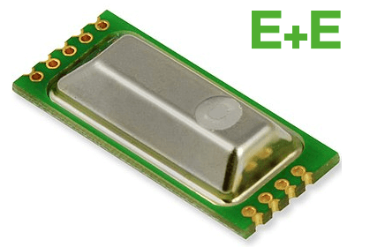

EE895 CO₂, Temperature and Pressure Sensor
===================================================

.. seo::
    :description: Instructions for setting up EE895 CO₂ Temperature and Pressure
    :image: EE895.png

The ``ee895`` sensor platform allows you to use your EE895 CO₂
(`datasheet <https://www.epluse.com/fileadmin/data/product/ee895/BA_EE895.pdf>`__,
`E+E EE895 <https://www.epluse.com/products/co2-measurement/co2-modules-and-probes/ee895/>`__) sensor with ESPHome.
The :ref:`I²C Bus <i2c>` is required to be set up in your configuration for this sensor to work. We recommend the use of pull up resistors.

.. code-block:: yaml

    # Example configuration entry
    sensor:
      - platform: ee895
        co2:
          name: "Office CO2"
          accuracy_decimals: 0
        temperature:
          name: "Office Temperature"
          accuracy_decimals: 2
        pressure:
          name: "Office Pressure"
          accuracy_decimals: 1
        address: 0x5F
        update_interval: 15s

Configuration variables:
------------------------

- **temperature** (**Required**): The information for the Temperature sensor.

  - **name** (**Required**, string): The name for the temperature sensor.
  - **id** (*Optional*, :ref:`config-id`): Set the ID of this sensor for use in lambdas.
  - All other options from :ref:`Sensor <config-sensor>`.

- **co2** (**Required**): The information for the CO₂ sensor.

  - **name** (**Required**, string): The name for the CO₂eq sensor.
  - **id** (*Optional*, :ref:`config-id`): Set the ID of this sensor for use in lambdas.
  - All other options from :ref:`Sensor <config-sensor>`.

- **pressure** (**Required**): The information for the Pressure sensor.

  - **name** (**Required**, string): The name for the Pressure sensor.
  - **id** (*Optional*, :ref:`config-id`): Set the ID of this sensor for use in lambdas.
  - All other options from :ref:`Sensor <config-sensor>`.

- **address** (*Optional*, int): Manually specify the I²C address of the sensor.
  Defaults to ``0x5F``.

- **update_interval** (*Optional*, :ref:`config-time`): The interval to check the
  sensor. Defaults to ``60s``.

See Also
--------

- :ref:`sensor-filters`
- :doc:`tee501`
- :doc:`hte501`
- :doc:`dht`
- :doc:`dht12`
- :apiref:`ee895/ee895.h`
- :ghedit:`Edit`
