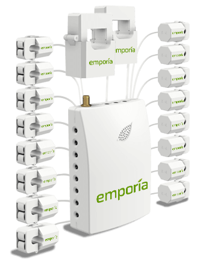

Emporia Vue 2
=====================

.. seo::
    :description: Instructions for setting up a Emporia Vue 2
    :image: emporia-vue-2-only.png

The ``emporia_vue`` sensor platform allows you to use a Emporia Vue 2
(`more info <https://www.emporiaenergy.com/how-the-vue-energy-monitor-works>`__)
with ESPHome.

The energy monitoring co-processor communicates via :ref:`I2C <i2c>`.

.. warning::

    This component currently only support the Emporia Vue 2. The Emporia Vue is not yet supported.

.. code-block:: yaml

    # Example configuration entry
    i2c:
      sda: 21
      scl: 22
      scan: false        # Scanning is not needed
      frequency: 200kHz  # recommended range is 50-200kHz
      id: i2c_a
      
    sensor:
      - platform: emporia_vue
        i2c_id: i2c_a
        phases:
          - id: phase_a
            input: BLACK
            voltage: 
              name: "Phase A Voltage"
          - id: phase_c
            input: RED
            voltage: 
              name: "Phase C Voltage"
        ct_clamps:
          - name: "A"
            phase_id: phase_a
            input: "A"
          - name: "C"
            phase_id: phase_c
            input: "C"
          - name: "1"
            phase_id: phase_a
            input: "1"
          - name: "2"
            phase_id: phase_a
            input: "2"
          - name: "3"
            phase_id: phase_a
            input: "3"
            
Configuration variables:
------------------------

- **id** (*Optional*, :ref:`config-id`): Manually specify the ID used for code generation.
- **i2c_id** (*Optional*, :ref:`config-id`): Manually specify the ID of the :doc:`../i2c` if you want to use multiple i2c buses.
- **name** (**Required**, string): The name of the emporia device.
- **sensor_poll_interval** (*Optional*, :ref:`config-time`): Time between i2c requests to the co-processor. Defaults to ``240ms``.
- **phases** (**Required**, list): Connected phases.

  - **id** (**Required**, :ref:`config-id`): Specify the ID used for code generation.
  - **input** (**Required**, enum): The color of the wire connected to the phase. The valid options are :

    - ``BLACK``
    - ``RED``
    - ``BLUE``

  - **calibration** (*Optional*, float): The calibration value for that phase. Defaults to ``0.022``.
  - **voltage** (*Optional*): The information for the current voltage.

    - **name** (**Required**, string): The name of the sensor.
    - **id** (*Optional*, :ref:`config-id`): Set the ID of this sensor for use in lambdas.
    - All other options from :ref:`Sensor <config-sensor>`.

- **ct_clamps** (**Required**, list): Connected ct clamps.
  
  - **id** (*Optional*, :ref:`config-id`): Manually specify the ID used for code generation.
  - **phase_id** (**Required**, :ref:`config-id`): ID of the phase on which the CT clamp is connected on.
  - **input** (**Required**, enum): CT input number. The valid options are :

    - ``A`` , ``B`` , ``C`` , ``1`` , ``2`` , ``3`` , ``4`` , ``5`` , ``6`` , ``7`` , ``8`` , ``9`` , ``10`` , ``11`` , ``12`` , ``13`` , ``14`` , ``15`` , ``16`` 
 
  - All other options from :ref:`Sensor <config-sensor>`.

Acknowledgments:
----------------

Thanks to the following people for their contributions to reverse engineering the I2C protocol and source code in the following repositorie:

* `Flaviu Tamas & Kodey Converse <https://github.com/flaviut/emporia-vue2-reversing>`_

See Also
--------

- :doc:`/components/sensor/index`
- :apiref:`emporia_vue/emporia_vue.h`
- :ref:`i2c`
- :ghedit:`Edit`
