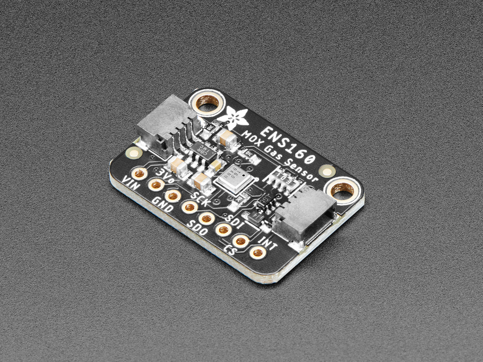

ENS160 Sensor
=============

.. seo::
    :description: Instructions for setting up ENS160 air-quality sensors
    :keywords: ENS160

The ``ens160`` sensor platform allows you to use your ENS160
(`datasheet <https://www.sciosense.com/wp-content/uploads/documents/SC-001224-DS-9-ENS160-Datasheet.pdf>`__) air-quality sensors with ESPHome. The :ref:`I²C <i2c>` component is
required to be set up in your configuration for this sensor to work.

.. note::

    On first power-up of the ENS160 sensor, there is a 1 hour initial startup delay before readings will be available.
    For subsequent starts or reboots, there is a 3 minute warm up period before readings are available. Also, be aware that the 
    ENS160 can take up to 1 second for sucessive data measurements to be ready.
    

    ENS160 Air Quality Sensor.

.. code-block:: yaml

    # Example configuration entry
    sensor:
      - platform: ens160
        eco2:
          name: "ENS160 eCO2"
        tvoc:
          name: "ENS160 Total Volatile Organic Compounds"
        aqi:
          name: "ENS160 Air Quality Index"
        update_interval: 60s  
        address: 0x53
        compensation:
          temperature: id_temperature_sensor
          humidity: id_humidity_sensor
        

Configuration variables:
------------------------

- **eco2** (**Required**): Configuration for the eCO2 sensor.

  - **name** (**Required**, string): The name for the eCO2 sensor.
  - **id** (*Optional*, :ref:`config-id`): Set the ID of this sensor for use in lambdas.
  - All other options from :ref:`Sensor <config-sensor>`.

- **tvoc** (**Required**): Configuration for the TVOC sensor.

  - **name** (**Required**, string): The name for the TVOC sensor.
  - **id** (*Optional*, :ref:`config-id`): Set the ID of this sensor for use in lambdas.
  - All other options from :ref:`Sensor <config-sensor>`.

- **aqi** (*Optional*): Configuration for the air quality index sensor.

  - **name** (**Required**, string): The name for the AQI sensor.
  - **id** (*Optional*, :ref:`config-id`): Set the ID of this sensor for use in lambdas.
  - All other options from :ref:`Sensor <config-sensor>`.

- **update_interval** (*Optional*, :ref:`config-time`): The interval to check the
  sensor. Defaults to ``60s``. The update interval should be greater than the measurement
  frequency of the ENS160 which is up to 1 second.

Advanced:

- **address** (*Optional*, int): Manually specify the I²C address of
  the sensor. Defaults to ``0x53``. Another address can be ``0x52``.
 
- **compensation** (*Optional*): The block containing sensors used for compensation. 
  Temperature and humidity compensation improves the accuracy of sensor readings. Without compensation, the
  ENS160 internally assumes 25°C temperature and 50% humidity, with readings noticeably diverting from real changes without compensation in temperature and humidity.
  
  - **temperature** (**Required**, :ref:`config-id`): The ID of an external temperature sensor.
  - **humidity** (**Required**, :ref:`config-id`): The ID of an external humidity sensor.
    
Example Text Sensor configuration
---------------------------------

The Air Quality Index(AQI) from this sensor is a number between 1 and 5. The ENS160
(`datasheet <https://www.sciosense.com/wp-content/uploads/documents/SC-001224-DS-7-ENS160-Datasheet.pdf>`__) states that
"The AQI-UBA air quality index is derived from a guideline by the German Federal Environmental
Agency based on a TVOC sum signal". The following is an example configuration to convert the numeric ENS160 AQI to the rating text. 

.. code-block:: yaml

    text_sensor:
      - platform: template
        name: "ENS160 Air Quality Rating"
        lambda: |-
          switch ( (int) (id(ens160_air_quality_index).state) ) {
            case 1: return {"Excellent"};
            case 2: return {"Good"};
            case 3: return {"Moderate"};
            case 4: return {"Poor"};
            case 5: return {"Unhealthy"}; 
            default: return {"Not Available"};
          }

See Also
--------

- :ref:`sensor-filters`
- :doc:`ccs811`
- :doc:`sgp30`
- :apiref:`ens160/ens160.h`
- :ghedit:`Edit`
