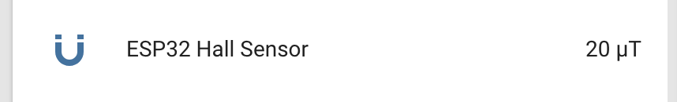

ESP32 Hall Sensor
=================

.. seo::
    :description: Instructions for setting up the integrated hall-effect sensor of the ESP32.
    :image: magnet.svg
    :keywords: esp32, hall

The ``esp32_hall`` sensor platform allows you to use the integrated
`hall effect sensor <https://en.wikipedia.org/wiki/Hall_effect_sensor>`__ of the
ESP32 chip to measure the magnitude and direction of magnetic field around the
chip (with quite poor accuracy).

Please make sure that nothing is connected to pins ``GPIO36`` and ``GPIO39`` if this
component is enabled, as those pins are used for the internal low-noise amplifier used
by the hall sensor.

.. code-block:: yaml

    # Example configuration entry
    sensor:
      - platform: esp32_hall
        name: "ESP32 Hall Sensor"
        update_interval: 60s

Configuration variables:
------------------------

- **name** (**Required**, string): The name of the hall effect sensor.
- **update_interval** (*Optional*, :ref:`config-time`): The interval
  to check the sensor. Defaults to ``60s``.
- **id** (*Optional*, :ref:`config-id`): Manually specify the ID used for code generation.
- All other options from :ref:`Sensor <config-sensor>`.

.. warning::

    The values this sensor outputs were only calibrated with a few magnets and no real "truth" sensor.
    Therefore the values could very well be off by orders of magnitude. Besides, this sensor should
    only be used to detect sudden high changes in the magnetic field.

    If you have a real magnetic field calibration setup and want to contribute your values to ESPHome,
    please feel free to do so 😺.

See Also
--------

- :ref:`sensor-filters`
- :doc:`adc`
- :doc:`/components/esp32`
- :apiref:`esp32_hall/esp32_hall.h`
- :ghedit:`Edit`
