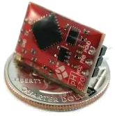

EZO sensor circuits
===================

.. seo::
    :description: Instructions for setting up EZO sensor circuits in esphome
    :image: ezo-ph-circuit.png
    :keywords: ezo ph ec rtd sensor circuit esphome

The ``ezo`` sensor platform allows you to use your EZO sensor circuits with
ESPHome. The :ref:`I²C Bus <i2c>` is
required to be set up in your configuration for this sensor to work.
All embedded solutions from EZO can be found `here <https://atlas-scientific.com/embedded-solutions/>`__.
If a certain command is not supported directly, it can be executed with the ``send_custom()`` method call.

.. code-block:: yaml

    # Example configuration entry
    sensor:

      - platform: ezo
        id: ph_ezo
        address: 99
        unit_of_measurement: "pH"
        update_interval: 10s

      - platform: ezo
        id: rtd_ezo
        name: "RTD Temperature"
        address: 102
        accuracy_decimals: 2
        unit_of_measurement: "°C"
        update_interval: 10s

Configuration variables:
------------------------

- **address** (**Required**, int): Specify the I²C address of the sensor.
- **update_interval** (*Optional*, :ref:`config-time`): The interval to check the
  sensor. Defaults to ``60s``.
- **id** (*Optional*, :ref:`config-id`): Set the ID of this sensor for use in lambdas.
- All other options from :ref:`Sensor <config-sensor>`.

Automation triggers:

- **on_led** (*Optional*, :ref:`Action <config-action>`): Triggered when the result of ``get_led_state()`` is ready. The LED
  state is provided as a boolean variable named ``x``.
- **on_device_information** (*Optional*, :ref:`Action <config-action>`): Triggered when the result of ``get_device_information()``
  is ready.  The result is provided as a ``std::string`` variable named ``x``.
- **on_slope** (*Optional*, :ref:`Action <config-action>`): Triggered when the result of ``get_slope()`` is ready.  The result
  is provided as a ``std::string`` variable named ``x``.
- **on_calibration** (*Optional*, :ref:`Action <config-action>`): Triggered when the result of ``get_calibration()`` is ready.
  The result is provided as a ``std::string`` variable named ``x``.
- **on_t** (*Optional*, :ref:`Action <config-action>`): Triggered when the result of ``get_t()`` is ready.  The result is provided
  as a ``std::string`` variable named ``x``.
- **on_custom** (*Optional*, :ref:`Action <config-action>`): Triggered when the result of ``get_custom()`` is ready.  The result is provided as a ``std::string`` variable named ``x``.

.. _ezo_lambda_calls:

Lambda calls
------------

From :ref:`lambdas <config-lambda>`, you can interact with the sensor in various ways. For any ``get`` command a trigger will be called
with the information retrieved from the sensor. For more information on the command specifics, refer to the datasheet.

- ``set_i2c(uint8_t address)``: Set I2C address of the device, must be an integer between 1 and 127

  .. code-block:: cpp

      id(ph_ezo).set_i2c(100);

- ``get_device_information()``: Sensor retrieves calibration and triggers ``on_device_information:`` once done

  .. code-block:: cpp

      id(ph_ezo).get_device_information();

- ``set_sleep()``:  Put the device to sleep

  .. code-block:: cpp

      id(ph_ezo).set_sleep();

- ``get_state()``: Performs a read on the current sensor.

  .. code-block:: cpp

      id(ph_ezo).get_state();

- ``get_slope()``: Sensor retrieves slope and triggers ``on_slope:`` once done

  .. code-block:: cpp

      id(ph_ezo).get_slope();

- ``get_t()``: Sensor retrieves temperature compensation value (in Celcius) and triggers ``on_t:`` once done

  .. code-block:: cpp

      id(ph_ezo).get_t();

- ``set_t(float value)``: Send the given temperature (in Celcius) to the sensor.

  .. code-block:: cpp

      id(ph_ezo).set_t("27.00");

- ``set_tempcomp_value(float temp)``: Send the given temperature (in Celcius) to the sensor (this is an alias of `set_t()` for backwards compatibility)

  .. code-block:: cpp

      id(ph_ezo).set_tempcomp_value(id(rtd_ezo).state);

- ``get_calibration()``: Sensor retrieves calibration and triggers ``on_calibration:`` once done

  .. code-block:: cpp

      id(ph_ezo).get_calibration();

- ``set_calibration_generic(float value)``: Sets the calibration with no point.

  .. code-block:: cpp

      id(ph_ezo).set_calibration_generic(750.0);

- ``set_calibration_point_low(float value)``: Sets the low calibration point.

  .. code-block:: cpp

      id(ph_ezo).set_calibration_point_low(4.00);

- ``set_calibration_point_mid(float value)``: Sets the medium calibration point.

  .. code-block:: cpp

      id(ph_ezo).set_calibration_point_mid(7.00);

- ``set_calibration_point_high(float value)``: Sets the high calibration point.

  .. code-block:: cpp

      id(ph_ezo).set_calibration_point_high(10.00);

- ``clear_calibration()``: Clears all calibration points.

  .. code-block:: cpp

      id(ph_ezo).clear_calibration();

- ``get_led_state()``: Sensor LED state and triggers ``on_led:`` once done

  .. code-block:: cpp

      id(ph_ezo).get_led_state();

- ``set_led_state(bool on)``: Sensor LED on or off

  .. code-block:: cpp

      id(ph_ezo).set_led_state(true);

- ``send_custom(const std::string &payload, uint16_t delay_ms = 300, bool response_expected = false)``: Runs a custom command. This sends exactly what is in ``payload``. Optionally you can set a ``delay`` and if a response is expected that should be parsed. Defaults to ``false`` for custom commands.  Triggers ``on_custom:`` if there's a response.

  .. code-block:: cpp

      // Run a custom command to turn on the LED
      id(ph_ezo).send_custom("L,1");

See Also
--------

- :ref:`sensor-filters`
- :apiref:`ezo/ezo.h`
- :ghedit:`Edit`
