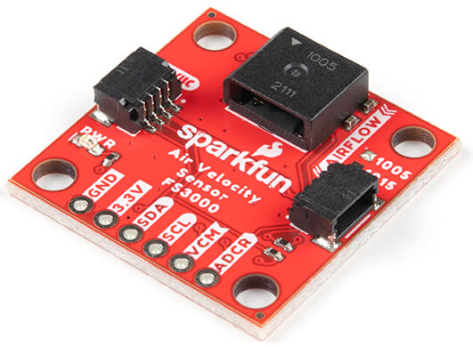

FS3000 Air Velocity Sensor
==========================

.. seo::
    :description: Instructions for setting up the FS3000 Air Velocity sensor.
    :image: fs3000.jpg
    :keywords: FS3000

The FS3000 Air Velocity sensor allows you to use your FS3000
(`datasheet <https://www.renesas.com/kr/en/document/dst/fs3000-datasheet?r=1395551>`__,
`sparkfun <https://www.sparkfun.com/products/18377>`__)
sensors with ESPHome.

    FS3000 Air Velocity Sensor.
    (Credit: `SparkFun <https://www.sparkfun.com/products/18377>`__, image compressed)

.. _SparkFun: https://www.sparkfun.com/products/18377

The FS3000 is a solid state air velocity sensor that communicates over over I²C. It is based on a MEMS thermopile sensor. There are two subtypes available: the FS3000-1005 measures air velocities between 0 meters/second and 7.23 meters/second, and the FS3000-1015 measures air velocities between 0 meters/second and 15 meters/second.

To use the sensor, first set up an :ref:`I²C Bus <i2c>` and connect the sensor to the specified pins.

.. code-block:: yaml

    # Example configuration entry
    sensor:
      - platform: fs3000
        name: "Air Velocity"
        model: 1005
        update_interval: 60s

Configuration variables:
------------------------

- **model** (**Required**, string): Specify FS3000 model, can be ``1005`` or ``1015``.
- **address** (*Optional*, int): Manually specifiy the I²C address of the sensor. Defaults to ``0x28``.
- **update_interval** (*Optional*, :ref:`config-time`): The interval to check the sensor. Defaults to ``60s``.
- All other options from :ref:`Sensor <config-sensor>`.

See Also
--------

- :ref:`sensor-filters`
- :apiref:`fs3000/fs3000.h`
- `SparkFun FS3000 Library <https://github.com/sparkfun/SparkFun_FS3000_Arduino_Library>`__ by `SparkFun <https://www.sparkfun.com/>`__
- :ghedit:`Edit`
