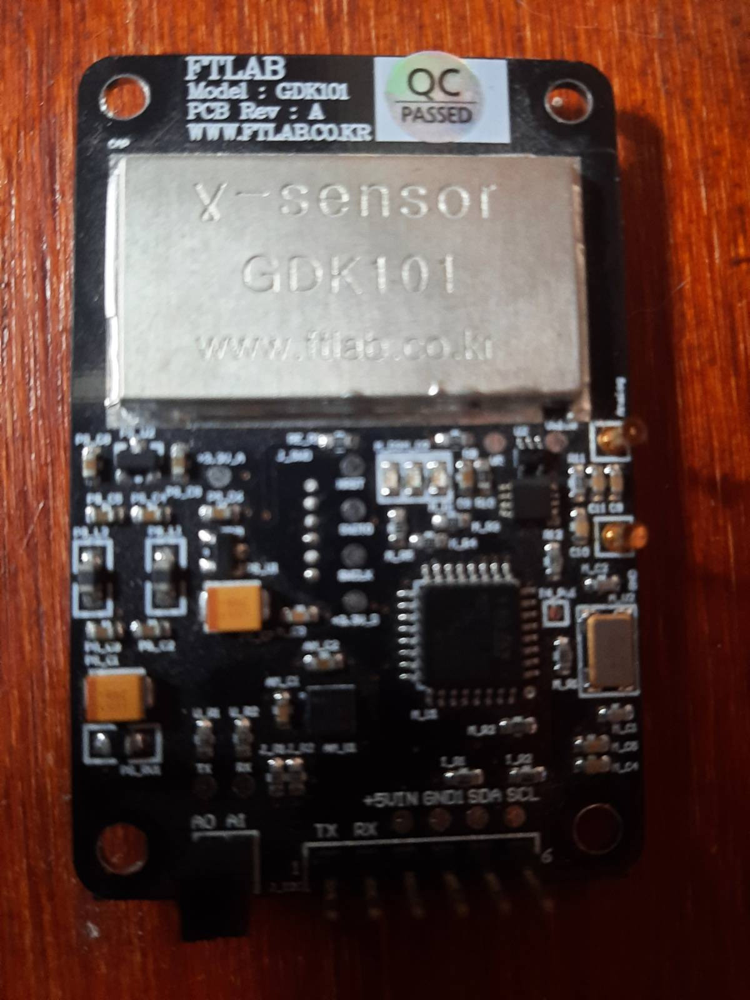

FTLab GDK101 Gamma Radiation Sensor Module
==========================================

.. seo::
    :description: Instructions for setting up GDK101 Gamma Radiation Sensor Module
    :image: gdk101.jpg
    :keywords: gdk101

The **GDK101** sensor platform allows you to use your GDK101 sensor to monitor radiation levels at your place.

The GDK101 can measure average dose rate per 1 and 10 minutes, it also detect vibrations that can disturb the measurement.

The GDK101 requires setting up :ref:`I²C <i2c>` for data communication.

Module Pins
-----------

============  ===============================================================
 Module Pin   Description
============  ===============================================================
TX            UART TX pin
RX            UART RX pin
+5VIN         Positive supply voltage
GND1          Ground
SDA           I²C data bus
SCL           I²C clock bus

A0            Adress Jumper 1
A1            Adress Jumper 2
============  ===============================================================

============  ===============================================================
I2C Address   Jumpers State
============  ===============================================================
0x18          A0 Short, A1 Short
0x19          A0 Open,  A1 Short
0x1A          A0 Short, A1 Open
0x1B          A0 Open,  A1 Open
============  ===============================================================

    GDK101 Gamma Radiation Sensor Module.

Component/Hub
-------------

.. code-block:: yaml

    # Example configuration entry
    gdk101:
      i2c_id: bus_a
      address: 0x18
      update_interval: 10s

- **address** (*Optional*, int): Manually specify the I²C address of
  the sensor. Defaults to ``0x18`` (``A0`` and ``A1`` shorted).
  The address is made up using the state of ``A0`` as bit 1 and the state of ``A1`` as bit 2, so a total of four addresses is possible.
- **update_interval** (*Optional*, int): Manually defined update iterval of sensor. Default to 60s.
- **i2c_id** (*Optional*, string): Optional name of the bus.

Sensor
------

.. code-block:: yaml

    # Example configuration entry
    sensor:
      - platform: gdk101
        radiation_dose_per_1m:
          name: "GDK101 Radiation Dose @ 1 min"
        radiation_dose_per_10m:
          name: "GDK101 Radiation Dose @ 10 min"
        status:
          name: "GDK101 Status"
        version:
          name: "GDK101 FW Version"
        measurement_duration:
          name: "GDK101 Measuring Time"

A sensor platform to radiation data

Configuration variables:

- **radiation_dose_per_1m** (**Required**): Radiation average dose per 1 minute.
  All options from :ref:`Sensor <config-sensor>`.
- **radiation_dose_per_10m** (**Required**): Radiation average dose per 10 minutes.
  All options from :ref:`Sensor <config-sensor>`.
- **version** (**Required**): Fimware version of the module.
  All options from :ref:`Sensor <config-sensor>`.
- **status** (*Optional*): Sensor status.
  All options from :ref:`Sensor <config-sensor>`.
- **measurement_duration** (*Optional*): Total time of measurement.
  All options from :ref:`Sensor <config-sensor>`.

Binary Sensor
-------------

.. code-block:: yaml

    # Example configuration entry
    binary_sensor:
      - platform: gdk101
        vibrations:
          name: "GDK101 Vibrations"

Binary sensor that indicates if measurement was disturbed by vibrations.

Configuration variables:

- **vibrations** (**Required**): Vibration status.
  All options from :ref:`Binary Sensor <config-binary_sensor>`.

See Also
--------

- :ref:`sensor-filters`
- :apiref:`gdk101/gdk101.h`
- `Data Sheet <https://www.eleparts.co.kr/data/goods_old/design/product_file/Hoon/AN_GDK101_V1.0_I2C.pdf>`__
- `Application Notes <https://merona.blob.core.windows.net/radonftlab-web/GDK101.zip>`__
- `Arduino Sensors for Everyone blog post <https://arduino.steamedu123.com/entry/GDK101-Radiation-Sensor>`__
- :ghedit:`Edit`
