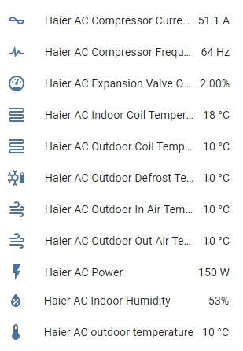

Haier Climate Sensors
=====================

.. seo::
    :description: Instructions for setting up additional sensors for Haier climate devices.
    :image: haier.svg

Additional sensors for Haier Climate device. **These sensors are supported only by the hOn protocol**.

.. code-block:: yaml

    # Example configuration entry
    sensor:
      - platform: haier
        haier_id: haier_ac
        outdoor_temperature:
          name: Haier outdoor temperature
        humidity:
          name: Haier Indoor Humidity
        compressor_current:
          name: Haier Compressor Current
        compressor_frequency:
          name: Haier Compressor Frequency
        expansion_valve_open_degree:
          name: Haier Expansion Valve Open Degree
        indoor_coil_temperature:
          name: Haier Indoor Coil Temperature
        outdoor_coil_temperature:
          name: Haier Outdoor Coil Temperature
        outdoor_defrost_temperature:
          name: Haier Outdoor Defrost Temperature
        outdoor_in_air_temperature:
          name: Haier Outdoor In Air Temperature
        outdoor_out_air_temperature:
          name: Haier Outdoor Out Air Temperature
        power:
          name: Haier Power

Configuration variables:
------------------------

- **haier_id** (**Required**, :ref:`config-id`): The id of haier climate component
- **outdoor_temperature** (*Optional*): Temperature sensor for outdoor temperature.
  All options from :ref:`Sensor <config-sensor>`.
- **humidity** (*Optional*): Sensor for indoor humidity. Make sure that your climate model supports this type of sensor.
  All options from :ref:`Sensor <config-sensor>`.
- **compressor_current** (*Optional*): Sensor for climate compressor current. Make sure that your climate model supports this type of sensor.
  All options from :ref:`Sensor <config-sensor>`.
- **compressor_frequency** (*Optional*): Sensor for climate compressor frequency. Make sure that your climate model supports this type of sensor.
  All options from :ref:`Sensor <config-sensor>`.
- **expansion_valve_open_degree** (*Optional*): Sensor for climate's expansion valve open degree. Make sure that your climate model supports this type of sensor.
  All options from :ref:`Sensor <config-sensor>`.
- **indoor_coil_temperature** (*Optional*): Temperature sensor for indoor coil temperature. Make sure that your climate model supports this type of sensor.
  All options from :ref:`Sensor <config-sensor>`.
- **outdoor_coil_temperature** (*Optional*): Temperature sensor for outdoor coil temperature. Make sure that your climate model supports this type of sensor.
  All options from :ref:`Sensor <config-sensor>`.
- **outdoor_defrost_temperature** (*Optional*): Temperature sensor for outdoor defrost temperature. Make sure that your climate model supports this type of sensor.
  All options from :ref:`Sensor <config-sensor>`.
- **outdoor_in_air_temperature** (*Optional*): Temperature sensor incoming air temperature.
  All options from :ref:`Sensor <config-sensor>`.
- **outdoor_out_air_temperature** (*Optional*): Temperature sensor for outgoing air temperature.
  All options from :ref:`Sensor <config-sensor>`.
- **power** (*Optional*): Sensor for climate power consumption. Make sure that your climate model supports this type of sensor.
  All options from :ref:`Sensor <config-sensor>`.

See Also
--------

- :doc:`Haier Climate </components/climate/haier>`
- :ref:`sensor-filters`
- :ghedit:`Edit`
