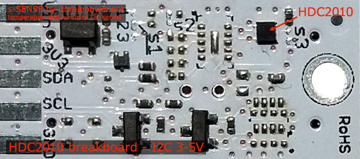

HDC2010 High Precision Temperature and Humidity Sensor
===================================
.. seo::
    :description: Instructions for setting up HDC2010 temperature and humidity sensors.
    :image: hdc2010.jpg
    :keywords: HDC2010

The HDC2010 Temperature and Humidity sensor allows you to use your HDC2010
(`Datasheet <https://www.ti.com/lit/ds/symlink/hdc2010.pdf>`__,
`Itbrainpower <https://itbrainpower.net/a-gsm/Arduino-HDC2010-sensor_howto>`__) sensors with
ESPHome. The :ref:`I²C Bus <i2c>` is
required to be set up in your configuration for this sensor to work.

    HDC2010 Temperature & Humidity Sensor. Image by `Itbrainpower`_.

.. _Itbrainpower: https://itbrainpower.net/a-gsm/Arduino-HDC2010-sensor_howto

.. figure:: images/temperature-humidity.png
    :align: center
    :width: 80.0%

.. code-block:: yaml

    # Example configuration entry
    sensor:
      - platform: hdc2010
        temperature:
          name: "Living Room Temperature"
        humidity:
          name: "Living Room Humidity"
        update_interval: 60s

Configuration variables:
------------------------

- **temperature** (**Required**): The information for the temperature sensor.

  - **name** (**Required**, string): The name for the temperature sensor.
  - **id** (*Optional*, :ref:`config-id`): Set the ID of this sensor for use in lambdas.
  - All other options from :ref:`Sensor <config-sensor>`.

- **humidity** (**Required**): The information for the humidity sensor

  - **name** (**Required**, string): The name for the humidity sensor.
  - **id** (*Optional*, :ref:`config-id`): Set the ID of this sensor for use in lambdas.
  - All other options from :ref:`Sensor <config-sensor>`.

- **update_interval** (*Optional*, :ref:`config-time`): The interval to check the sensor. Defaults to ``60s``.

Currently, the platform doesn't support activating the built-in heater,
as it seems to only be rarely of use. If you need it, please open an
issue.

See Also
--------

- :ref:`sensor-filters`
- :doc:`absolute_humidity`
- :doc:`dht`
- :doc:`dht12`
- :doc:`htu21d`
- :doc:`sht3xd`
- :doc:`hdc1080`
- `HDC2010 Library <https://github.com/vigsterkr/homebridge-hdc2010/>`__
- `HDC2010 Library <https://github.com/lime-labs/HDC2080-Arduino/>`__
- `HDC2010 Tutorial and library <https://www.hackster.io/dragos-iosub/arduino-hdc2010-read-data-and-comfort-zone-alerts-3d62af/>`__
- :ghedit:`Edit`
