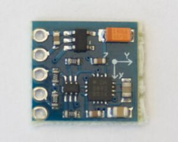

.. _hmc5883l:

HMC5883L Magnetometer
=====================

.. seo::
    :description: Instructions for setting up HMC5883L IMU compass sensors.
    :image: hmc5883l.jpg
    :keywords: HMC5883L

The ``hmc5883l`` allows you to use your HMC5883L triple-axis magnetometers
(`datasheet <https://cdn-shop.adafruit.com/datasheets/HMC5883L_3-Axis_Digital_Compass_IC.pdf>`__,
`Adafruit`_) with ESPHome. The :ref:`I²C Bus <i2c>` is required to be set up in your configuration
for this sensor to work.

    HMC5883L Magnetometer.

.. _Adafruit: https://www.adafruit.com/product/1746

.. code-block:: yaml

    # Example configuration entry
    sensor:
      - platform: hmc5883l
        address: 0x1E
        field_strength_x:
          name: "HMC5883L Field Strength X"
        field_strength_y:
          name: "HMC5883L Field Strength Y"
        field_strength_z:
          name: "HMC5883L Field Strength Z"
        heading:
          name: "HMC5883L Heading"
        oversampling: 1x
        range: 130uT
        update_interval: 60s

Configuration variables:
------------------------

- **address** (*Optional*, int): Manually specify the I²C address of the sensor. Defaults to ``0x1E``.
- **field_strength_x** (*Optional*): The field strength in microtesla along the X-Axis. All options from
  :ref:`Sensor <config-sensor>`.
- **field_strength_y** (*Optional*): The field strength in microtesla along the Y-Axis. All options from
  :ref:`Sensor <config-sensor>`.
- **field_strength_z** (*Optional*): The field strength in microtesla along the Z-Axis. All options from
  :ref:`Sensor <config-sensor>`.
- **heading** (*Optional*): The heading of the sensor in degrees. All options from
  :ref:`Sensor <config-sensor>`.
- **oversampling** (*Optional*): The oversampling parameter for the sensor.
- **update_interval** (*Optional*, :ref:`config-time`): The interval to check the sensor. Defaults to ``60s``.
- **oversampling** (*Optional*): Number of readings to average over for each sample. One of ``1x``, ``2x``,
  ``4x``, ``8x``. Defaults to ``1x``.
- **range** (*Optional*): Select a range / gain preset. This does not affect the scale of the values published
  but allows one to avoid overflows at the cost of reading resolution. Supported values are 88µT, 130µT, 190µT,
  250µT, 400µT, 470µT, 560µT, 810µT. Default range is ±130µT.

- **id** (*Optional*, :ref:`config-id`): Manually specify the ID used for code generation.

Oversampling Options
--------------------

By default, the HMC5883L sensor measures each value 1 times when requesting a new value. You can, however,
configure this amount. The result is the sensor will take the adverage of the x samples. Possible oversampling values:

-  ``1x`` (default)
-  ``2x``
-  ``4x``
-  ``8x``

Range Options
-------------

By default, the HMC5883L sensor measurement range is 130uT. You can, however,
configure this amount. Possible values:

-  ``88uT``
-  ``130uT`` (default)
-  ``190uT``
-  ``250uT``
-  ``400uT``
-  ``470uT``
-  ``560uT``
-  ``810uT``

See Also
--------

- :ref:`sensor-filters`
- :doc:`template`
- :apiref:`hmc5883l/hmc5883l.h`
- `HMC5883L Library <https://github.com/jarzebski/Arduino-HMC5883L>`__ by `Korneliusz Jarzębski <https://github.com/jarzebski>`__
- :ghedit:`Edit`
