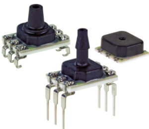

Honeywell ABP 2 Pressure Sensors
================================

.. seo::
    :description: Instructions for setting up Honeywell ABP2 Pressure sensors
    :image: honeywellabp.jpg
    :keywords: Honeywell ABP2

The ``honeywellabp2_i2c`` sensor platform allows you to use your Honeywell ABP 
(`website <https://sps.honeywell.com/us/en/products/advanced-sensing-technologies/healthcare-sensing/board-mount-pressure-sensors/basic-abp2-series>`__,
`datasheet <https://prod-edam.honeywell.com/content/dam/honeywell-edam/sps/siot/en-us/products/sensors/pressure-sensors/board-mount-pressure-sensors/basic-abp2-series/documents/sps-siot-abp2-series-datasheet-32350268-en.pdf?download=false>`_) 
pressure and temperature sensors with ESPHome. The :ref:`I2C <i2c>` is
required to be set up in your configuration for this sensor to work

    Honeywell ABP Pressure and Temperature Sensor.

.. code-block:: yaml

    sensor:
      - platform: honeywellabp2_i2c
        pressure:
          name: "Honeywell2 pressure"
          min_pressure: 0
          max_pressure: 16000
          transfer_function: "A"
        temperature:
          name: "Honeywell2 temperature"

Configuration variables:
------------------------

The values for ``min_pressure`` and ``max_pressure`` and ``transfer_function`` can be found in the device datasheet for the specific device. 
These are used to calculate the pressure reading published by the sensor. Some sensors measure pressure in ``bar`` or ``Psi``; 
set ``min_pressure`` and ``max_pressure`` to the measurement range, ``transfer_function`` to ``A`` or ``B`` and ``unit_of_measurement`` to the appropriate unit for your device.

- **pressure** (*Optional*): The information for the pressure sensor.

  - **min_pressure** (**Required**, int or float): Minimum pressure for the pressure sensor.
  - **max_pressure** (**Required**, int or float): Maximum pressure for the pressure sensor.
  - **transfer_function** (**Required**, "A" or "B"): Transfer function used by the pressure sensor.
  - All other options from :ref:`Sensor <config-sensor>`.

Some sensors do not have temperature sensing ability, see datasheet. In some cases the sensor may return a valid temperature even though the 
datasheet indicates that the sensor does not measure temperature.

- **temperature** (*Optional*): The information for the temperature sensor.
  All options from :ref:`Sensor <config-sensor>`.

- **update_interval** (*Optional*, :ref:`config-time`): The interval to check the
  sensor. Defaults to ``60s``.

See Also
--------

- :ref:`sensor-filters`
- :apiref:`honeywellabp/honeywellabp2.h`
- :ghedit:`Edit`
