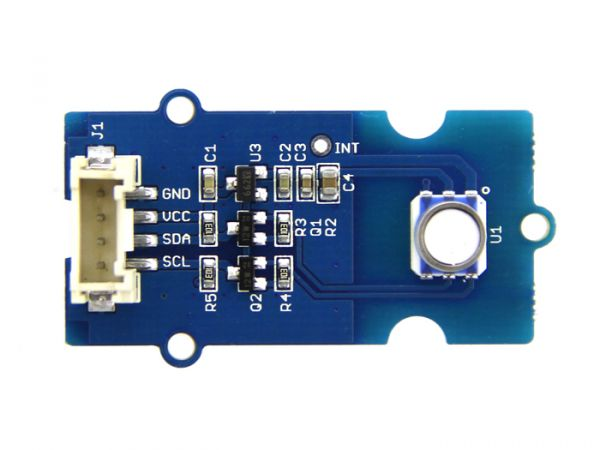

HP206C Temperature+Pressure Sensor
==================================

.. seo::
    :description: Instructions for setting up HP206C pressure and temperature sensors
    :image: hp206c.jpg
    :keywords: HP206C

The HP206C sensor platform allows you to use your HP206C
(`datasheet <https://www.hoperf.com/data/upload/portal/20190307/HP206C_DataSheet_EN_V2.0.pdf>`__,) temperature and
pressure sensors with ESPHome. The :ref:`I²C <i2c>` is required to be set up in
your configuration for this sensor to work.

    Seeed Studio Grove - Barometer (High-Accuracy) with HP206C

.. code-block:: yaml

    # Example configuration entry
    sensor:
      - platform: hp206c
        i2c_id: bus_a
        temperature:
          name: "Outside Temperature"
        pressure:
          name: "Outside Pressure"
        update_interval: 60s

Configuration variables:
------------------------

- **temperature** (*Optional*): The information for the temperature sensor.

  - **name** (**Required**, string): The name for the temperature
    sensor.
  - **id** (*Optional*, :ref:`config-id`): Set the ID of this sensor for use in lambdas.
  - All other options from :ref:`Sensor <config-sensor>`.

- **pressure** (*Optional*): The information for the pressure sensor.

  - **name** (**Required**, string): The name for the pressure sensor.
  - **id** (*Optional*, :ref:`config-id`): Set the ID of this sensor for use in lambdas.
  - All other options from :ref:`Sensor <config-sensor>`.

-  **address** (*Optional*, int): Manually specify the I²C address of
   the sensor. Defaults to ``0x76``.
-  **update_interval** (*Optional*, :ref:`config-time`): The interval to check the
   sensor. Defaults to ``60s``.
-  **internal_filter_mode** (*Optional*): Sensor internal decimation filter setting,
   highier the number longer the data aquisition. One of ``128``, ``256``, ``512``, ``1024``, ``2048``, ``4096``. Defaults to ``2048``.

See Also
--------

- :ref:`sensor-filters`
- :doc:`bme280`
- :apiref:`hp206c/hp206c.h`
- `i2cdevlib <https://github.com/jrowberg/i2cdevlib>`__ by `Jeff Rowberg <https://github.com/jrowberg>`__
- :ghedit:`Edit`
