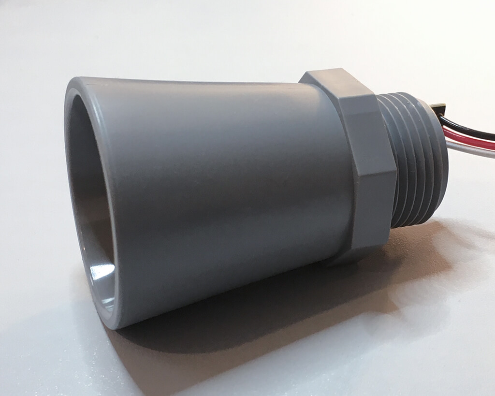

HRXL/XL MaxSonar WR Series
==========================

.. seo::
    :description: Instructions for setting up MaxBotix HRXL or XL MaxSonar WR ultrasonic distance measurement sensors in ESPHome.
    :image: hrxl_maxsonar_wr.jpg
    :keywords: ultrasonic, maxbotix, maxsonar

This sensor allows you to use HRXL MaxSonar WR series ultrasonic sensors by MaxBotix
(`datasheet <https://www.maxbotix.com/documents/HRXL-MaxSonar-WR_Datasheet.pdf>`__)
or the XL MaxSonar WR series
(`datasheet <https://www.maxbotix.com/documents/XL-MaxSonar-WR_Datasheet.pdf>`__)
with ESPHome to measure distances. Depending on the model, these sensors can measure
in a range between 30 centimeters and 10 meters.

This sensor platform works with the **TTL versions** of those sensors and expects the
sensor's TTL pin to be wired to one of the ESP's input pins. Since these sensors read
multiple times per second, filtering is highly recommended.

    MB7388 HRXL-MaxSonar-WRMLT Ultrasonic Distance Sensor.

.. code-block:: yaml

    # Example configuration entry
    sensor:
      - platform: "hrxl_maxsonar_wr"
        name: "Rainwater Tank"

Configuration variables:
------------------------

- All options from :ref:`Sensor <config-sensor>`.

Advanced options:

- **uart_id** (*Optional*, :ref:`config-id`): The ID of the :ref:`UART bus <uart>` you wish to use for this sensor.
  Use this if you want to use multiple UART buses at once.

See Also
--------

- :ref:`sensor-filters`
- :ref:`uart`
- :doc:`template`
- :apiref:`hrxl_maxsonar_wr/hrxl_maxsonar_wr.h`
- :ghedit:`Edit`
