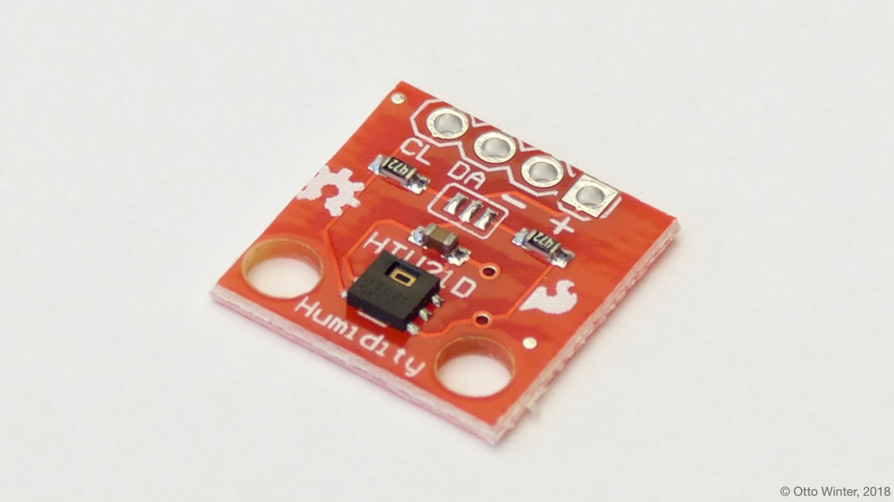

HTU21D | Si7021 | SHT21 Temperature & Humidity Sensor
=====================================================

.. seo::
    :description: Instructions for setting up HTU21D temperature and humidity sensors.
    :image: htu21d.jpg
    :keywords: HTU21D

The HTU21D Temperature & Humidity component allows you to use HTU21D, Si7021 and SHT21 sensors with
ESPHome. The :ref:`I²C Bus <i2c>` is required to be set up in your configuration for this sensor to work.

Example sensors:

- (`Adafruit <https://www.adafruit.com/product/1899>`__)

    HTU21D Temperature & Humidity Sensor.

.. _Adafruit: https://learn.adafruit.com/adafruit-htu21d-f-temperature-humidity-sensor/overview

.. figure:: images/temperature-humidity.png
    :align: center
    :width: 80.0%

.. code-block:: yaml

    # Example configuration entry
    sensor:
      - platform: htu21d
        model: htu21d
        temperature:
          name: "Temperature"
        humidity:
          name: "Humidity"
        heater:
          name: "Heater"

Configuration variables:
------------------------

- **temperature** (*Optional*): The information for the temperature sensor.
  All options from :ref:`Sensor <config-sensor>`.

- **humidity** (*Optional*): The information for the humidity sensor.
  All options from :ref:`Sensor <config-sensor>`.

- **heater** (*Optional*): The information for the heater sensor.
  All options from :ref:`Sensor <config-sensor>`.

- **update_interval** (*Optional*, :ref:`config-time`): The interval to check the sensor. Defaults to ``60s``.

- **model** (*Optional*): Possible values are HTU21D, SI7021, SHT21. Defaults to HTU21D.

The heater may be enabled to help correct the reading; see the datasheet for more information.

See Also
--------

- :ref:`sensor-filters`
- :doc:`absolute_humidity`
- :doc:`dht`
- :doc:`dht12`
- :doc:`hdc1080`
- :doc:`sht3xd`
- :apiref:`htu21d/htu21d.h`
- `i2cdevlib <https://github.com/jrowberg/i2cdevlib>`__ by `Jeff Rowberg <https://github.com/jrowberg>`__
- :ghedit:`Edit`
