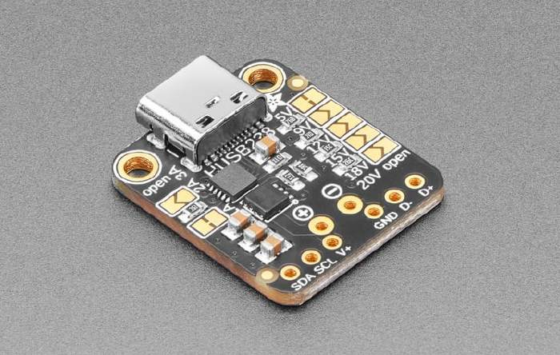

HUSB238 USB Power Delivery (PD) Sink
====================================

.. seo::
    :description: Instructions for setting up HUSB238 USB Power Delivery Sink
    :image: husb238.jpg

.. _husb238-component:

The Hynetek HUSB238 (`description <https://en.hynetek.com/2421.html>`__ ,
`datasheet <https://en.hynetek.com/uploadfiles/site/219/news/b038530d-67c0-4ba0-9269-de0e666cb35b.pdf>`__)
) is a highly integrated USB Power Delivery (PD) controller as sink role for up to 100W power rating. 
The HUSB238 is compatible with PD3.0 and Type-C V1.4, and it can also support Apple Divider 3, BC1.2 SDP, CDP and 
DCP while the source is attached. 

    HUSB238 breakout board from Adafruit

Component/Hub
-------------

The ``husb238`` platform allows you to use HUSB238 with ESPHome. :ref:`I²C Bus <i2c>` is required for this device to work.

.. code-block:: yaml

    # Example configuration entry
    husb238:
      id: husb_01

Configuration variables:
************************

- **id** (*Optional*, :ref:`config-id`): Manually specify the ID for this component to make function 
  calls from lambdas.
- **i2c_id** (*Optional*, :ref:`config-id`): Manually specify the ID of the :ref:`I²C Bus <i2c>` in case you are using
  to use multiple I²C buses.

.. note::

    **Shorthand notation**: All the sensors described below support shorthand notation which is used in all the yaml examples.
    Should you wish to configure other sensor options please use regular notation.

    .. code-block:: yaml

        xxx_sensor:
          - platform: husb238
            sensor_abc: "Name of the sensor"    # shorthand notation

          - platform: husb238
            sensor_abc:                         # regular notation
              name: "Name of the sensor"
              ...  
              # other options from sensor/binary_sensor/...

Binary Sensor
-------------

.. code-block:: yaml

    binary_sensor:
      - platform: husb238
        attached: "PD device attached"
        cc_direction: "CC direction"

Configuration variables:
************************

- **attached** (*Optional*): True is compatible PD supply attached.
  All options from :ref:`Binary Sensor <config-binary_sensor>`.
- **cc_direction** (*Optional*): ``False`` if CC1 is connected to CC line or unattached. 
  ``True`` if CC2 is connected to CC line.
  All options from :ref:`Binary Sensor <config-binary_sensor>`.

Sensor
------

The ``husb238`` sensor shows voltage and current agreed between power source and the device.

.. code-block:: yaml

    sensor:
      - platform: husb238
        selected_voltage: "Selected Voltage"
        voltage: "Contracted Voltage"
        current: "Contracted Current"

Configuration variables:
************************

- **selected_voltage** (*Optional*): User selected voltage for the negotiation.
  All options from :ref:`Sensor <config-sensor>`.
- **voltage** (*Optional*): Voltage contracted after negotiation between PSU and the device.
  All options from :ref:`Sensor <config-sensor>`.
- **current** (*Optional*): Current contracted after negotiation between PSU and the device.
  All options from :ref:`Sensor <config-sensor>`.

Text Sensor
-----------

.. code-block:: yaml

    text_sensor:
      - platform: husb238
        capabilities: "Capabilities"
        status: "Last request status"

Configuration variables:
************************

- **capabilities** (*Optional*): Shows capabilities of attached power supply. For example, ``5V: 3.00A, 9V: 3.00A``.
  All options from :ref:`Text Sensor <config-text_sensor>`.
- **status** (*Optional*): Shows status of last command.
  All options from :ref:`Text Sensor <config-text_sensor>`.

Select
------

The ``husb238`` select allows you to control the negotiation and select desired voltage in the Home Assistant or Web UI.

.. code-block:: yaml

    select:
      - platform: husb238
        voltage: "Voltage selector"

Configuration variables:
************************

- **voltage**: Voltage selector. The list of volages is predefined: 5V, 9V, 12V, 15V, 18V.
  All options from :ref:`Select <config-select>`.

Functions
---------

The ``husb238`` component exposes several functions for your lambdas.

.. code-block:: cpp

    // Request specific voltage out of the list: 5, 9, 12, 15, 18, 20.
    bool command_request_voltage(int volt); 

    // Same, but accepts strings like "9V", "12V" as a parameter
    bool command_request_voltage(const std::string &str_volt);

    // Request power supply capabilities
    bool command_get_src_cap();
    
    // Resets husb238 device
    bool command_reset();

Usage example:

.. code-block:: yaml

    husb238:
      id: my_husb
    
    on_...:
      then:
        - lambda: |-
            id(my_husb).command_request_voltage(12);

See Also
--------

- :apiref:`husb238/husb238.h`
- :ghedit:`Edit`
