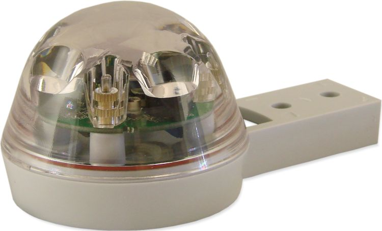

Hydreon Rain Sensor
===================

.. seo::
    :description: Instructions for setting up Hydreon rain sensors
    :image: hydreon_rg9.jpg
    :keywords: hydreon

The ``hydreon_rgxx`` sensor platform allows you to use rain sensors by Hydreon. Currently supported are the RG-9 and RG-15 sensors (`model comparison <https://rainsensors.com/products/model-comparison/>`_).

These optical rain sensors use a UART connection at 3.3V. The :ref:`UART <uart>` is
required to be set up in your configuration for this sensor to work.

Supported firmware versions:
  - RG-15: v1.000
  - RG-9: v1.000, v1.100, v1.200

Device FAQ: `<https://rainsensors.com/support/rg-9-rg-15-faq/>`__

    Hydreon RG-9 Rain Sensor. Image by `Hydreon <https://rainsensors.com/>`_.

.. code-block:: yaml

    # Example RG-9 entry
    sensor:
      - platform: hydreon_rgxx
        model: RG_9
        id: hydreon_1
        moisture:
          name: Rain Level
        temperature:
          name: Device Temperature

    binary_sensor:
      - platform: hydreon_rgxx
        hydreon_rgxx_id: hydreon_1
        too_cold:
          name: Temperature Status
        lens_bad:
          name: Lens Status
        em_sat:
          name: Emitter Saturation

.. code-block:: yaml

    # Example RG-15 entry
    sensor:
      - platform: hydreon_rgxx
        model: RG_15
        resolution: high
        acc:
          name: Rain
        event_acc:
          name: Rain Event"
        total_acc:
          name: Rain Total"
        r_int:
          name: Rain Intensity

Configuration variables:
------------------------

- **model** (**Required**, string): Specify which rain sensor you have connected. Must be either ``RG_9`` or ``RG_15``.

- **disable_led** (*Optional*): Disables the on-board LED. Defaults to ``false``. Only on RG-9 firmware version 1.200-onwards.

- **uart_id** (*Optional*, :ref:`config-id`): Manually specify the ID of the :ref:`UART Component <uart>` if you want
  to use multiple UART buses.

- **moisture** (*Optional*): Rain intensity level from 0-7 (`more detail <https://rainsensors.com/support/rg-9-rg-15-faq/#RG-9RValue>`__). Only on RG-9.

  - **name** (**Required**, string): The name for the sensor.
  - **id** (*Optional*, :ref:`config-id`): Set the ID of this sensor for use in lambdas.
  - All other options from :ref:`Sensor <config-sensor>`.

- **temperature** (*Optional*): Device internal temperature in Celsius. Accuracy is ±5°C. Only on RG-9 firmware version 1.100-onwards.

  - **name** (**Required**, string): The name for the sensor.
  - **id** (*Optional*, :ref:`config-id`): Set the ID of this sensor for use in lambdas.
  - All other options from :ref:`Sensor <config-sensor>`.

- **resolution** (*Optional*, string): Specify rain sensor resolution. Must be either ``low`` or ``high``. Default resolution is ``high``.
  Only applies to RG-15.

- **acc** (*Optional*): Amount of rain since last message (see ``update_interval``), in ``mm``. Only on RG-15.

  - **name** (**Required**, string): The name for the sensor.
  - **id** (*Optional*, :ref:`config-id`): Set the ID of this sensor for use in lambdas.
  - All other options from :ref:`Sensor <config-sensor>`.

- **event_acc** (*Optional*): Amount of rain for this event (i.e. since it last stopped raining), in ``mm``. Only on RG-15.

  - **name** (**Required**, string): The name for the sensor.
  - **id** (*Optional*, :ref:`config-id`): Set the ID of this sensor for use in lambdas.
  - All other options from :ref:`Sensor <config-sensor>`.

- **total_acc** (*Optional*): Total amount of rain this sensor has ever measured, in ``mm``. Only on RG-15.

  - **name** (**Required**, string): The name for the sensor.
  - **id** (*Optional*, :ref:`config-id`): Set the ID of this sensor for use in lambdas.
  - All other options from :ref:`Sensor <config-sensor>`.

- **r_int** (*Optional*): Current rain intensity in ``mm/h``. Only on RG-15.

  - **name** (**Required**, string): The name for the sensor.
  - **id** (*Optional*, :ref:`config-id`): Set the ID of this sensor for use in lambdas.
  - All other options from :ref:`Sensor <config-sensor>`.

- **update_interval** (*Optional*, :ref:`config-time`): The interval to check the sensor. Defaults to ``60s``.

See Also
--------

- :ref:`sensor-filters`
- :doc:`../binary_sensor/hydreon_rgxx`

- `Hydreon RG-9 <https://rainsensors.com/products/rg-9/>`__
- `Hydreon RG-15 <https://rainsensors.com/products/rg-15/>`__

- `RG-15 V1.000 manual <https://rainsensors.com/wp-content/uploads/sites/3/2020/07/rg-15_instructions_sw_1.000.pdf>`__

- `RG-9 1.000 manual <https://rainsensors.com/wp-content/uploads/sites/3/2021/03/2020.08.25-rg-9_instructions.pdf>`__
- `RG-9 1.100 manual <https://rainsensors.com/wp-content/uploads/sites/3/2021/03/2021.03.11-rg-9_instructions.pdf>`__
- `RG-9 1.200 manual <https://rainsensors.com/wp-content/uploads/sites/3/2022/03/2022.02.17-rev-1.200-rg-9_instructions.pdf>`__

- :ghedit:`Edit`
