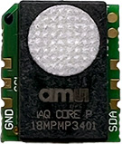

AMS iAQ-Core Indoor Air Quality Sensor
======================================

.. seo::
    :description: Instructions for setting up the iAQ-Core sensor.
    :image: iaqcore.jpg
    :keywords: co2, tvoc, i2c

The AMS iAQ-Core sensor allows you to use your
(`datasheet <https://www.sciosense.com/wp-content/uploads/documents/iaQ-Core-Datasheet.pdf>`__)
sensors with ESPHome.

    AMS iAQ-Core Indoor Air Quality Sensor.

The iAQ-Core sensor module is used to measure VOC levels and provide CO2 equivalent and TVOC equivalent predictions. The data is available via I²C bus.

To use the sensor, first set up an :ref:`I²C Bus <i2c>` and connect the sensor to the specified pins.

.. code-block:: yaml

    # Example configuration entry
    sensor:
      - platform: iaqcore
        address: 0x5A
        update_interval: 60s
        co2:
            name: "iAQ Core CO2 Sensor"
        tvoc:
            name: "iAQ Core TVOC Sensor"

Configuration variables:
------------------------

- **i2c_id** (*Optional*, ID): The id of the I²C Bus.
- **address** (*Optional*, int): Manually specifiy the I²C address of the sensor. Defaults to ``0x5A``.
- **update_interval** (*Optional*, :ref:`config-time`): The interval to check the sensor. Defaults to ``60s``.
- **co2** (*Optional*): The configuration for the CO2 sensor. All options from
  :ref:`Sensor <config-sensor>`.
- **tvoc** (*Optional*): The configuration for the TVOC sensor. All options from
  :ref:`Sensor <config-sensor>`.

See Also
--------

- :ref:`sensor-filters`
- :doc:`/components/sensor/index`
- :ghedit:`Edit`
