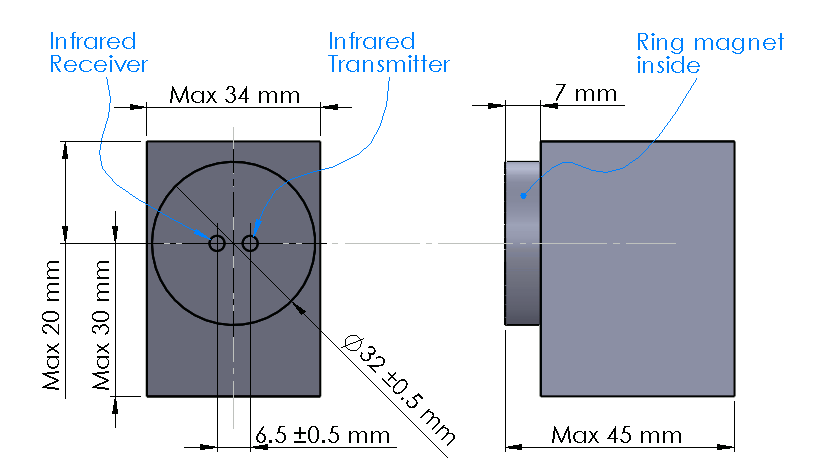

IEC 62056-21
=============

*IEC 62056-21* is an international standard for a protocol to exchange data with utility meters. Mostly for electricity but also water, thermal and other meters.

.. seo::
    :description: Instructions for setting up IEC 62056-21 meter component in ESPHome.
    :image: iec62056-21.svg

The ``iec62056`` component allows you to read data from any compatible meter. The component requires a *serial port* and *an external optical interface*. Data exchange uses an infrared optical channel. Compatible meters are equipped with a characteristic round metal plate with two opto-elements inside. 

The component only reads data from a meter, it does not support programming. Setting parameters requires a secret password which makes it impossible to use by ordinary users.

    The interface on a meter. Metal ring for a magnet and two optical elements inside.

Theory of operation
-------------------

The component reads data for the first time 15 seconds after boot-up. First, it sends an identification request at 300 bps.
The meter returns the maximum baud rate it can handle. Following that, the serial port baud rate if changed to the value provided by
the meter. It is also possible to limit the speed by the configuration option ``baud_rate``. The meter transmits data
registers with associated OBIS codes.

If the transmission has failed (bad checksum or invalid format), the component will try to read data again but this time using a slower transmission speed. For every retry, the speed is decreased. The number of retires and delays can be configured.

If the meter is battery-powered, a special wake-up sequence can be applied. This happens only when ``battery_meter`` is set to ``True``.

To see meter data in Home Assistant you must define a sensor or text sensor with the appropriate OBIS code. Note that meters support different sets of OBIS codes. By default, the component does not define any sensors.

OBIS codes
**********

The OBIS code identifies the different readings from a meter. The code consists of up to 6 group sub-identifiers.
The code is formatted like this: ``A-B:C.D.E*F``, where:

* ``A`` - medium: 0=abstract objects, 1=electricity, 6=heat, 7=gas, 8=water
* ``B`` - channel, 0=no channel available
* ``C`` - physical value, e.g. current, voltage, temperature.
* ``D`` - measurement type, 
* ``E`` - tariff, 0=total, 1=tariff #1, 2=tariff #2 and so on
* ``F`` - billing period

``A``, ``B`` and ``F`` may be omitted. Codes may use hexadecimal digits, for example, code ``15.8.0`` could be represented
as ``F.8.0``.

The codes are standardized but devices send a different number of codes. To get a list of codes supported by your meter enable ``DEBUG`` 
log for ``iec62056`` component and observe the log output. Sample output:

.. code-block::

    [10:50:12][D][iec62056.component:416]: Data: 1-0:15.8.1(00000009999.567*kWh)
    [10:50:12][D][iec62056.component:416]: Data: 1-0:15.8.2(00000000000.000*kWh)
    [10:50:12][D][iec62056.component:416]: Data: 1-0:15.8.3(00000000000.000*kWh)
    [10:50:12][D][iec62056.component:416]: Data: 1-0:15.8.4(00000000000.000*kWh)

.. note::

    Sensor OBIS code must match exactly what is transmitted from a meter. This is the part before the first bracket ``(``.

For a list of OBIS codes for electric meters, you can visit:

* `<https://www.promotic.eu/en/pmdoc/Subsystems/Comm/PmDrivers/IEC62056_OBIS.htm>`_
* `<https://onemeter.com/docs/device/obis/#index>`_

Hardware 
--------

To communicate with a meter you must attach an optical interface to the serial port. The interface consists of an infrared LED and phototransistor. In addition, the device must be equipped with a ring magnet to keep it aligned with the meter.

Probe
*****

The standard defines the dimensions of the probe that can be attached to a meter. It must be equipped with a magnet as it is the only way to keep the probe in a stable position.

Configuration
-------------

Serial port
***********

The component requires  :ref:`UART bus <uart>`. The serial must be configured *7E1* *300* baud.
The transmission speed is negotiated with a meter and typically it will be greater than 300 baud.

.. code-block:: yaml

    # Example UART configuration entry
    uart:
        rx_pin: GPIO21
        tx_pin: GPIO22
        baud_rate: 300
        data_bits: 7
        parity: EVEN
        stop_bits: 1

You may need to disable logging if the optical probe is connected to the serial port used by the logger component.

.. warning::

    For ESP8266 it is highly recommended to use hardware UART. Software UART
    cannot handle transmissions faster than 4800 bps.

.. code-block:: yaml

    # Set baud_rate to 0 to disable logging via UART.
    logger:
        baud_rate: 0

Platform
********

To use the component you must define ``iec62056`` platform section in the configuration file. It consists of basic settings.

.. code-block:: yaml

    # Example platform configuration entry
    iec62056:
      update_interval: 60s
      baud_rate: 9600
      receive_timeout: 3s
      battery_meter: False

Configuration variables
+++++++++++++++++++++++

- **update_interval** (*Optional*, :ref:`config-time`): The interval to read data from a meter.
  Defaults to ``15min``. ``never`` disables updates. In that case, a switch should be used to
  trigger readout. To get continuous readings use a small value like 1s.

- **baud_rate** (*Optional*, int): If set forces transmission speed to the specified value. If not used, the transmission
  speed is set to the baud rate reported by the meter. Typical usage is to lower transmission speed in case of transmission errors.
  For ESP8266 use software UART set ``4800`` or lower.

- **receive_timeout** (*Optional*, :ref:`config-time`): Maximum time component waits for data from a meter before reporting transmission error. Defaults to ``3s``.

- **battery_meter** (*Optional*, boolean): Set to true if a meter is battery-powered. That way special power-up sequence will be used.

- **retry_delay** (*Optional*, :ref:`config-time`): In case of transmission failure, time to wait before retrying transmission. Defaults to ``15s``.

- **retry_counter_max** (*Optional*, int): In case of transmission failure, the maximum number of retries. Defaults to ``2``.

- **uart_id** (*Optional*, :ref:`config-id`): Manually specify the ID of the :ref:`UART Component <uart>` if you want
  to use multiple UART buses.

.. warning::

    Battery-powered meters typically limit the number of readings to preserve energy, e.g. to 4 readings a day. If a meter does not impose the limit, frequent readings may significantly decrease battery life.

Sensor
******

The sensor reports the first value between brackets from the record. For the following data

.. code-block:: text

    1-0:15.6.0(00000006000.385*kW)(2000-01-01 20:10:30)

the sensor value is ``6000.385``. To get the second value (date/time in this example) using a text sensor.

.. code-block:: yaml

    # Example sensor configuration entries
    sensor:
      - platform: iec62056
        obis: 1-0:15.8.0
        name: Absolute active energy total
        unit_of_measurement: kWh
        accuracy_decimals: 3
        device_class: energy
        state_class: total_increasing

      - platform: iec62056
        name: Instantaneous current in phase L1
        obis: 1-0:31.7.0
        unit_of_measurement: A
        accuracy_decimals: 2
        device_class: current
        state_class: measurement

      - platform: iec62056
        name: Instantaneous voltage in phase L1
        obis: 1-0:32.7.0
        unit_of_measurement: V
        accuracy_decimals: 1
        device_class: voltage
        state_class: measurement

      - platform: iec62056
        name: Absolute active instantaneous power
        obis: 1-0:15.7.0
        unit_of_measurement: kW
        accuracy_decimals: 3
        device_class: energy
        state_class: measurement

Configuration variables
+++++++++++++++++++++++

- **obis** (*Required*): OBIS code.
- All other options from  :ref:`Sensor <config-sensor>`.

Text Sensor
***********

The text sensor provides readout data as a text. In contrast to Sensor, you can select
which part of the readout is reported and even send the entire data record back to Home Assistant.

.. code-block:: yaml

    # Sample text sensor configuration
    # Data record:
    # 1-0:15.6.0(00000006000.385*kW)(2000-01-01 20:10:30)

    - platform: iec62056
      obis: 1-0:15.6.0
      group: 2 # "2000-01-01 20:10:30"
      name: Date time

    - platform: iec62056
      obis: 1-0:15.6.0
      group: 1 # "00000006000.385"
      name: Value

    - platform: iec62056
      obis: 1-0:15.6.0
      group: 0 # "1-0:15.6.0(00000006000.385*kW)(2000-01-01 20:10:30)"
      name: The entire record

Configuration variables
+++++++++++++++++++++++

- **obis** (*Required*): OBIS code. You may define multiple text sensors with the same OBIS but a different group.
- **group** (*Optional*, int): Value group, ``0``, ``1``, or ``2``. Defaults to ``1``. If set to ``0``, the entire data record is reported
  including OBIS code. ``1`` reports the first value, ``2`` the second one.
- All other options are from  :ref:`Text Sensor <config-text_sensor>`.

Switch
******

The switch provides the ability to trigger readout on request. When the state is changed from ``OFF`` to ``ON``
the component initiates data transmission from a meter. You can use the switch in automation.

Configuration variables from  :ref:`Switch <config-switch>` could be used.

.. code-block:: yaml

    # Sample switch configuration
    switch:
      - platform: iec62056
        name: 'Readout Trigger'

Binary Sensor
*************

Set to ``ON`` when transmission to a meter begins. ``OFF`` when the transmission is finished.

You can use all configuration variables from :ref:`Binary Sensor <config-binary_sensor>`.

.. code-block:: yaml

    # Sample automation to turn LED on when data read from a meter
    switch:
      - platform: gpio
        pin: GPIO2
        name: Internal LED
        id: led_switch
        internal: True
      
    binary_sensor:
      - platform: iec62056
        id: meter_status
        name: Meter Connection Status
        on_press:
          then:
            - switch.turn_on: led_switch
        on_release:
          then:
            - switch.turn_off: led_switch

Troubleshooting
---------------

* Make sure the probe is properly aligned with the optical elements on the meter.
* Meters are usually installed in not very clean areas. You may need to remove dust from the optical interface from time to time.
* If you encounter transmission and BCC checksum errors decrease the baud rate using ``baud_rate`` setting.
* If your device handles multiple sensors that spend a lot of time in the update loop you may need to increase the serial port buffer size. Especially if you note transmission problems when additional sensors are enabled but not when they are disabled.

See Also
--------

- `International Standard IEC 62056-21:2002 <https://webstore.iec.ch/publication/6398>`_
- :doc:`dsmr`
- :ghedit:`Edit`
