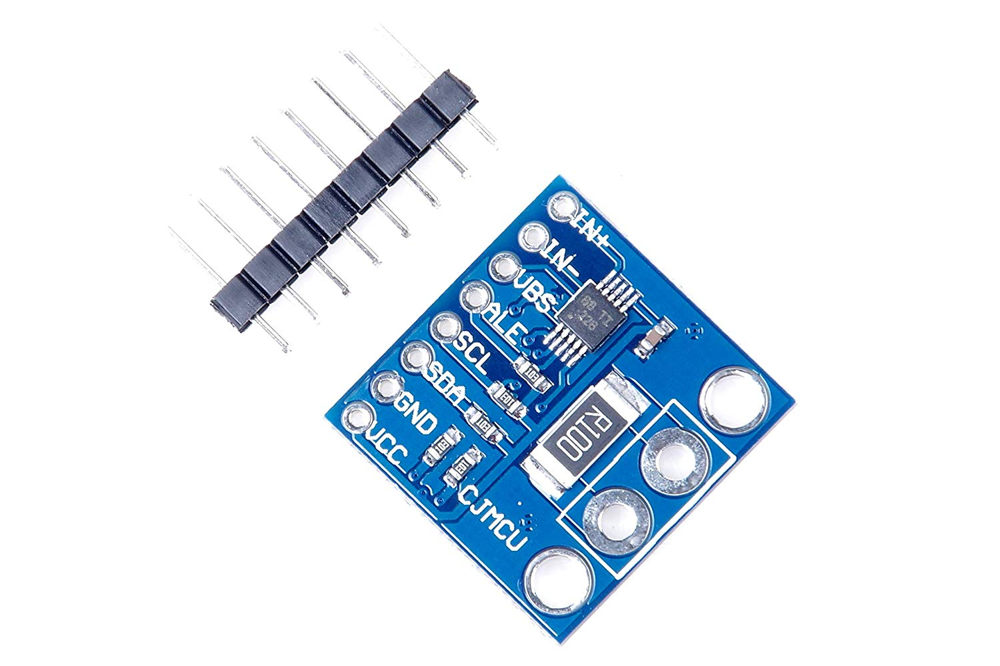

INA226 DC current and power sensor
==================================

.. seo::
    :description: Instructions for setting up INA226 DC current and power sensors
    :image: ina226.jpg
    :keywords: ina226

The ``ina226`` sensor platform allows you to use your INA226 DC Current and Power Sensor
(`datasheet <http://www.ti.com/lit/ds/symlink/ina226.pdf>`__, `eBay`_) sensors with ESPHome. 
The :ref:`I²C Bus <i2c>` is required to be set up in your configuration for this sensor to work.

    INA226 DC Current and Power Sensor.

.. _eBay: https://www.ebay.com/sch/i.html?_nkw=INA226

.. code-block:: yaml

    # Example configuration entry
    sensor:
      - platform: ina226
        address: 0x40
        shunt_resistance: 0.1 ohm
        max_current: 3.2A
        # adc time used for both, Bus Voltage and Shunt Voltage
        adc_time: 140us
        adc_averaging: 128
        update_interval: 60s
        current:
          name: "INA226 Current"
        power:
          name: "INA226 Power"
        bus_voltage:
          name: "INA226 Bus Voltage"
        shunt_voltage:
          name: "INA226 Shunt Voltage"

.. code-block:: yaml

    # Example configuration entry
    sensor:
      - platform: ina226
        address: 0x40
        adc_time:
          voltage: 140us
          current: 332us

Configuration variables:
------------------------

- **address** (*Optional*, integer): Manually specify the I²C address of the sensor. Defaults to ``0x40``.
- **shunt_resistance** (*Optional*, float): The value of the shunt resistor on the board for current calculation.
  Defaults to ``0.1 ohm``.
- **max_current** (*Optional*, float): The maximum current you are expecting. ESPHome will use this to
  configure the sensor optimally. Defaults to ``3.2A``.
- **adc_time** (*Optional*, :ref:`config-time` or both of the following nested options): The time in microseconds to perform a single ADC conversion.
  Defaults to ``1100us``. Valid values are ``140us``, ``204us``, ``332us``, ``588us``, ``1100us``, ``2116us``, 
  ``4156us``, ``8244us``.

  - **voltage** (**Required**, :ref:`config-time`) ADC conversion time for Bus Voltage
  - **current** (**Required**, :ref:`config-time`) ADC conversion time for Shunt Voltage (Current measurement)
- **adc_averaging** (*Optional*, integer): Selects ADC sample averaging count. Defaults to ``4``. Valid values are
  ``1``, ``4``, ``16``, ``64``, ``128``, ``256``, ``512``, ``1024``.
- **update_interval** (*Optional*, :ref:`config-time`): The interval to check the sensor. Defaults to ``60s``.

Sensors
-------
The component offers four sensors. You can configure all or any subset of them. Each configured sensor 
is reported  separately on each update_interval. The ``name`` option is required for each sensor configured. 
All other options from :ref:`Sensor <config-sensor>`.

- **current** (*Optional*): Calculated current output, Amperes. 
- **power** (*Optional*): Calculated power output, Watts. 
- **bus_voltage** (*Optional*): Bus voltage output (voltage of the high side contact), Volts.
- **shunt_voltage** (*Optional*): Shunt voltage (voltage across the shunt resistor) value of the sensor, Volts.

See Also
--------

- :ref:`sensor-filters`
- :doc:`ina219`
- :doc:`ina3221`
- :apiref:`ina226/ina226.h`
- `INA226 Arduino Library <https://github.com/SV-Zanshin/INA226>`__
- :ghedit:`Edit`
