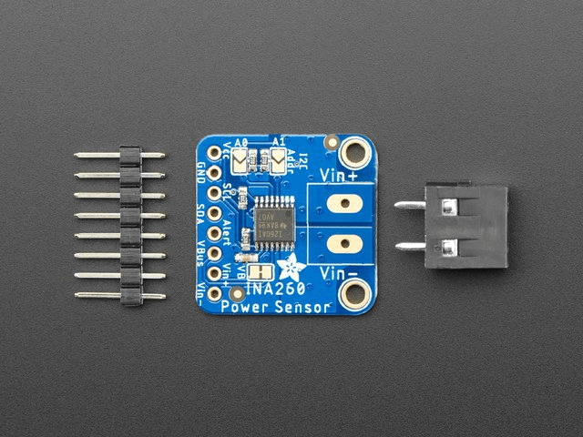

INA260 DC Current and Power sensor
==================================

.. seo::
    :description: Instructions for setting up INA260 DC current and power sensors
    :image: ina260.jpg
    :keywords: ina260

The ``ina260`` sensor platform allows you to use your INA260 DC Current and Power Sensor
(`datasheet <https://www.ti.com/lit/ds/symlink/ina260.pdf>`__,
`Adafruit`_) sensors with ESPHome. The :ref:`I²C Bus <i2c>` is
required to be set up in your configuration for this sensor to work.

    INA260 DC Current and Power Sensor.

.. _Adafruit: https://www.adafruit.com/product/4226

.. code-block:: yaml

    # Example configuration entry
    sensor:
      - platform: ina260
        address: 0x40
        current:
          name: "INA260 Current"
        power:
          name: "INA260 Power"
        bus_voltage:
          name: "INA260 Bus Voltage"
        update_interval: 60s

Configuration variables:
------------------------

- **address** (*Optional*, int): Manually specify the I²C address of the sensor. Defaults to ``0x40``.
- **current** (*Optional*): Use the current value of the sensor in amperes. All options from
  :ref:`Sensor <config-sensor>`.
- **power** (*Optional*): Use the power value of the sensor in watts. All options from
  :ref:`Sensor <config-sensor>`.
- **bus_voltage** (*Optional*): Use the bus voltage (voltage of the high side contact) value of the sensor in V. All options from :ref:`Sensor <config-sensor>`.
- **update_interval** (*Optional*, :ref:`config-time`): The interval to check the sensor. Defaults to ``60s``.

See Also
--------

- :ref:`sensor-filters`
- :doc:`ina219`
- :doc:`ina226`
- :doc:`ina3221`
- :apiref:`ina260/ina260.h`
- `INA260 Arduino Library <https://github.com/adafruit/Adafruit_INA260>`__
- :ghedit:`Edit`
