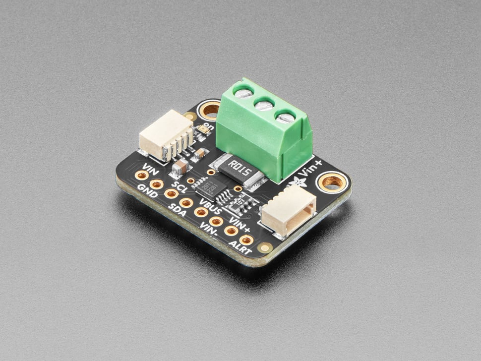

INA2xx family of digital power monitors
=======================================

.. seo::
    :description: Instructions for setting up INA228, INA229, INA237, INA238, INA239 DC current, power, and charge sensors
    :image: ina228.jpg
    :keywords: ina228 ina229 ina237 ina238 ina239

    INA228 Module with integrated shunt from Adafruit

Supported devices
-----------------
The ``ina2xx`` sensor platform allows you to use family of Texas Instruments current and power 
sensors with ESPHome. Appropriate interface (:ref:`I²C Bus <i2c>` or :ref:`SPI Bus <spi>`) is 
requred to be set up in your configuration for this sensor to work.

========================================================== ========== ==========================================================
 Product                                                    Protocol   Description
========================================================== ========== ==========================================================
 `INA228 <http://www.ti.com/lit/ds/symlink/ina228.pdf>`__     I²C       85-V, 20-Bit, Ultra-Precise Power/Energy/Charge Monitor
 `INA229 <http://www.ti.com/lit/ds/symlink/ina229.pdf>`__     SPI       85-V, 20-Bit, Ultra-Precise Power/Energy/Charge Monitor
 `INA238 <http://www.ti.com/lit/ds/symlink/ina238.pdf>`__     I²C       85-V, 16-Bit, High-Precision Power Monitor
 `INA239 <http://www.ti.com/lit/ds/symlink/ina239.pdf>`__     SPI       85-V, 16-Bit, High-Precision Power Monitor
 `INA237 <http://www.ti.com/lit/ds/symlink/ina237.pdf>`__     I²C       85-V, 16-Bit, Precision Power Monitor
========================================================== ========== ==========================================================

All devices can measure a selectable full-scale differential input of ±163.84 mV
or ±40.96 mV across the shunt with common-mode voltage support from –0.3 V to +85 V.

INA228 and INA229 are the most comprehensive devices of the family with extra features: 20-bit ADC resolution,
energy and charge accumulation, and capability to utilize the temperature measurement to compensate 
for shunt resistor temperature variance.

Example configuration
---------------------

Use ``ina2xx_i2c`` or ``ina2xx_spi`` components for :ref:`I²C <i2c>` or :ref:`SPI <spi>` devices respectively. 

.. code-block:: yaml

    # Example configuration entry for I²C
    i2c:
      sda: D1
      scl: D2
        
    sensor:
      - platform: ina2xx_i2c
        id: my_change_sensor
        address: 0x40
        shunt_resistance: 0.010 ohm
        max_current: 10 A
        adc_range: 0
        update_interval: 60s
        current:
          name: "INA2xx Current"
        bus_voltage:
          name: "INA2xx Bus Voltage"
        charge:
          name: "INA2xx Charge"

.. code-block:: yaml

    # Example configuration entry for SPI
    spi:
      clk_pin: D0
      mosi_pin: D1
      miso_pin: D2
        
    sensor:
      - platform: ina2xx_i2c
        cs_pin: D3
        shunt_resistance: 0.001130 ohm
        max_current: 40 A
        adc_range: 0
        temperature_coefficient: 50
        current:
          name: "INA2xx Current"
        power:
          name: "INA2xx Power"

         
Configuration variables:
------------------------

- **shunt_resistance** (float): The value of the shunt resistor used for current calculation. No default value.
- **max_current** (float): The maximum current you are expecting. Component will use it to 
  calibrate the sensor. No default value.
- **adc_range** (*Optional*, ``0`` or ``1``): Selects the range for differential input across shunt
  resistor. ``0`` for ±163.84 mV, ``1`` for ±40.96 mV range. Defaults to ``0``.
- **temperature_coefficient** (*Optional*, integer from ``0`` to ``16383``): Temperature coefficient (ppm/°C) of the 
  shunt for temperature compensation correction. Only applicable to INA228 and INA229 devices. Zero value means 
  no compensation is done. Defaults to ``0``.
- **update_interval** (*Optional*, :ref:`config-time`): The interval to check the sensor. Defaults to ``60s``.
- All other options for SPI/I²C devices as descibed in respective documentation.

Sensors
-------
The component offers nine sensors. You can configure all or any subset of the sensors. Each configured sensor 
is reported  separately on each update_interval. The ``name`` option is required for each sensor configured. 
All other options from :ref:`Sensor <config-sensor>`.

- **shunt_voltage** (*Optional*): Differential voltage measured across the shunt, mV
- **bus_voltage** (*Optional*): Bus voltage output, V
- **temperature** (*Optional*): Internal die temperature measurement, °C
- **current** (*Optional*): Calculated current output, A
- **power** (*Optional*): Calculated power output, W
- **energy** (*Optional*): Calculated energy output, Wh (*INA228/229 only*)
- **energy_joules** (*Optional*): Calculated energy output, Joules (*INA228/229 only*)
- **charge** (*Optional*): Calculated charge output, Ah (*INA228/229 only*)
- **charge_coulombs** (*Optional*): Calculated charge output, Coulombs (*INA228/229 only*)

Lambda calls
------------

The component exposes one function to reset INA228/INA229 energy and charge accumulators.

- ``reset_energy_counters()``

  .. code-block:: cpp

      // Within lambda, reset counters.
      id(my_charge_sensor).reset_energy_counters();

To simplify the use of this function, you can use the following example to add a button to reset the counters.

  .. code-block:: yaml

      button:
        - platform: template
          name: "Reset counters"
          on_press:
            - lambda: "id(my_change_sensor).reset_energy_counters();"

See Also
--------

- :ref:`sensor-filters`
- :doc:`ina219`
- :doc:`ina226`
- :doc:`ina3221`
- :apiref:`ina2xx_base/ina2xx_base.h`
- :ghedit:`Edit`
