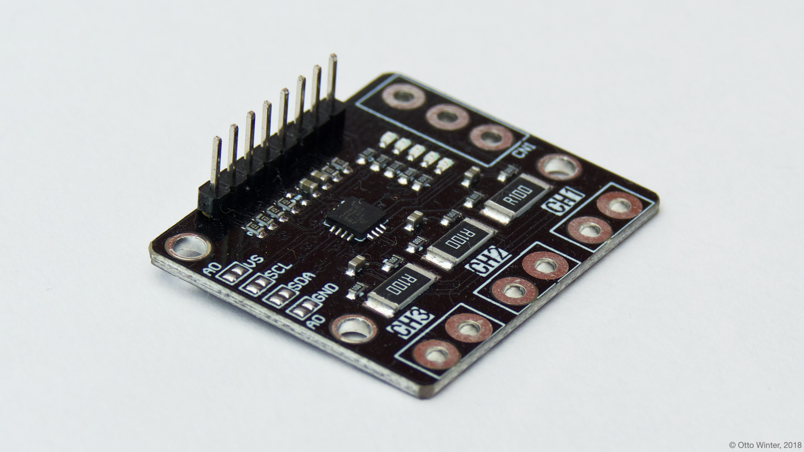
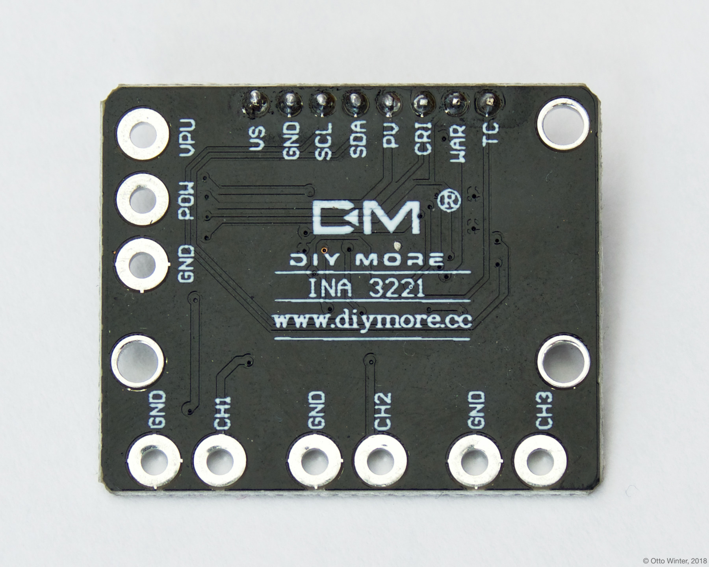

INA3221 3-Channel DC Current Sensor
===================================

.. seo::
    :description: Instructions for setting up INA3221 3-channel DC current sensors.
    :image: ina3221.jpg
    :keywords: ina3221

The ``ina3221`` sensor platform allows you to use your INA3221 3-Channel DC Current Sensor
(`datasheet <http://www.ti.com/lit/ds/symlink/ina3221.pdf>`__,
`switchdoc`_) sensors with
ESPHome. The :ref:`I²C Bus <i2c>` is
required to be set up in your configuration for this sensor to work.

    INA3221 3-Channel DC Current Sensor

.. _switchdoc: http://www.switchdoc.com/ina3221-breakout-board/

.. figure:: images/ina3221-ui.png
    :align: center
    :width: 80.0%

.. code-block:: yaml

    # Example configuration entry
    sensor:
      - platform: ina3221
        address: 0x40
        channel_1:
          shunt_resistance: 0.1 ohm
          current:
            name: "INA3221 Channel 1 Current"
          power:
            name: "INA3221 Channel 1 Power"
          bus_voltage:
            name: "INA3221 Channel 1 Bus Voltage"
          shunt_voltage:
            name: "INA3221 Channel 1 Shunt Voltage"
        channel_2:
          # ...
        channel_3:
          # ...
        update_interval: 60s

Configuration variables:
------------------------

- **address** (*Optional*, int): Manually specify the I²C address of the sensor. Defaults to ``0x40``.
- **channel_1** (*Optional*): The configuration options for the 1st channel.

  - **shunt_resistance** (*Optional*, float): The value of the shunt resistor on this channel for current calculation.
    Defaults to ``0.1 ohm``.
  - **current** (*Optional*): Use the current value on this channel in amperes. All options from
    :ref:`Sensor <config-sensor>`.
  - **power** (*Optional*): Use the power value on this channel in watts. All options from
    :ref:`Sensor <config-sensor>`.
  - **bus_voltage** (*Optional*): Use the bus voltage (voltage of the high side contact) value on this channel in V.
    All options from :ref:`Sensor <config-sensor>`.
  - **shunt_voltage** (*Optional*): Use the shunt voltage (voltage across the shunt resistor) value on this channel in V.
    All options from :ref:`Sensor <config-sensor>`.

- **channel_2** (*Optional*): The configuration options for the 2nd channel. Same options as 1st channel.
- **channel_3** (*Optional*): The configuration options for the 3rd channel. Same options as 1st channel.
- **update_interval** (*Optional*, :ref:`config-time`): The interval to check the sensor. Defaults to ``60s``.

    Pins on the INA3221. For communication only VS, GND, SCL and SDA need to be connected.
    Note that all 3 channels share the same GND reference.

See Also
--------

- :ref:`sensor-filters`
- :doc:`ina219`
- :apiref:`ina3221/ina3221.h`
- `INA3221 Arduino Library <https://github.com/switchdoclabs/SDL_Arduino_INA3221>`__ by `SwitchDoc Labs <https://github.com/switchdoclabs>`__
- :ghedit:`Edit`
