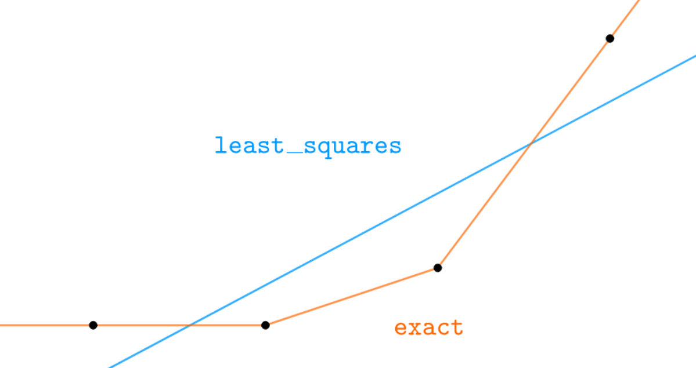

Sensor Component
================

.. seo::
    :description: Instructions for setting up sensor components in ESPHome.
    :image: folder-open.svg

ESPHome has support for many different sensors. Each of them is a
platform of the ``sensor`` domain and each sensor has several base
configuration options.

.. _config-sensor:

Base Sensor Configuration
-------------------------

All sensors in ESPHome have a name and some other
optional configuration options. By default, the sensor platform will
chose appropriate values for all of these by default, but you can always
override them if you want to.

.. code-block:: yaml

    # Example sensor configuration
    name: Livingroom Temperature

    # Optional variables:
    unit_of_measurement: "°C"
    icon: "mdi:water-percent"
    device_class: "temperature"
    state_class: "measurement"
    accuracy_decimals: 1
    expire_after: 30s
    filters:
      - sliding_window_moving_average:
          window_size: 15
          send_every: 15

Configuration variables:

- **id** (*Optional*, string): Manually specify the ID for code generation. At least one of **id** and **name** must be specified.
- **name** (*Optional*, string): The name for the sensor. At least one of **id** and **name** must be specified.

  .. note::

      If you have a :ref:`friendly_name <esphome-configuration_variables>` set for your device and
      you want the sensor to use that name, you can set ``name: None``.

- **unit_of_measurement** (*Optional*, string): Manually set the unit
  of measurement the sensor should advertise its values with. This does
  not actually do any maths (conversion between units).
- **device_class** (*Optional*, string): The device class for the
  sensor. See https://www.home-assistant.io/integrations/sensor/#device-class
  for a list of available options. Set to ``""`` to remove the default device class of a sensor.
- **state_class** (*Optional*, string): The state class for the
  sensor. See https://developers.home-assistant.io/docs/core/entity/sensor/#available-state-classes
  for a list of available options. Set to ``""`` to remove the default state class of a sensor.
- **icon** (*Optional*, icon): Manually set the icon to use for the sensor in the frontend.
- **accuracy_decimals** (*Optional*, int): Manually set the number of decimals to use when reporting values. This does not impact the actual value reported to Home Assistant, it just sets the number of decimals to use when displaying it.
- **filters** (*Optional*): Specify filters to use for some basic
  transforming of values. See :ref:`Sensor Filters <sensor-filters>` for more information.
- **internal** (*Optional*, boolean): Mark this component as internal. Internal components will
  not be exposed to the frontend (like Home Assistant). Only specifying an ``id`` without
  a ``name`` will implicitly set this to true.
- **force_update** (*Optional*, boolean): If true, this option will force the frontend (usually Home
  Assistant) to create a state changed event when the sensor updates even if the value stayed the same.
  Some applications like Grafana require this when working with Home Assistant, but beware it can
  significantly increase the database size. Defaults to ``false``.
- **disabled_by_default** (*Optional*, boolean): If true, then this entity should not be added to any client's frontend,
  (usually Home Assistant) without the user manually enabling it (via the Home Assistant UI).
  Defaults to ``false``.
- **entity_category** (*Optional*, string): The category of the entity.
  See https://developers.home-assistant.io/docs/core/entity/#generic-properties
  for a list of available options.
  Set to ``""`` to remove the default entity category.

Automations:

- **on_value** (*Optional*, :ref:`Automation <automation>`): An automation to perform
  when a new value is published. See :ref:`sensor-on_value`.
- **on_value_range** (*Optional*, :ref:`Automation <automation>`): An automation to perform
  when a published value transition from outside to a range to inside. See :ref:`sensor-on_value_range`.
- **on_raw_value** (*Optional*, :ref:`Automation <automation>`): An automation to perform
  when a raw value is received that hasn't passed through any filters. See :ref:`sensor-on_raw_value`.

MQTT Options:

- **expire_after** (*Optional*, :ref:`config-time`): Manually set the time in which
  the sensor values should be marked as “expired”/“unknown”. Not providing any value means no expiry.
- All other options from :ref:`MQTT Component <config-mqtt-component>`.

.. note::

    If you're trying to setup filters for a sensor that has multiple outputs - for example a DHT22 which
    reports temperature *and* humidity - put the ``filters`` option into each sensor output like this:

    .. code-block:: yaml

        sensor:
          - platform: dht
            # ...
            temperature:
              filters:
                # ...
            humidity:
              filters:
                # ...

.. _sensor-filters:

Sensor Filters
--------------

ESPHome allows you to do some basic pre-processing of
sensor values before they’re sent to Home Assistant. This is for example
useful if you want to apply some average over the last few values.

There are a lot of filters that sensors support. You define them by adding a ``filters``
block in the sensor configuration (at the same level as ``platform``; or inside each sensor block
for platforms with multiple sensors)

Filters are processed in the order they are defined in your configuration.

.. code-block:: yaml

    # Example filters:
    filters:
      - offset: 2.0
      - multiply: 1.2
      - calibrate_linear:
          - 0.0 -> 0.0
          - 40.0 -> 45.0
          - 100.0 -> 102.5
      - filter_out: 42.0
      - median:
          window_size: 5
          send_every: 5
          send_first_at: 1
      - quantile:
          window_size: 5
          send_every: 5
          send_first_at: 1
          quantile: .9
      - sliding_window_moving_average:
          window_size: 15
          send_every: 15
      - exponential_moving_average:
          alpha: 0.1
          send_every: 15
      - throttle: 1s
      - throttle_average: 1s
      - heartbeat: 5s
      - debounce: 0.1s
      - timeout: 1min
      - delta: 5.0
      - or:
        - throttle: 1s
        - delta: 5.0
      - lambda: return x * (9.0/5.0) + 32.0;

``offset``
**********

Adds a constant value to each sensor value.

.. code-block:: yaml

    # Example configuration entry
    - platform: adc
      # ...
      filters:
        - offset: 2.0
        - multiply: 1.2

``multiply``
************

Multiplies each value by a constant value.

.. _sensor-filter-calibrate_linear:

``calibrate_linear``
********************

Calibrate your sensor values by using values you measured with an accurate "truth" source.

Configuration variables:

- **method** (*Optional*, string): The method for calculating the linear function(s).
  One of ``least_squares`` or ``exact``. Defaults to ``least_squares``.
- **datapoints** (**Required**): The list of datapoints.

First, collect a bunch of values of what the sensor shows and what the real value should be.
For temperature, this can for example be achieved by using an accurate thermometer. For other
sensors like power sensor this can be done by connecting a known load and then writing down
the value the sensor shows.

.. code-block:: yaml

    # Example configuration entry
    - platform: dht
      # ...
      temperature:
        name: "DHT22 Temperature"
        filters:
          - calibrate_linear:
             method: least_squares
             datapoints:
              # Map 0.0 (from sensor) to 1.0 (true value)
              - 0.0 -> 1.0
              - 10.0 -> 12.1

The arguments are a list of data points, each in the form ``MEASURED -> TRUTH``. Depending on
the ``method`` ESPHome will then either fit a linear equation to the values (using least squares)
or connect the values exactly using multiple linear equations. You need to supply at least two
values. When using ``least_squares`` and more than two values are given a linear solution will be
calculated and may not represent each value exactly.

.. _sensor-calibrate_polynomial:

``calibrate_polynomial``
************************

Calibrate your sensor values by fitting them to a polynomial functions. This is similar to
the ``calibrate_linear`` filter, but also allows for higher-order functions like quadratic polynomials.

.. code-block:: yaml

    # Example configuration entry
    - platform: adc
      # ...
      filters:
        - calibrate_polynomial:
           degree: 2
           datapoints:
            # Map 0.0 (from sensor) to 0.0 (true value)
            - 0.0 -> 0.0
            - 10.0 -> 12.1
            - 13.0 -> 14.0

The arguments are a list of data points, each in the form ``MEASURED -> TRUTH``. Additionally, you need
to specify the degree of the resulting polynomial, the datapoints will then be fitted to the given
degree with a least squares solver.

``filter_out``
**************

(**Required**, number): Filter out specific values to be displayed. For example to filter out the value ``85.0``

.. code-block:: yaml

    # Example configuration entry
    - platform: wifi_signal
      # ...
      filters:
        - filter_out: 85.0

``clamp``
*********

Limits the value to the range between ``min_value`` and ``max_value``. By default, sensor values outside these bounds will be set to ``min_value`` or ``max_value``, respectively. If ``ignore_out_of_range`` is true, then sensor values outside those bounds will be ignored. If ``min_value`` is not set, there is no lower bound; if ``max_value`` is not set there is no upper bound.

Configuration variables:

- **min_value** (*Optional*, float): The lower bound of the range.
- **max_value** (*Optional*, float): The upper bound of the range.
- **ignore_out_of_range** (*Optional*, bool): If true, ignores all sensor values out of the range. Defaults to ``false``.

.. code-block:: yaml

    # Example configuration entry
    - platform: wifi_signal
      # ...
      filters:
        - clamp:
            min_value: 10
            max_value: 75
            ignore_out_of_range: true

``round``
*********

Rounds the value to the given decimal places.

.. code-block:: yaml

    - platform: ...
      filters:
        - round: 1 # will round to 1 decimal place

``quantile``
************

A `simple moving quantile <https://www.itl.nist.gov/div898/software/dataplot/refman2/auxillar/quantile.htm>`__
over the last few values. This can be used to filter outliers from the received sensor data. A large
window size will make the filter slow to react to input changes.

.. code-block:: yaml

    # Example configuration entry
    - platform: wifi_signal
      # ...
      filters:
        - quantile:
            window_size: 7
            send_every: 4
            send_first_at: 3
            quantile: .9

Configuration variables:

- **window_size** (*Optional*, int): The number of values over which to calculate the quantile
  when pushing out a value.
  Defaults to ``5``.
- **send_every** (*Optional*, int): How often a sensor value should be pushed out. For
  example, in above configuration the quantile is calculated after every 4th
  received sensor value, over the last 7 received values.
  Defaults to ``5``.
- **send_first_at** (*Optional*, int): By default, the very first raw value on boot is immediately
  published. With this parameter you can specify when the very first value is to be sent.
  Must be smaller than or equal to ``send_every``
  Defaults to ``1``.
- **quantile** (*Optional*, float): value from 0 to 1 to determine which quantile to pick.
  Defaults to ``.9``.

``median``
**********

A `simple moving median <https://en.wikipedia.org/wiki/Median_filter#Worked_1D_example>`__
over the last few values. This can be used to filter outliers from the received sensor data. A large
window size will make the filter slow to react to input changes.

.. code-block:: yaml

    # Example configuration entry
    - platform: wifi_signal
      # ...
      filters:
        - median:
            window_size: 7
            send_every: 4
            send_first_at: 3

Configuration variables:

- **window_size** (*Optional*, int): The number of values over which to calculate the median
  when pushing out a value. This number should
  be odd if you want an actual received value pushed out.
  Defaults to ``5``.
- **send_every** (*Optional*, int): How often a sensor value should be pushed out. For
  example, in above configuration the median is calculated after every 4th
  received sensor value, over the last 7 received values.
  Defaults to ``5``.
- **send_first_at** (*Optional*, int): By default, the very first raw value on boot is immediately
  published. With this parameter you can specify when the very first value is to be sent.
  Must be smaller than or equal to ``send_every``
  Defaults to ``1``.

``min``
*******

A moving minimum over the last few values. A large window size will make the filter slow to
react to input changes.

.. code-block:: yaml

    # Example configuration entry
    - platform: wifi_signal
      # ...
      filters:
        - min:
            window_size: 7
            send_every: 4
            send_first_at: 3

Configuration variables:

- **window_size** (*Optional*, int): The number of values over which to calculate the min/max when pushing out a
  value. Defaults to ``5``.
- **send_every** (*Optional*, int): How often a sensor value should be pushed out. For
  example, in above configuration the min is calculated after every 4th
  received sensor value, over the last 7 received values.
  Defaults to ``5``.
- **send_first_at** (*Optional*, int): By default, the very first raw value on boot is immediately
  published. With this parameter you can specify when the very first value is to be sent.
  Must be smaller than or equal to ``send_every``
  Defaults to ``1``.

``max``
*******

A moving maximum over the last few values. A large window size will make the filter slow to
react to input changes.

Configuration variables:

- **window_size** (*Optional*, int): The number of values over which to calculate the min/max
  when pushing out a value.
  Defaults to ``5``.
- **send_every** (*Optional*, int): How often a sensor value should be pushed out. For
  example, in above configuration the max is calculated after every 4th
  received sensor value, over the last 7 received values.
  Defaults to ``5``.
- **send_first_at** (*Optional*, int): By default, the very first raw value on boot is immediately
  published. With this parameter you can specify when the very first value is to be sent.
  Must be smaller than or equal to ``send_every``
  Defaults to ``1``.

``sliding_window_moving_average``
*********************************

A `simple moving average <https://en.wikipedia.org/wiki/Moving_average#Simple_moving_average>`__
over the last few values. It can be used to have a short update interval on the sensor but only push
out an average on a specific interval (thus increasing resolution).

.. code-block:: yaml

    # Example configuration entry
    - platform: wifi_signal
      # ...
      filters:
        - sliding_window_moving_average:
            window_size: 15
            send_every: 15

Configuration variables:

- **window_size** (*Optional*, int): The number of values over which to perform an
  average when pushing out a value.
- **send_every** (*Optional*, int): How often a sensor value should be pushed out. For
  example, in above configuration the weighted average is only
  pushed out on every 15th received sensor value.
- **send_first_at** (*Optional*, int): By default, the very first raw value on boot is immediately
  published. With this parameter you can specify when the very first value is to be sent.
  Defaults to ``1``.

.. _sensor-filter-exponential_moving_average:

``exponential_moving_average``
******************************

A simple `exponential moving average
<https://en.wikipedia.org/wiki/Moving_average#Exponential_moving_average>`__ over the last few
values. It can be used to have a short update interval on the sensor but only push
out an average on a specific interval (thus increasing resolution).

Configuration variables:

- **alpha** (*Optional*, float): The forget factor/alpha value of the filter.
  A higher value includes more details in the output while a lower value removes more noise.
  Defaults to ``0.1``.
- **send_every** (*Optional*, int): How often a sensor value should be pushed out. Defaults to ``15``.
- **send_first_at** (*Optional*, int): By default, the very first raw value on boot is immediately
  published. With this parameter you can specify when the very first value is to be sent.
  Defaults to ``1``.

``skip_initial``
****************

A simple skip filter; ``skip_initial: N`` skips the first ``N`` sensor readings and passes on the
rest. This can be used when the sensor needs a few readings to 'warm up'. After the initial
readings have been skipped, this filter does nothing.

.. code-block:: yaml

    # Example configuration entry
    - platform: wifi_signal
      # ...
      filters:
        - skip_initial: 3

``throttle``
************

Throttle the incoming values. When this filter gets an incoming value,
it checks if the last incoming value is at least ``specified time period`` old.
If it is not older than the configured value, the value is not passed forward.

.. code-block:: yaml

    # Example filters:
    filters:
      - throttle: 1s
      - heartbeat: 5s
      - debounce: 0.1s
      - delta: 5.0
      - lambda: return x * (9.0/5.0) + 32.0;

``throttle_average``
********************

An average over the ``specified time period``, potentially throttling incoming values. When this filter gets incoming values, it sums up all values and pushes out the average after the ``specified time period`` passed. There are two edge cases to consider within the ``specified time period``:

* no value(s) received: ``NaN`` is returned - add the ``heartbeat`` filter if periodical pushes are required and/or ``filter_out: nan`` if required
* one value received: the value is pushed out after the ``specified time period`` passed, without calculating an average

For example a ``throttle_average: 60s`` will push out a value every 60 seconds, in case at least one sensor value is received within these 60 seconds.

In comparison to the ``throttle`` filter, it won't discard any values. In comparison to the ``sliding_window_moving_average`` filter, it supports variable sensor reporting rates without influencing the filter reporting interval (except for the first edge case).

``heartbeat``
*************

Send the value periodically with the specified time interval.
If the sensor value changes during the interval the interval will not reset.
The last value of the sensor will be sent.

So a value of ``10s`` will cause the filter to output values every 10s regardless
of the input values.

``timeout``
************

After the first value has been sent, if no subsequent value is published within the
``specified time period``, send a value which defaults to ``NaN``.
Especially useful when data is derived from some other communication
channel, e.g. a serial port, which can potentially be interrupted.

.. code-block:: yaml

    # Example filters:
    filters:
      - timeout: 10s  # sent value will be NaN
      - timeout:
          timeout: 10s
          value: 0

``debounce``
************

Only send values if the last incoming value is at least ``specified time period``
old. For example if two values come in at almost the same time, this filter will only output
the last value and only after the specified time period has passed without any new incoming
values.

``delta``
*********

This filter stores the last value passed through this filter and only passes incoming values through
if incoming value is sufficiently different from the previously passed one.
This difference can be calculated in two ways an absolute difference or a percentage difference.

If a number is specified, it will be used as the absolute difference required.
For example if the filter were configured with a value of 2 and the last value passed through was 10,
only values greater than 12 or less than 8 would be passed through.

.. code-block:: yaml

    filters:
      - delta: 2.0

If a percentage is specified a percentage of the last value will be used as the required difference.
For example if the filter were configured with a value of 20% and the last value passed through was 10,
only values greater than 12 or less than 8 would be passed through.
However, if the last value passed through was 100 only values greater than 120 or less than 80 would be passed through.

.. code-block:: yaml

    filters:
      - delta: 20%

``or``
******

Pass forward a value with the first child filter that returns. Below example
will only pass forward values that are *either* at least 1s old or are if the absolute
difference is at least 5.0.

.. code-block:: yaml

    # Example filters:
    filters:
      - or:
        - throttle: 1s
        - delta: 5.0

``lambda``
**********

Perform a simple mathematical operation over the sensor values. The input value is ``x`` and
the result of the lambda is used as the output (use ``return``).

.. code-block:: yaml

    filters:
      - lambda: return x * (9.0/5.0) + 32.0;

Make sure to add ``.0`` to all values in the lambda, otherwise divisions of integers will
result in integers (not floating point values).

To prevent values from being published, return ``{}``:

.. code-block:: yaml

    filters:
      - lambda: |-
          if (x < 10) return {};
          return x-10;

Example: Converting Celsius to Fahrenheit
-----------------------------------------

While I personally don’t like the Fahrenheit temperature scale, I do
understand that having temperature values appear in the Fahrenheit unit
is quite useful to some users. ESPHome uses the Celsius temperature
unit internally, and I’m not planning on making converting between the
two simple (😉), but you can use this filter to convert Celsius values to
Fahrenheit.

.. code-block:: yaml

    filters:
      - lambda: return x * (9.0/5.0) + 32.0;
    unit_of_measurement: "°F"

.. _sensor-automations:

Sensor Automation
-----------------

You can access the most recent state of the sensor in :ref:`lambdas <config-lambda>` using
``id(sensor_id).state`` and the most recent raw state using ``id(sensor_id).raw_state``.

.. _sensor-on_value:

``on_value``
************

This automation will be triggered when a new value that has passed through all filters
is published. In :ref:`Lambdas <config-lambda>` you can get the value from the trigger
with ``x``.

.. code-block:: yaml

    sensor:
      - platform: dallas
        # ...
        on_value:
          then:
            - light.turn_on:
                id: light_1
                red: !lambda "return x/255;"

Configuration variables: See :ref:`Automation <automation>`.

.. _sensor-on_value_range:

``on_value_range``
******************

With this automation you can observe if a sensor value passes from outside
a defined range of values to inside a range. For example you can have an
automation that triggers when a humidity crosses a threshold, and then turns on a dehumidifier.
This trigger will only trigger when the new value is inside the range and the previous value
was outside the range. On startup, the last state before reboot is restored and if the value crossed
the boundary during the boot process, the trigger is also executed.

Define the range with ``above`` and ``below``. If only one of them is defined, the interval is half-open.
So for example ``above: 5`` with no below would mean the range from 5 to positive infinity.

.. code-block:: yaml

    sensor:
      - platform: dallas
        # ...
        on_value_range:
          - below: 5.0
            then:
              - switch.turn_on: relay_1
          - above: 5.0
            below: 10.0
            then:
              - switch.turn_on: relay_2
          - above: 10.0
            then:
              - switch.turn_on: relay_3

Configuration variables:

- **above** (*Optional*, float): The minimum for the trigger.
- **below** (*Optional*, float): The maximum for the trigger.
- See :ref:`Automation <automation>`.

.. _sensor-on_raw_value:

``on_raw_value``
****************

This automation will be triggered when a new value is received that hasn't passed
through any filters. In :ref:`Lambdas <config-lambda>` you can get the value from the
trigger with ``x``.

.. code-block:: yaml

    sensor:
      - platform: dallas
        # ...
        on_raw_value:
          then:
            - light.turn_on:
                id: light_1
                red: !lambda "return x/255;"

Configuration variables: See :ref:`Automation <automation>`.

.. _sensor-in_range_condition:

``sensor.in_range`` Condition
*****************************

This condition passes if the state of the given sensor is inside a range.

Define the range with ``above`` and ``below``. If only one of them is defined, the interval is half-open.
So for example ``above: 5`` with no below would mean the range from 5 to positive infinity.

.. code-block:: yaml

    # in a trigger:
    on_...:
      if:
        condition:
          sensor.in_range:
            id: my_sensor
            above: 50.0
        then:
        - script.execute: my_script

Configuration variables:

- **above** (*Optional*, float): The minimum for the condition.
- **below** (*Optional*, float): The maximum for the condition.

.. _sensor-lambda_calls:

lambda calls
************

From :ref:`lambdas <config-lambda>`, you can call several methods on all sensors to do some
advanced stuff (see the full API Reference for more info).

- ``publish_state()``: Manually cause the sensor to push out a value. It will then
  be processed by the sensor filters, and once filtered will propagate though ESPHome and though the API to Home Assistant or out via MQTT if configured.

  .. code-block:: cpp

      // Within lambda, push a value of 42.0
      id(my_sensor).publish_state(42.0);

- ``.state``: Retrieve the current value of the sensor that has passed through all sensor filters.
  Is ``NAN`` if no value has gotten through all filters yet.

  .. code-block:: cpp

      // For example, create a custom log message when a value is received:
      ESP_LOGI("main", "Value of my sensor: %f", id(my_sensor).state);

- ``raw_state``: Retrieve the current value of the sensor that has not passed through any filters.
  Is ``NAN`` if no value has been pushed by the sensor itself yet.

  .. code-block:: cpp

      // For example, create a custom log message when a value is received:
      ESP_LOGI("main", "Raw Value of my sensor: %f", id(my_sensor).raw_state);

See Also
--------

- :apiref:`sensor/sensor.h`
- :ghedit:`Edit`

.. toctree::
    :maxdepth: 1
    :glob:

    *
