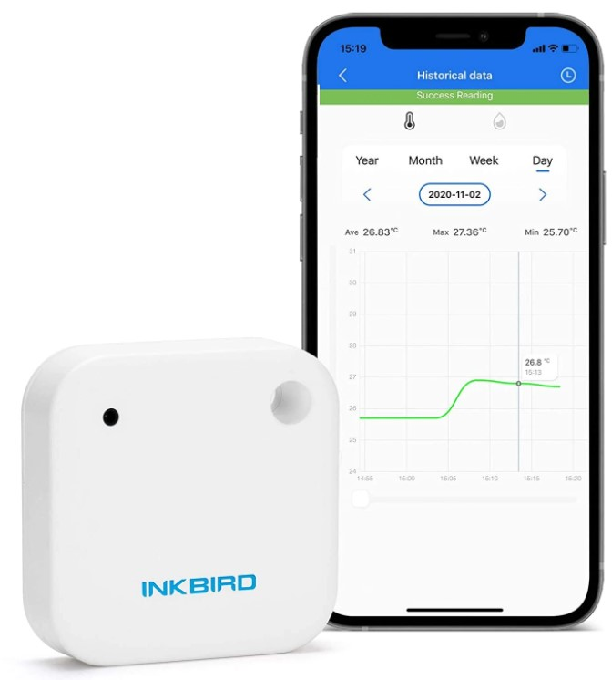
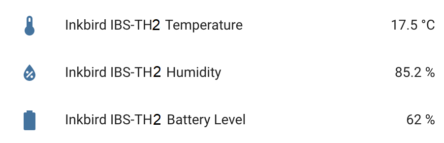

Inkbird IBS-TH2 BLE Sensor
===========================================

.. seo::
    :description: Instructions for setting up Inkbird IBS-TH2 Bluetooth-based temperature and humidity sensors in ESPHome.
    :image: inkbird_isbth2.jpg
    :keywords: Inkbird, BLE, Bluetooth, IBS-TH2

The ``inkbird_ibsth2`` sensor platform lets you track the output of Inkbird IBS-TH2 Bluetooth
Low Energy devices using the :doc:`/components/esp32_ble_tracker`. This component will track the
temperature, humidity and the battery level of the IBS-TH2 device every time the
sensor sends out a BLE broadcast. Note that contrary to other implementations, ESPHome can track as
many IBS-TH2 devices at once as you want.

    Inkbird IBS-TH2 Temperature and Humidity Sensor over BLE.

.. code-block:: yaml

    # Example configuration entry
    esp32_ble_tracker:

    sensor:
      - platform: inkbird_ibsth2
        mac_address: 38:81:D7:0A:9C:11
        temperature:
          name: "Inkbird IBS-TH2 Temperature"
        humidity:
          name: "Inkbird IBS-TH2 Humidity"
        battery_level:
          name: "Inkbird IBS-TH2 Battery Level"

Configuration variables:
------------------------

- **mac_address** (**Required**, MAC Address): The MAC address of the Inkbird IBS-TH2 device.
- **temperature** (*Optional*): The information for the temperature sensor.

  - **name** (**Required**, string): The name for the temperature sensor.
  - **id** (*Optional*, :ref:`config-id`): Set the ID of this sensor for use in lambdas.
  - All other options from :ref:`Sensor <config-sensor>`.

- **humidity** (*Optional*): The information for the humidity sensor

  - **name** (**Required**, string): The name for the humidity sensor.
  - **id** (*Optional*, :ref:`config-id`): Set the ID of this sensor for use in lambdas.
  - All other options from :ref:`Sensor <config-sensor>`.

- **battery_level** (*Optional*): The information for the battery level sensor

  - **name** (**Required**, string): The name for the battery level sensor.
  - **id** (*Optional*, :ref:`config-id`): Set the ID of this sensor for use in lambdas.
  - All other options from :ref:`Sensor <config-sensor>`.

Setting Up Devices
------------------

To set up Inkbird IBS-TH2 devices you first need to find their MAC Address so that ESPHome can
identify them. So first, create a simple configuration without any ``inkbird_ibsth2`` entries
like so:

.. code-block:: yaml

    esp32_ble_tracker:

After uploading the ESP32 will immediately try to scan for BLE devices such as the Inkbird IBS-TH2. 
When it detects these sensors, it will automatically parse the BLE message print a
message like this one:

.. code::

    [13:36:43][D][esp32_ble_tracker:544]: Found device 38:81:D7:0A:9C:11 RSSI=-53
    [13:36:43][D][esp32_ble_tracker:565]:   Address Type: PUBLIC
    [13:36:43][D][esp32_ble_tracker:567]:   Name: 'sps'

Note that it can sometimes take some time for the first BLE broadcast to be received. Please note that address type
should say 'PUBLIC' and the device name should be 'sps', this is how you find the Inkbird IBS-TH2 among all the 
other devices.

Then just copy the address (``38:81:D7:0A:9C:11``) into a new ``sensor.inkbird_ibsth2`` platform
entry like in the configuration example at the top.

.. note::

    The ESPHome Inkbird IBS-TH2 integration listens passively to packets the device sends by itself.
    ESPHome therefore has no impact on the battery life of the device.

See Also
--------

- :doc:`/components/esp32_ble_tracker`
- :doc:`/components/sensor/index`
- :apiref:`inkbird_ibsth2/inkbird_ibsth2.h`
- `OpenMQTTGateway <https://github.com/1technophile/OpenMQTTGateway>`__ by `@1technophile <https://github.com/1technophile>`__
- :ghedit:`Edit`
