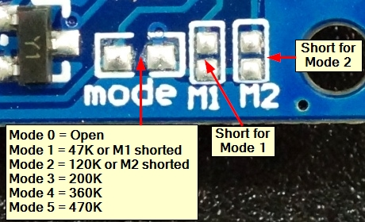
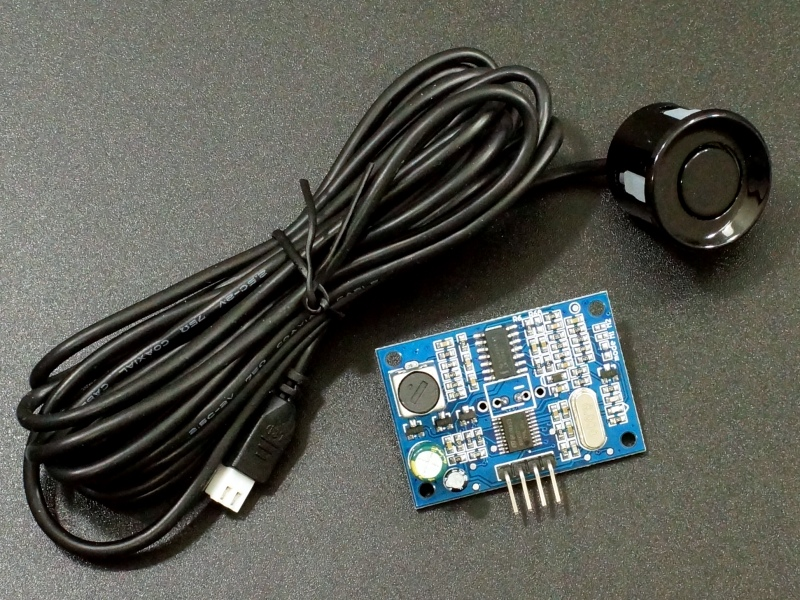

JSN-SR04T Waterproof Ultrasonic Range Finder
============================================

.. seo::
    :description: Instructions for setting up JSN-SR04T waterproof ultrasonic distance sensor in ESPHome.
    :image: jsn-sr04t-v3.jpg
    :keywords: JSN-SR04T

This sensor allows you to use the JSN-SR04T Waterproof Ultrasonic Range Finder **in Mode 1 and 2** 
with ESPHome to measure distances. This sensor can measure
ranges between 25 centimeters and 600 centimeters with a resolution of 1 millimeter.

Configure the JSN-SR04T for mode 1:
    - **V1.0 and V2.0**: Add a 47k resistor to pad R27.
    - **V3.0**: Short pad M1 or add 47k resistor to pad mode.

Configure the JSN-SR04T for mode 2:
    - **V1.0 and V2.0**: Add a 120k resistor to pad R27.
    - **V3.0**: Short pad M2 or add 120k resistor to pad mode.

    JSN-SR04T Waterproof Ultrasonic Range Finder Mode Select Pads.

In mode 1 the module continuously takes measurements approximately every 100mS and outputs the distance on the TX pin at 9600 baud. 
In this mode :ref:`sensor-filters` are highly recommended.

In mode 2 the module takes a measurement only when a trigger command of 0x55 is sent to the RX pin on the module. 
The module then outputs the distance on its TX pin. The frequency of the measurements can be set with the **update_interval** option.

To use the sensor, first set up an :ref:`uart` with a baud rate of 9600 and connect the sensor to the specified pin.

    JSN-SR04T Waterproof Ultrasonic Range Finder.

.. code-block:: yaml

    # Example configuration entry
    sensor:
      - platform: "jsn_sr04t"
        name: "Distance"
        update_interval: 1s
 

Configuration variables:
------------------------

- **name** (**Required**, string): The name of the sensor.
- **update_interval** (*Optional*, :ref:`config-time`): The interval to check the
  sensor. Defaults to ``60s``. Not applicable in mode 1.
- **uart_id** (*Optional*, :ref:`config-id`): The ID of the :ref:`UART bus <uart>` you wish to use for this sensor.
  Use this if you want to use multiple UART buses at once.
- All other options from :ref:`Sensor <config-sensor>`.

See Also
--------

- :ref:`uart`
- :ref:`sensor-filters`
- :apiref:`jsn_sr04t/jsn_sr04t.h`
- :ghedit:`Edit`
