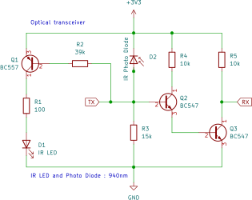

Kamstrup Meter Protocol [KMP]
=============================

    Kamstrup MULTICAL 403

The Kamstrup Meter Protocol (KMP) is used by certain Kamstrup utility
meters and can be used to read measurements from the meter.

For example, the Kamstrup MULTICAL 403 is a meter used by some energy
companies in The Netherlands to measure delivered heat by a district heating
network (in Dutch: stadsverwarming).

Heat is transported using warm water to the consumer. The meter measures
the temperature of the water delivered and returned as well as the water
flow. This is used to calculate the consumed energy, typically in giga
joule (GJ).

The Kamstrup Multical has an optical interface just above the display
that uses the Kamstrup Meter Protocol for communication.
This component can be used to request measurements from the meter using
the optical interface.

A :ref:`UART bus <uart>` is required to communicate with the meter.

Configuration
-------------

.. code-block:: yaml

    # Example configuration entry
    sensor:
      - platform: kamstrup_kmp
        heat_energy:
          name: Heat Energy
        power:
          name: Heat Power
        temp_diff:
          name: Heat Temperature Difference
        flow:
          name: Heat Flow
        custom:
          - name: Custom Heat Energy
            command: 0x003C
          - name: Custom Heat Power
            command: 0x0050

Configuration variables:

- **heat_energy** (*Optional*): Heat energy delivered.
  All options from :ref:`Sensor <config-sensor>`.
- **power** (*Optional*): Current power delivered.
  All options from :ref:`Sensor <config-sensor>`.
- **temp1** (*Optional*): Temperatue of sensor 1.
  All options from :ref:`Sensor <config-sensor>`.
- **temp2** (*Optional*): Temperatue of sensor 2.
  All options from :ref:`Sensor <config-sensor>`.
- **temp_diff** (*Optional*): Temperature difference between the 2 sensors.
  All options from :ref:`Sensor <config-sensor>`.
- **flow** (*Optional*): Water flow.
  All options from :ref:`Sensor <config-sensor>`.
- **volume** (*Optional*): Volume.
  All options from :ref:`Sensor <config-sensor>`.
- **custom** (*Optional*): List of custom sensors.

  - **command** (**Required**, 2-byte hex): The KMP command code (e.g. 0x003C).
  - All other options from :ref:`Sensor <config-sensor>`.

- **update_interval** (*Optional*): The polling interval. Defaults to ``60s``.

.. note::

    - The uart baudrate has to be set to 1200 baud and the stop bits to 2.
      It is recommended to use pins associated with a hardware UART.
      For more information regarding uart configuration, refer to :ref:`UART <uart>`.
    - Only the provided sensors will appear as sensor, and only those are read from
      the meter.
    - Custom sensors can be used to receive measurements from the Kampstrup meter,
      other than the ones provided natively with this component. To request extra
      measurements, add one or multiple sensors to the ``custom`` setting and provide the
      KMP command. This command is a 2 byte integer value. For example ``0x003C`` is
      the command code for heat energy. In the example above, two custom sensors were
      added. These request the Heat Energy and Heat Power respectively. This will be the
      same as the native ``heat_energy`` and ``power`` sensors.
    - Keep in mind that the meter is battery operated. The more sensors read and the
      lower the update interval, the faster the battery will drain.

Hardware
--------

The Kamstrup meter uses an optical interface, just above the display. The required
optical transceiver can be made using the schematic below. Connect the RX and TX
lines to the pins configured under the uart section in the config file.

    Optical reader schematic

To safe energy, the optical interface of the Kamstrup meter is not active by default.
To activate the interface, press a button on the device. The interface will now be
available for a few minutes. To keep the interface alive, magnets must be placed
around the LED / photo diode. The image below shows the arrangement. The green
circles are the LED and photo diode, which must be placed exactly on top of the
optical interface window of the meter. The red circles indicate 6mm neodymium
magnets.

.. figure:: images/kamstrup_kmp_holder.svg

    Magnet arrangement

See Also
--------

- :ref:`config-sensor`
- `DIY hardware with housing <https://github.com/cfeenstra1024/kamstrup-multical-hardware#readme>`__ by `Chris Feenstra <https://github.com/cfeenstra1024>`__
- :ghedit:`Edit`
