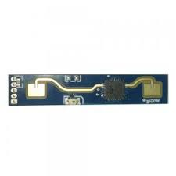
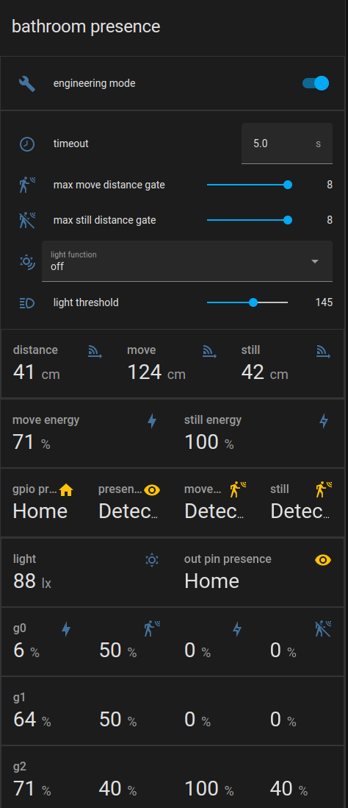

LD2410 Sensor
=============

.. seo::
    :description: Instructions for setting up LD2410 sensors.
    :image: ld2410.jpg

Component/Hub
-------------
.. _ld2410-component:

The ``ld2410`` sensor platform allows you to use HI-LINK LD2410 motion and presence sensor.
(`datasheet and user manual <https://drive.google.com/drive/folders/1p4dhbEJA3YubyIjIIC7wwVsSo8x29Fq-?spm=a2g0o.detail.1000023.17.93465697yFwVxH>`__) with ESPHome.
The :ref:`UART <uart>` is required to be set up in your configuration for this sensor to work.

Use of hardware UART pins is highly recommended, in order to support the out-of-the-box 256000 baud rate of the LD2410 sensor.

    LD2410 motion and presence sensor

.. code-block:: yaml

    # Example configuration entry
    uart:
      id: uart1
      tx_pin: REPLACE ME
      rx_pin: REPLACE ME
      baud_rate: 256000
      parity: NONE
      stop_bits: 1

    ld2410:
      uart_id: uart1
      throttle: 1500ms

.. note::

    For UART configuration, ``parity`` and ``stop_bits`` **must be** respectively ``NONE`` and ``1``.

    Use of hardware UART pins is highly recommended, in order to support the out-of-the-box 256000 baud rate of the LD2410 sensor.

Configuration variables:
************************

- **uart_id** (*Optional*, :ref:`config-id`): Manually specify the ID of the :ref:`UART Component <uart>` if you want
  to use multiple UART buses.
- **throttle** (*Optional*, int): Time in milliseconds to control the rate of data updates. Defaults to ``1000ms``.

Binary Sensor
-------------

The ``ld2410`` binary sensor allows you to use your :doc:`ld2410` to perform different
measurements.

.. code-block:: yaml

    binary_sensor:
      - platform: ld2410
        has_target:
          name: Presence
        has_moving_target:
          name: Moving Target
        has_still_target:
          name: Still Target
        out_pin_presence:
          name: out pin presence

Configuration variables:
************************

- **has_target** (*Optional*): If true target detect either still or in movement.
  All options from :ref:`Binary Sensor <config-binary_sensor>`.
- **has_moving_target** (*Optional*): If true a moving target is detected.
  All options from :ref:`Binary Sensor <config-binary_sensor>`.
- **has_still_target** (*Optional*): If true a still target is detected.
  All options from :ref:`Binary Sensor <config-binary_sensor>`.
- **out_pin_presence** (*Optional*): When in :ref:`engineering mode<ld2410-engineering-mode>`, indicates whether the OUT pin indicates presence or not, otherwise ``false``.
  OUT pin indication depends on the :ref:`light function<ld2410-light-function>` configuration.
  All options from :ref:`Binary Sensor <config-binary_sensor>`.

Sensor
------

The ``ld2410`` sensor allows you to use your :doc:`ld2410` to perform different
measurements.

.. code-block:: yaml

    sensor:
      - platform: ld2410
        light:
          name: light
        moving_distance:
          name : Moving Distance
        still_distance:
          name: Still Distance
        moving_energy:
          name: Move Energy
        still_energy:
          name: Still Energy
        detection_distance:
          name: Detection Distance
        g0_move_energy:
          name: g0 move energy
        g0_still_energy:
          name: g0 still energy
        g1_move_energy:
          name: g1 move energy
        g1_still_energy:
          name: g1 still energy
        g2_move_energy:
          name: g2 move energy
        g2_still_energy:
          name: g2 still energy
        g3_move_energy:
          name: g3 move energy
        g3_still_energy:
          name: g3 still energy
        g4_move_energy:
          name: g4 move energy
        g4_still_energy:
          name: g4 still energy
        g5_move_energy:
          name: g5 move energy
        g5_still_energy:
          name: g5 still energy
        g6_move_energy:
          name: g6 move energy
        g6_still_energy:
          name: g6 still energy
        g7_move_energy:
          name: g7 move energy
        g7_still_energy:
          name: g7 still energy
        g8_move_energy:
          name: g8 move energy
        g8_still_energy:
          name: g8 still energy

.. _ld2410-sensors:

Configuration variables:
************************

- **light** (*Optional*, int): When in :ref:`engineering mode<ld2410-engineering-mode>`, indicates the light sensitivity, otherwise ``unknown``.
  Value between ``0`` and ``255`` inclusive.
  All options from :ref:`Sensor <config-sensor>`.
- **moving_distance** (*Optional*, int): Distance in cm of detected moving target.
  All options from :ref:`Sensor <config-sensor>`.
- **still_distance** (*Optional*, int): Distance in cm of detected still target.
  All options from :ref:`Sensor <config-sensor>`.
- **moving_energy** (*Optional*, int): Energy for moving target.
  Value between ``0`` and ``100`` inclusive.
  All options from :ref:`Sensor <config-sensor>`.
- **still_energy** (*Optional*, int): Energy for still target.
  Value between ``0`` and ``100`` inclusive.
  All options from :ref:`Sensor <config-sensor>`.
- **detection_distance** (*Optional*, int): Distance in cm of target.
  All options from :ref:`Sensor <config-sensor>`.
- **gX_move_energy** (*Optional*, int): When in :ref:`engineering mode<ld2410-engineering-mode>`, the move energy of the Xth gate(X => 0 to 8), otherwise ``unknown``.
  Value between ``0`` and ``100`` inclusive.
  All options from :ref:`Sensor <config-sensor>`.
- **gX_still_energy** (*Optional*, int): When in :ref:`engineering mode<ld2410-engineering-mode>`, the still energy of the Xth gate(X => 0 to 8), otherwise ``unknown``.
  Value between ``0`` and ``100`` inclusive.
  All options from :ref:`Sensor <config-sensor>`.

Switch
------

The ``ld2410`` switch allows you to control your :doc:`ld2410`.

.. code-block:: yaml

    switch:
      - platform: ld2410
        engineering_mode:
          name: "engineering mode"
        bluetooth:
          name: "control bluetooth"

.. _ld2410-engineering-mode:

Configuration variables:
************************

- **engineering_mode** (*Optional*): enable/disable engineering mode. Defaults to ``false``.
  All options from :ref:`Switch <config-switch>`.
- **bluetooth** (*Optional*): Turn on/off the bluetooth adapter. Defaults to ``true``.
  All options from :ref:`Switch <config-switch>`.

.. _ld2410-number:

Number
------

The ``ld2410`` number allows you to control the configuration of your :doc:`ld2410`.

.. code-block:: yaml

    number:
      - platform: ld2410
        timeout:
          name: timeout
        light_threshold:
          name: light threshold
        max_move_distance_gate:
          name: max move distance gate
        max_still_distance_gate:
          name: max still distance gate
        g0_move_threshold:
          name: g0 move threshold
        g0_still_threshold:
          name: g0 still threshold
        g1_move_threshold:
          name: g1 move threshold
        g1_still_threshold:
          name: g1 still threshold
        g2_move_threshold:
          name: g2 move threshold
        g2_still_threshold:
          name: g2 still threshold
        g3_move_threshold:
          name: g3 move threshold
        g3_still_threshold:
          name: g3 still threshold
        g4_move_threshold:
          name: g4 move threshold
        g4_still_threshold:
          name: g4 still threshold
        g5_move_threshold:
          name: g5 move threshold
        g5_still_threshold:
          name: g5 still threshold
        g6_move_threshold:
          name: g6 move threshold
        g6_still_threshold:
          name: g6 still threshold
        g7_move_threshold:
          name: g7 move threshold
        g7_still_threshold:
          name: g7 still threshold
        g8_move_threshold:
          name: g8 move threshold
        g8_still_threshold:
          name: g8 still threshold

.. _ld2410-light-threshold:

Configuration variables:
************************

- **timeout** (*Optional*, int): Time in seconds during which presence state will stay present
  after leaving. Defaults to ``5s``
  All options from :ref:`Number <config-number>`.
- **light_threshold** (*Optional*, int): Sets the light threshold for the :ref:`light function<ld2410-light-function>`.
  Value between ``0`` and ``255`` inclusive. Defaults to ``128``.
  All options from :ref:`Number <config-number>`.
- **max_move_distance_gate** (*Optional*, int): Maximum distance gate for movement detection.
  Value between ``2`` and ``8`` inclusive. Defaults to ``8``.
  All options from :ref:`Number <config-number>`.
- **max_still_distance_gate** (*Optional*, int): Maximum distance gate for still detection.
  Value between ``2`` and ``8`` inclusive. Defaults to ``8``.
  All options from :ref:`Number <config-number>`.
- **gX_move_threshold** (*Optional*, int): Threshold for the Xth gate for motion detection (X => 0 to 8).
  Above this level for the considered gate (distance), movement detection will be triggered.
  Value between ``0`` and ``100`` inclusive. See default values below.
  All options from :ref:`Number <config-number>`.
- **gX_still_threshold** (*Optional*, int): Threshold for the Xth gate for still detection. (X => 0 to 8).
  Above this level for the considered gate (distance), still detection will be triggered.
  Value between ``0`` and ``100`` inclusive. See default values below.
  All options from :ref:`Number <config-number>`.

.. list-table:: Default values for gate threshold
    :widths: 25 25 25
    :header-rows: 1

    * - Gate
      - Default Move threshold
      - Default Still threshold
    * - 0
      - 50
      - 0
    * - 1
      - 50
      - 0
    * - 2
      - 40
      - 40
    * - 3
      - 30
      - 40
    * - 4
      - 20
      - 30
    * - 5
      - 15
      - 30
    * - 6
      - 15
      - 20
    * - 7
      - 15
      - 20
    * - 8
      - 15
      - 20

Button
------

The ``ld2410`` button allows you to perfrom actions on your :doc:`ld2410`.

.. code-block:: yaml

    button:
      - platform: ld2410
        factory_reset:
          name: "factory reset"
        restart:
          name: "restart"
        query_params:
          name: query params

Configuration variables:
************************

- **factory_reset** (*Optional*): This command is used to restore all configuration values to their original values.
  All options from :ref:`Button <config-button>`.
- **restart** (*Optional*): Restart the device.
  All options from :ref:`Button <config-button>`.
- **query_params** (*Optional*): Refresh all sensors values of the device.
  All options from :ref:`Button <config-button>`.

Text Sensor
-----------

The ``ld2410`` text sensor allows you get information about your :doc:`ld2410`.

.. code-block:: yaml

    text_sensor:
      - platform: ld2410
        version:
          name: "firmware version"
        mac_address:
          name: "mac address"

Configuration variables:
************************

- **version** (*Optional*): The firmware version.
  All options from :ref:`Text Sensor <config-text_sensor>`.
- **mac_address** (*Optional*): The bluetooth mac address. Will be set to ``unknown`` when bluetooth is off.
  All options from :ref:`Text Sensor <config-text_sensor>`.

Select
-----------

The ``ld2410`` select allows you control your :doc:`ld2410`.

.. code-block:: yaml

    select:
      - platform: ld2410
        distance_resolution:
          name: "distance resolution"
        baud_rate:
          name: "baud rate"
        light_function:
          name: light function
        out_pin_level:
          name: out ping level

.. _ld2410-light-function:

Configuration variables:
************************

- **distance_resolution** (*Optional*): Control the gates distance resolution. Can be ``0.75m`` or ``0.2m``. Defaults to ``0.75m``.
  All options from :ref:`Select <config-select>`.
- **baud_rate** (*Optional*): Control the serial port baud rate. Defaults to ``256000``.
  Once changed, all sensors will stop working until a fresh install with an updated :ref:`UART Component <uart>` configuration.
  All options from :ref:`Select <config-select>`.
- **light_function** (*Optional*): If set, will affect the OUT pin value, based on :ref:`light threshold<ld2410-light-threshold>`. Can be ``off``, ``low`` or ``above``. Defaults to ``off``.
  All options from :ref:`Select <config-select>`.
- **out_pin_level** (*Optional*): Control OUT pin ``away`` value. Can be ``low`` or ``high``. Defaults to ``low``.
  All options from :ref:`Select <config-select>`.

Automations
-----------

``bluetooth_password.set`` Action
*********************************

This is an :ref:`Action <config-action>` for setting the bluetooth password.

.. code-block:: yaml

    - bluetooth_password.set:
        id: my_ld2410
        password: "HiLink"

Configuration variables:

- **id** (**Required**, :ref:`config-id`): The ID of the ld2410 to set.
- **password** (**Required**, string, :ref:`templatable <config-templatable>`):
  The password to set. Case sensitive. Must be exactly 6 characters long. Default password is `HiLink`.

To change the password from HA you can use the following example config:

.. code-block:: yaml

    ld2410:
      id: my_ld2410

    api:
      services:
        - service: set_ld2410_bluetooth_password
          variables:
            password: string
          then:
            - bluetooth_password.set:
                id: my_ld2410
                password: !lambda 'return password;'

OUT pin
-------

In order to monitor the presence indicated by the component, with the :ref:`light function<ld2410-light-function>` taken
under account, you can set up a :ref:`GPIO Binary Sensor <gpio-binary-sensor>`:

.. code-block:: yaml

    binary_sensor:
      - platform: gpio
        pin: REPLACE ME
        name: gpio out pin presence
        device_class: presence

Calibration Process
-------------------

In order to calibrate your ``ld2410`` sensor perform the following:

1. Enable :ref:`engineering mode<ld2410-engineering-mode>`.
2. Monitor the ``gX_move_energy`` and ``gX_still_energy`` :ref:`sensors<ld2410-sensors>`.
3. Change the :ref:`thresholds<ld2410-number>` and repeat step 2 until satisfaction.
4. Disable :ref:`engineering mode<ld2410-engineering-mode>`.

Home Assistant Card
*******************

For easy calibration process you can use the following card.

It requires the following HACS custom cards:

- `Decluttering Card <https://github.com/custom-cards/decluttering-card>`__
- `Vertical Stack In Card <https://github.com/ofekashery/vertical-stack-in-card>`__

First add the templates using the ``raw configuration editor``:

.. code-block:: yaml

    decluttering_templates:
      ld2410_gate_row_header:
        card:
          type: custom:vertical-stack-in-card
          horizontal: true
          cards:
            - type: entity
              entity: '[[move_energy_sensor]]'
              name: '[[gate]]'
            - type: entity
              entity: '[[move_threshold_number]]'
              name: ' '
            - type: entity
              entity: '[[still_energy_sensor]]'
              name: ' '
            - type: entity
              entity: '[[still_threshold_number]]'
              name: ' '
      ld2410_gate_row:
        card:
          type: custom:vertical-stack-in-card
          horizontal: true
          cards:
            - type: entity
              entity: '[[move_energy_sensor]]'
              name: '[[gate]]'
              icon: ' '
            - type: entity
              entity: '[[move_threshold_number]]'
              name: ' '
              icon: ' '
            - type: entity
              entity: '[[still_energy_sensor]]'
              name: ' '
              icon: ' '
            - type: entity
              entity: '[[still_threshold_number]]'
              name: ' '
              icon: ' '
      ld2410:
        card:
          type: custom:vertical-stack-in-card
          title: '[[title]]'
          cards:
            - type: custom:vertical-stack-in-card
              horizontal: true
              cards:
                - type: entities
                  entities:
                    - entity: '[[engineering_mode_switch]]'
                      name: engineering mode
            - type: custom:vertical-stack-in-card
              cards:
                - type: entities
                  entities:
                    - entity: '[[presence_timeout_number]]'
                      name: timeout
                    - entity: '[[presence_max_move_distance_gate_number]]'
                      name: max move distance gate
                    - entity: '[[presence_max_still_distance_gate_number]]'
                      name: max still distance gate
                    - entity: '[[light_function_select]]'
                      name: light function
                    - entity: '[[light_threshold_number]]'
                      name: light threshold
                - type: custom:vertical-stack-in-card
                  horizontal: true
                  cards:
                    - type: entity
                      entity: '[[distance_detection_sensor]]'
                      name: distance
                    - type: entity
                      entity: '[[moving_distance_sensor]]'
                      name: move
                    - type: entity
                      entity: '[[still_distance_sensor]]'
                      name: still
            - type: custom:vertical-stack-in-card
              horizontal: true
              cards:
                - type: entity
                  entity: '[[move_energy_sensor]]'
                  name: move energy
                - type: entity
                  entity: '[[still_energy_sensor]]'
                  name: still energy
            - type: custom:vertical-stack-in-card
              horizontal: true
              cards:
                - type: entity
                  entity: '[[gpio_out_pin_presence_binary_sensor]]'
                  name: gpio presence
                  state_color: true
                - type: entity
                  entity: '[[presence_binary_sensor]]'
                  name: presence
                  state_color: true
                - type: entity
                  entity: '[[movement_binary_sensor]]'
                  name: movement
                  state_color: true
                - type: entity
                  entity: '[[still_binary_sensor]]'
                  name: still
                  state_color: true
            - type: conditional
              conditions:
                - entity: '[[engineering_mode_switch]]'
                  state: 'on'
              card:
                type: custom:vertical-stack-in-card
                cards:
                  - type: custom:vertical-stack-in-card
                    horizontal: true
                    cards:
                      - type: entity
                        entity: '[[light_sensor]]'
                        name: light
                      - type: entity
                        entity: '[[out_pin_presence_binary_sensor]]'
                        name: out pin presence
                        state_color: true
                  - type: custom:decluttering-card
                    template: ld2410_gate_row_header
                    variables:
                      - gate: g0
                      - move_energy_sensor: '[[g0_move_energy_sensor]]'
                      - move_threshold_number: '[[g0_move_threshold_number]]'
                      - still_energy_sensor: '[[g0_still_energy_sensor]]'
                      - still_threshold_number: '[[g0_still_threshold_number]]'
                  - type: custom:decluttering-card
                    template: ld2410_gate_row
                    variables:
                      - gate: g1
                      - move_energy_sensor: '[[g1_move_energy_sensor]]'
                      - move_threshold_number: '[[g1_move_threshold_number]]'
                      - still_energy_sensor: '[[g1_still_energy_sensor]]'
                      - still_threshold_number: '[[g1_still_threshold_number]]'
                  - type: custom:decluttering-card
                    template: ld2410_gate_row
                    variables:
                      - gate: g2
                      - move_energy_sensor: '[[g2_move_energy_sensor]]'
                      - move_threshold_number: '[[g2_move_threshold_number]]'
                      - still_energy_sensor: '[[g2_still_energy_sensor]]'
                      - still_threshold_number: '[[g2_still_threshold_number]]'
                  - type: custom:decluttering-card
                    template: ld2410_gate_row
                    variables:
                      - gate: g3
                      - move_energy_sensor: '[[g3_move_energy_sensor]]'
                      - move_threshold_number: '[[g3_move_threshold_number]]'
                      - still_energy_sensor: '[[g3_still_energy_sensor]]'
                      - still_threshold_number: '[[g3_still_threshold_number]]'
                  - type: custom:decluttering-card
                    template: ld2410_gate_row
                    variables:
                      - gate: g4
                      - move_energy_sensor: '[[g4_move_energy_sensor]]'
                      - move_threshold_number: '[[g4_move_threshold_number]]'
                      - still_energy_sensor: '[[g4_still_energy_sensor]]'
                      - still_threshold_number: '[[g4_still_threshold_number]]'
                  - type: custom:decluttering-card
                    template: ld2410_gate_row
                    variables:
                      - gate: g5
                      - move_energy_sensor: '[[g5_move_energy_sensor]]'
                      - move_threshold_number: '[[g5_move_threshold_number]]'
                      - still_energy_sensor: '[[g5_still_energy_sensor]]'
                      - still_threshold_number: '[[g5_still_threshold_number]]'
                  - type: custom:decluttering-card
                    template: ld2410_gate_row
                    variables:
                      - gate: g6
                      - move_energy_sensor: '[[g6_move_energy_sensor]]'
                      - move_threshold_number: '[[g6_move_threshold_number]]'
                      - still_energy_sensor: '[[g6_still_energy_sensor]]'
                      - still_threshold_number: '[[g6_still_threshold_number]]'
                  - type: custom:decluttering-card
                    template: ld2410_gate_row
                    variables:
                      - gate: g7
                      - move_energy_sensor: '[[g7_move_energy_sensor]]'
                      - move_threshold_number: '[[g7_move_threshold_number]]'
                      - still_energy_sensor: '[[g7_still_energy_sensor]]'
                      - still_threshold_number: '[[g7_still_threshold_number]]'
                  - type: custom:decluttering-card
                    template: ld2410_gate_row
                    variables:
                      - gate: g8
                      - move_energy_sensor: '[[g8_move_energy_sensor]]'
                      - move_threshold_number: '[[g8_move_threshold_number]]'
                      - still_energy_sensor: '[[g8_still_energy_sensor]]'
                      - still_threshold_number: '[[g8_still_threshold_number]]'

Then create a custom card and fill all of the entities:

.. code-block:: yaml

    type: custom:decluttering-card
    template: ld2410
    variables:
      - title: bathroom presence
      - engineering_mode_switch: switch.bathroom_presence_engineering_mode
      - presence_timeout_number: number.bathroom_presence_timeout
      - presence_max_move_distance_gate_number: number.bathroom_presence_max_move_distance_gate
      - presence_max_still_distance_gate_number: number.bathroom_presence_max_still_distance_gate
      - distance_detection_sensor: sensor.bathroom_presence_distance_detection_cm
      - moving_distance_sensor: sensor.bathroom_presence_moving_distance_cm
      - still_distance_sensor: sensor.bathroom_presence_still_distance_cm
      - move_energy_sensor: sensor.bathroom_presence_move_energy
      - still_energy_sensor: sensor.bathroom_presence_still_energy
      - presence_binary_sensor: binary_sensor.bathroom_presence_presence
      - movement_binary_sensor: binary_sensor.bathroom_presence_movement
      - still_binary_sensor: binary_sensor.bathroom_presence_still
      - light_function_select: select.bathroom_presence_light_function
      - light_threshold_number: number.bathroom_presence_light_threshold
      - gpio_out_pin_presence_binary_sensor: binary_sensor.bathroom_presence_gpio_out_pin_presence
      - out_pin_presence_binary_sensor: binary_sensor.bathroom_presence_out_pin_presence
      - light_sensor: sensor.bathroom_presence_light
      - g0_move_energy_sensor: sensor.bathroom_presence_g0_move_energy
      - g0_move_threshold_number: number.bathroom_presence_g0_move_threshold
      - g0_still_energy_sensor: sensor.bathroom_presence_g0_still_energy
      - g0_still_threshold_number: number.bathroom_presence_g0_still_threshold
      - g1_move_energy_sensor: sensor.bathroom_presence_g1_move_energy
      - g1_move_threshold_number: number.bathroom_presence_g1_move_threshold
      - g1_still_energy_sensor: sensor.bathroom_presence_g1_still_energy
      - g1_still_threshold_number: number.bathroom_presence_g1_still_threshold
      - g2_move_energy_sensor: sensor.bathroom_presence_g2_move_energy
      - g2_move_threshold_number: number.bathroom_presence_g2_move_threshold
      - g2_still_energy_sensor: sensor.bathroom_presence_g2_still_energy
      - g2_still_threshold_number: number.bathroom_presence_g2_still_threshold
      - g3_move_energy_sensor: sensor.bathroom_presence_g3_move_energy
      - g3_move_threshold_number: number.bathroom_presence_g3_move_threshold
      - g3_still_energy_sensor: sensor.bathroom_presence_g3_still_energy
      - g3_still_threshold_number: number.bathroom_presence_g3_still_threshold
      - g4_move_energy_sensor: sensor.bathroom_presence_g4_move_energy
      - g4_move_threshold_number: number.bathroom_presence_g4_move_threshold
      - g4_still_energy_sensor: sensor.bathroom_presence_g4_still_energy
      - g4_still_threshold_number: number.bathroom_presence_g4_still_threshold
      - g5_move_energy_sensor: sensor.bathroom_presence_g5_move_energy
      - g5_move_threshold_number: number.bathroom_presence_g5_move_threshold
      - g5_still_energy_sensor: sensor.bathroom_presence_g5_still_energy
      - g5_still_threshold_number: number.bathroom_presence_g5_still_threshold
      - g6_move_energy_sensor: sensor.bathroom_presence_g6_move_energy
      - g6_move_threshold_number: number.bathroom_presence_g6_move_threshold
      - g6_still_energy_sensor: sensor.bathroom_presence_g6_still_energy
      - g6_still_threshold_number: number.bathroom_presence_g6_still_threshold
      - g7_move_energy_sensor: sensor.bathroom_presence_g7_move_energy
      - g7_move_threshold_number: number.bathroom_presence_g7_move_threshold
      - g7_still_energy_sensor: sensor.bathroom_presence_g7_still_energy
      - g7_still_threshold_number: number.bathroom_presence_g7_still_threshold
      - g8_move_energy_sensor: sensor.bathroom_presence_g8_move_energy
      - g8_move_threshold_number: number.bathroom_presence_g8_move_threshold
      - g8_still_energy_sensor: sensor.bathroom_presence_g8_still_energy
      - g8_still_threshold_number: number.bathroom_presence_g8_still_threshold

The result:

See Also
--------

- `Official Datasheet and user manuals <https://drive.google.com/drive/folders/1p4dhbEJA3YubyIjIIC7wwVsSo8x29Fq->`_
- `Source of inspiration for implementation <https://github.com/rain931215/ESPHome-LD2410>`_
- :apiref:`ld2410/ld2410.h`
- :ghedit:`Edit`
