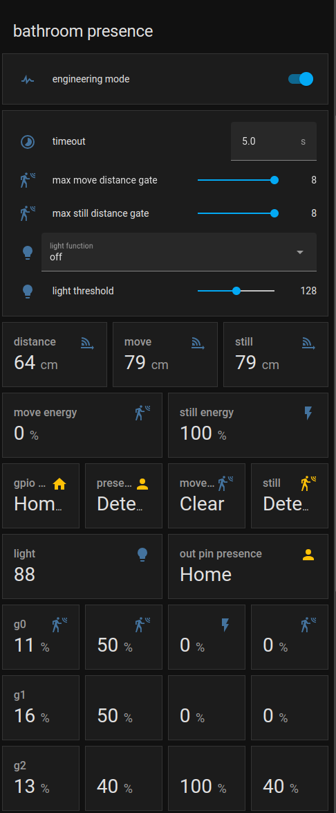

LD2410 Sensor
=============

.. seo::
    :description: Instructions for setting up LD2410 sensors.
    :image: ld2410.jpg

Component/Hub
-------------
.. _ld2410-component:

The ``ld2410`` sensor platform allows you to use HI-LINK LD2410 motion and presence sensor
(`datasheet and user manual <https://drive.google.com/drive/folders/1p4dhbEJA3YubyIjIIC7wwVsSo8x29Fq-?spm=a2g0o.detail.1000023.17.93465697yFwVxH>`__) with ESPHome.

The :ref:`UART <uart>` is required to be set up in your configuration for this sensor to work, ``parity`` and ``stop_bits`` **must be** respectively ``NONE`` and ``1``.
Use of hardware UART pins is highly recommended, in order to support the out-of-the-box 256000 baud rate of the LD2410 sensor.

    LD2410 motion and presence sensor

.. code-block:: yaml

    # Example configuration entry
    ld2410:

Configuration variables:
************************

- **uart_id** (*Optional*, :ref:`config-id`): Manually specify the ID of the :ref:`UART Component <uart>` if you want
  to use multiple UART buses.
- **throttle** (*Optional*, int): Time in milliseconds to control the rate of data updates. Defaults to ``1000ms``.
- **id** (*Optional*, :ref:`config-id`): Manually specify the ID for this :doc:`ld2410` component if you need multiple components.

Binary Sensor
-------------

The ``ld2410`` binary sensor allows you to use your :doc:`ld2410` to perform different
measurements.

.. code-block:: yaml

    binary_sensor:
      - platform: ld2410
        has_target:
          name: Presence
        has_moving_target:
          name: Moving Target
        has_still_target:
          name: Still Target
        out_pin_presence_status:
          name: out pin presence status

Configuration variables:
************************

- **has_target** (*Optional*): If true target detect either still or in movement.
  All options from :ref:`Binary Sensor <config-binary_sensor>`.
- **has_moving_target** (*Optional*): If true a moving target is detected.
  All options from :ref:`Binary Sensor <config-binary_sensor>`.
- **has_still_target** (*Optional*): If true a still target is detected.
  All options from :ref:`Binary Sensor <config-binary_sensor>`.
- **out_pin_presence_status** (*Optional*): When in :ref:`engineering mode<ld2410-engineering-mode>`, indicates whether the OUT pin indicates presence or not, otherwise ``false``.
  OUT pin indication depends on the :ref:`light function<ld2410-light-function>` configuration. Might need latest firmware to work.
  All options from :ref:`Binary Sensor <config-binary_sensor>`.
- **ld2410_id** (*Optional*, :ref:`config-id`): Manually specify the ID for the :doc:`ld2410` component if you are using multiple components.

Sensor
------

The ``ld2410`` sensor allows you to use your :doc:`ld2410` to perform different
measurements.

.. code-block:: yaml

    sensor:
      - platform: ld2410
        light:
          name: light
        moving_distance:
          name : Moving Distance
        still_distance:
          name: Still Distance
        moving_energy:
          name: Move Energy
        still_energy:
          name: Still Energy
        detection_distance:
          name: Detection Distance
        g0:
          move_energy:
            name: g0 move energy
          still_energy:
            name: g0 still energy
        g1:
          move_energy:
            name: g1 move energy
          still_energy:
            name: g1 still energy
        g2:
          move_energy:
            name: g2 move energy
          still_energy:
            name: g2 still energy
        g3:
          move_energy:
            name: g3 move energy
          still_energy:
            name: g3 still energy
        g4:
          move_energy:
            name: g4 move energy
          still_energy:
            name: g4 still energy
        g5:
          move_energy:
            name: g5 move energy
          still_energy:
            name: g5 still energy
        g6:
          move_energy:
            name: g6 move energy
          still_energy:
            name: g6 still energy
        g7:
          move_energy:
            name: g7 move energy
          still_energy:
            name: g7 still energy
        g8:
          move_energy:
            name: g8 move energy
          still_energy:
            name: g8 still energy

.. _ld2410-sensors:

Configuration variables:
************************

- **light** (*Optional*, int): When in :ref:`engineering mode<ld2410-engineering-mode>`, indicates the light sensitivity, otherwise ``unknown``.
  Value between ``0`` and ``255`` inclusive. Though it seems that the value ``85`` is the lowest value at complete darkness.
  All options from :ref:`Sensor <config-sensor>`.
- **moving_distance** (*Optional*, int): Distance in cm of detected moving target.
  All options from :ref:`Sensor <config-sensor>`.
- **still_distance** (*Optional*, int): Distance in cm of detected still target.
  All options from :ref:`Sensor <config-sensor>`.
- **moving_energy** (*Optional*, int): Energy for moving target.
  Value between ``0`` and ``100`` inclusive.
  All options from :ref:`Sensor <config-sensor>`.
- **still_energy** (*Optional*, int): Energy for still target.
  Value between ``0`` and ``100`` inclusive.
  All options from :ref:`Sensor <config-sensor>`.
- **detection_distance** (*Optional*, int): Distance in cm of target.
  All options from :ref:`Sensor <config-sensor>`.
- **gX** (*Optional*): Energies for the Xth gate (X => 0 to 8).
  
    - **move_energy** (*Optional*, int): When in :ref:`engineering mode<ld2410-engineering-mode>`, the move energy of the gate, otherwise ``unknown``.
      Value between ``0`` and ``100`` inclusive.
      All options from :ref:`Sensor <config-sensor>`.
    - **still_energy** (*Optional*, int): When in :ref:`engineering mode<ld2410-engineering-mode>`, the still energy of the gate, otherwise ``unknown``.
      Value between ``0`` and ``100`` inclusive.
      All options from :ref:`Sensor <config-sensor>`.

- **ld2410_id** (*Optional*, :ref:`config-id`): Manually specify the ID for the :doc:`ld2410` component if you are using multiple components.

Switch
------

The ``ld2410`` switch allows you to control your :doc:`ld2410`.

.. code-block:: yaml

    switch:
      - platform: ld2410
        engineering_mode:
          name: "engineering mode"
        bluetooth:
          name: "control bluetooth"

.. _ld2410-engineering-mode:

Configuration variables:
************************

- **engineering_mode** (*Optional*): enable/disable engineering mode. Defaults to ``false``.
  Notice this requires more resources and is not recommended to be enabled when not necessary.
  All options from :ref:`Switch <config-switch>`.
- **bluetooth** (*Optional*): Turn on/off the bluetooth adapter. Defaults to ``true``.
  All options from :ref:`Switch <config-switch>`.
- **ld2410_id** (*Optional*, :ref:`config-id`): Manually specify the ID for the :doc:`ld2410` component if you are using multiple components.

.. _ld2410-number:

Number
------

The ``ld2410`` number allows you to control the configuration of your :doc:`ld2410`.

.. code-block:: yaml

    number:
      - platform: ld2410
        timeout:
          name: timeout
        light_threshold:
          name: light threshold
        max_move_distance_gate:
          name: max move distance gate
        max_still_distance_gate:
          name: max still distance gate
        g0:
          move_threshold:
            name: g0 move threshold
          still_threshold:
            name: g0 still threshold
        g1:
          move_threshold:
            name: g1 move threshold
          still_threshold:
            name: g1 still threshold
        g2:
          move_threshold:
            name: g2 move threshold
          still_threshold:
            name: g2 still threshold
        g3:
          move_threshold:
            name: g3 move threshold
          still_threshold:
            name: g3 still threshold
        g4:
          move_threshold:
            name: g4 move threshold
          still_threshold:
            name: g4 still threshold
        g5:
          move_threshold:
            name: g5 move threshold
          still_threshold:
            name: g5 still threshold
        g6:
          move_threshold:
            name: g6 move threshold
          still_threshold:
            name: g6 still threshold
        g7:
          move_threshold:
            name: g7 move threshold
          still_threshold:
            name: g7 still threshold
        g8:
          move_threshold:
            name: g8 move threshold
          still_threshold:
            name: g8 still threshold

.. _ld2410-light-threshold:

Configuration variables:
************************

- **timeout** (*Optional*, int): Time in seconds during which presence state will stay present
  after leaving. Defaults to ``5s``
  All options from :ref:`Number <config-number>`.
- **light_threshold** (*Optional*, int): Sets the light threshold for the :ref:`light function<ld2410-light-function>`.
  Value between ``0`` and ``255`` inclusive. Defaults to ``128``.
  All options from :ref:`Number <config-number>`.
- **max_move_distance_gate** (*Optional*, int): Maximum distance gate for movement detection.
  Value between ``2`` and ``8`` inclusive. Defaults to ``8``.
  All options from :ref:`Number <config-number>`.
- **max_still_distance_gate** (*Optional*, int): Maximum distance gate for still detection.
  Value between ``2`` and ``8`` inclusive. Defaults to ``8``.
  All options from :ref:`Number <config-number>`.
- **gX** (*Optional*): Thresholds for the Xth gate (X => 0 to 8).
  
    - **move_threshold** (**Required**, int): Threshold for the gate for motion detection.
      Above this level for the considered gate (distance), movement detection will be triggered.
      Value between ``0`` and ``100`` inclusive. See default values below.
      All options from :ref:`Number <config-number>`.
    - **still_threshold** (**Required**, int): Threshold for the gate for still detection.
      Above this level for the considered gate (distance), still detection will be triggered.
      Value between ``0`` and ``100`` inclusive. See default values below.
      All options from :ref:`Number <config-number>`.

- **ld2410_id** (*Optional*, :ref:`config-id`): Manually specify the ID for the :doc:`ld2410` component if you are using multiple components.

.. list-table:: Default values for gate threshold
    :widths: 25 25 25
    :header-rows: 1

    * - Gate
      - Default Move threshold
      - Default Still threshold
    * - 0
      - 50
      - 0
    * - 1
      - 50
      - 0
    * - 2
      - 40
      - 40
    * - 3
      - 30
      - 40
    * - 4
      - 20
      - 30
    * - 5
      - 15
      - 30
    * - 6
      - 15
      - 20
    * - 7
      - 15
      - 20
    * - 8
      - 15
      - 20

Button
------

The ``ld2410`` button allows you to perform actions on your :doc:`ld2410`.

.. code-block:: yaml

    button:
      - platform: ld2410
        factory_reset:
          name: "factory reset"
        restart:
          name: "restart"
        query_params:
          name: query params

Configuration variables:
************************

- **factory_reset** (*Optional*): This command is used to restore all configuration values to their original values.
  All options from :ref:`Button <config-button>`.
- **restart** (*Optional*): Restart the device.
  All options from :ref:`Button <config-button>`.
- **query_params** (*Optional*): Refresh all sensors values of the device.
  All options from :ref:`Button <config-button>`.
- **ld2410_id** (*Optional*, :ref:`config-id`): Manually specify the ID for the :doc:`ld2410` component if you are using multiple components.

Text Sensor
-----------

The ``ld2410`` text sensor allows you to get information about your :doc:`ld2410`.

.. code-block:: yaml

    text_sensor:
      - platform: ld2410
        version:
          name: "firmware version"
        mac_address:
          name: "mac address"

Configuration variables:
************************

- **version** (*Optional*): The firmware version.
  All options from :ref:`Text Sensor <config-text_sensor>`.
- **mac_address** (*Optional*): The bluetooth mac address. Will be set to ``unknown`` when bluetooth is off.
  All options from :ref:`Text Sensor <config-text_sensor>`.
- **ld2410_id** (*Optional*, :ref:`config-id`): Manually specify the ID for the :doc:`ld2410` component if you are using multiple components.

Select
-----------

The ``ld2410`` select allows you to control your :doc:`ld2410`.

.. code-block:: yaml

    select:
      - platform: ld2410
        distance_resolution:
          name: "distance resolution"
        baud_rate:
          name: "baud rate"
        light_function:
          name: light function
        out_pin_level:
          name: out pin level

.. _ld2410-light-function:

Configuration variables:
************************

- **distance_resolution** (*Optional*): Control the gates distance resolution. Can be ``0.75m`` or ``0.2m``. Defaults to ``0.75m``.
  All options from :ref:`Select <config-select>`.
- **baud_rate** (*Optional*): Control the serial port baud rate. Defaults to ``256000``.
  Once changed, all sensors will stop working until a fresh install with an updated :ref:`UART Component <uart>` configuration.
  All options from :ref:`Select <config-select>`.
- **light_function** (*Optional*): If set, will affect the OUT pin value, based on :ref:`light threshold<ld2410-light-threshold>`. Can be ``off``, ``low`` or ``above``. Defaults to ``off``.
  All options from :ref:`Select <config-select>`.
- **out_pin_level** (*Optional*): Control OUT pin ``away`` value. Can be ``low`` or ``high``. Defaults to ``low``.
  All options from :ref:`Select <config-select>`.
- **ld2410_id** (*Optional*, :ref:`config-id`): Manually specify the ID for the :doc:`ld2410` component if you are using multiple components.

Automations
-----------

``bluetooth_password.set`` Action
*********************************

This is an :ref:`Action <config-action>` for setting the bluetooth password.

.. code-block:: yaml

    - bluetooth_password.set:
        id: my_ld2410
        password: "HiLink"

Configuration variables:

- **id** (**Required**, :ref:`config-id`): The ID of the :doc:`ld2410` component to set.
- **password** (**Required**, string, :ref:`templatable <config-templatable>`):
  The password to set. Case sensitive. Must be exactly 6 characters long. Default password is ``HiLink``.

To change the password from HA you can use the following example config:

.. code-block:: yaml

    ld2410:
      id: my_ld2410

    api:
      services:
        - service: set_ld2410_bluetooth_password
          variables:
            password: string
          then:
            - bluetooth_password.set:
                id: my_ld2410
                password: !lambda 'return password;'

OUT pin
-------

In order to monitor the presence indicated by the component, with the :ref:`light function<ld2410-light-function>` taken
under account, you can set up a :ref:`GPIO Binary Sensor <gpio-binary-sensor>`:

.. code-block:: yaml

    binary_sensor:
      - platform: gpio
        pin: GPIOXX
        name: gpio out pin presence
        device_class: presence

Calibration Process
-------------------

In order to calibrate your ``ld2410`` sensor perform the following:

1. Enable :ref:`engineering mode<ld2410-engineering-mode>`.
2. Monitor the ``gX_move_energy`` and ``gX_still_energy`` :ref:`sensors<ld2410-sensors>`.
3. Change the :ref:`thresholds<ld2410-number>` and repeat step 2 until satisfaction.
4. Disable :ref:`engineering mode<ld2410-engineering-mode>`.

Home Assistant Card
*******************

For easy calibration process, you can use the following custom manual card.

.. code-block:: yaml

    type: vertical-stack
    title: 'DEVICE'
    cards:
      - type: horizontal-stack
        cards:
          - type: entities
            entities:
              - entity: 'switch.DEVICE_engineering_mode'
                name: engineering mode
      - type: vertical-stack
        cards:
          - type: entities
            entities:
              - entity: 'number.DEVICE_timeout'
                name: timeout
              - entity: 'number.DEVICE_max_move_distance_gate'
                name: max move distance gate
              - entity: 'number.DEVICE_max_still_distance_gate'
                name: max still distance gate
              - entity: 'select.DEVICE_light_function'
                name: light function
              - entity: 'number.DEVICE_light_threshold'
                name: light threshold
          - type: horizontal-stack
            cards:
              - type: entity
                entity: 'sensor.DEVICE_detection_distance'
                name: distance
              - type: entity
                entity: 'sensor.DEVICE_moving_distance'
                name: move
              - type: entity
                entity: 'sensor.DEVICE_still_distance'
                name: still
      - type: horizontal-stack
        cards:
          - type: entity
            entity: 'sensor.DEVICE_move_energy'
            name: move energy
          - type: entity
            entity: 'sensor.DEVICE_still_energy'
            name: still energy
      - type: horizontal-stack
        cards:
          - type: entity
            entity: 'binary_sensor.DEVICE_gpio_out_pin_presence'
            name: gpio presence
            state_color: true
          - type: entity
            entity: 'binary_sensor.DEVICE_presence'
            name: presence
            state_color: true
          - type: entity
            entity: 'binary_sensor.DEVICE_moving_target'
            name: movement
            state_color: true
          - type: entity
            entity: 'binary_sensor.DEVICE_still_target'
            name: still
            state_color: true
      - type: conditional
        conditions:
          - entity: 'switch.DEVICE_engineering_mode'
            state: 'on'
        card:
          type: vertical-stack
          cards:
            - type: horizontal-stack
              cards:
                - type: entity
                  entity: 'sensor.DEVICE_light'
                  name: light
                - type: entity
                  entity: 'binary_sensor.DEVICE_out_pin_presence_status'
                  name: out pin presence
                  state_color: true
            - type: horizontal-stack
              cards:
                - type: entity
                  entity: 'sensor.DEVICE_g0_move_energy'
                  name: 'g0'
                - type: entity
                  entity: 'number.DEVICE_g0_move_threshold'
                  name: ' '
                - type: entity
                  entity: 'sensor.DEVICE_g0_still_energy'
                  name: ' '
                - type: entity
                  entity: 'number.DEVICE_g0_still_threshold'
                  name: ' '
            - type: horizontal-stack
              cards:
                - type: entity
                  entity: 'sensor.DEVICE_g1_move_energy'
                  name: 'g1'
                  icon: ' '
                - type: entity
                  entity: 'number.DEVICE_g1_move_threshold'
                  name: ' '
                  icon: ' '
                - type: entity
                  entity: 'sensor.DEVICE_g1_still_energy'
                  name: ' '
                  icon: ' '
                - type: entity
                  entity: 'number.DEVICE_g1_still_threshold'
                  name: ' '
                  icon: ' '
            - type: horizontal-stack
              cards:
                - type: entity
                  entity: 'sensor.DEVICE_g2_move_energy'
                  name: 'g2'
                  icon: ' '
                - type: entity
                  entity: 'number.DEVICE_g2_move_threshold'
                  name: ' '
                  icon: ' '
                - type: entity
                  entity: 'sensor.DEVICE_g2_still_energy'
                  name: ' '
                  icon: ' '
                - type: entity
                  entity: 'number.DEVICE_g2_still_threshold'
                  name: ' '
                  icon: ' '
            - type: horizontal-stack
              cards:
                - type: entity
                  entity: 'sensor.DEVICE_g3_move_energy'
                  name: 'g3'
                  icon: ' '
                - type: entity
                  entity: 'number.DEVICE_g3_move_threshold'
                  name: ' '
                  icon: ' '
                - type: entity
                  entity: 'sensor.DEVICE_g3_still_energy'
                  name: ' '
                  icon: ' '
                - type: entity
                  entity: 'number.DEVICE_g3_still_threshold'
                  name: ' '
                  icon: ' '
            - type: horizontal-stack
              cards:
                - type: entity
                  entity: 'sensor.DEVICE_g4_move_energy'
                  name: 'g4'
                  icon: ' '
                - type: entity
                  entity: 'number.DEVICE_g4_move_threshold'
                  name: ' '
                  icon: ' '
                - type: entity
                  entity: 'sensor.DEVICE_g4_still_energy'
                  name: ' '
                  icon: ' '
                - type: entity
                  entity: 'number.DEVICE_g4_still_threshold'
                  name: ' '
                  icon: ' '
            - type: horizontal-stack
              cards:
                - type: entity
                  entity: 'sensor.DEVICE_g5_move_energy'
                  name: 'g5'
                  icon: ' '
                - type: entity
                  entity: 'number.DEVICE_g5_move_threshold'
                  name: ' '
                  icon: ' '
                - type: entity
                  entity: 'sensor.DEVICE_g5_still_energy'
                  name: ' '
                  icon: ' '
                - type: entity
                  entity: 'number.DEVICE_g5_still_threshold'
                  name: ' '
                  icon: ' '
            - type: horizontal-stack
              cards:
                - type: entity
                  entity: 'sensor.DEVICE_g6_move_energy'
                  name: 'g6'
                  icon: ' '
                - type: entity
                  entity: 'number.DEVICE_g6_move_threshold'
                  name: ' '
                  icon: ' '
                - type: entity
                  entity: 'sensor.DEVICE_g6_still_energy'
                  name: ' '
                  icon: ' '
                - type: entity
                  entity: 'number.DEVICE_g6_still_threshold'
                  name: ' '
                  icon: ' '
            - type: horizontal-stack
              cards:
                - type: entity
                  entity: 'sensor.DEVICE_g7_move_energy'
                  name: 'g7'
                  icon: ' '
                - type: entity
                  entity: 'number.DEVICE_g7_move_threshold'
                  name: ' '
                  icon: ' '
                - type: entity
                  entity: 'sensor.DEVICE_g7_still_energy'
                  name: ' '
                  icon: ' '
                - type: entity
                  entity: 'number.DEVICE_g7_still_threshold'
                  name: ' '
                  icon: ' '
            - type: horizontal-stack
              cards:
                - type: entity
                  entity: 'sensor.DEVICE_g8_move_energy'
                  name: 'g8'
                  icon: ' '
                - type: entity
                  entity: 'number.DEVICE_g8_move_threshold'
                  name: ' '
                  icon: ' '
                - type: entity
                  entity: 'sensor.DEVICE_g8_still_energy'
                  name: ' '
                  icon: ' '
                - type: entity
                  entity: 'number.DEVICE_g8_still_threshold'
                  name: ' '
                  icon: ' '

Then replace all instances of ``DEVICE`` with your device name

The result:

See Also
--------

- `Official Datasheet and user manuals <https://drive.google.com/drive/folders/1p4dhbEJA3YubyIjIIC7wwVsSo8x29Fq->`_
- `Source of inspiration for implementation <https://github.com/rain931215/ESPHome-LD2410>`_
- :apiref:`ld2410/ld2410.h`
- :ghedit:`Edit`
