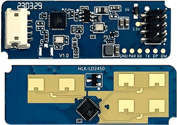

LD2450 Sensor
=============

.. seo::
    :description: Instructions for setting up LD2450 sensors.
    :image: ld2450.png

Component
---------
.. _ld2450-component:

The ``ld2450`` component allows you to use `HLK-LD2450 <https://www.hlktech.net/index.php?id=1157>`__ human presence and motion detection and tracking radar module with ESPHome.

`HLK-LD2450 Official Datasheet and user manuals <https://drive.google.com/drive/folders/1aItrdziwnEqI-ovDWf24Lj6ioALaljFA?usp=sharing>`__

Motion target tracking involves real-time tracking of the position of a moving target within a specific area, enabling distance, angle, and speed measurements of the target. 
The LD2450 is a sensor module for motion target tracking within the Hi-link 24G millimeter-wave radar series. This module features simplified 24 GHz radar sensor hardware and intelligent algorithm firmware.
It is is mainly used in general indoor scenarios such as homes, offices and hotels to enable the location tracking of moving human targets.

    HLK-LD2450 radar module

The :ref:`UART <uart>` is required to be set up in your configuration for this sensor to work, ``parity`` and ``stop_bits`` **must be** respectively ``NONE`` and ``1``.
Use of hardware UART pins is highly recommended, in order to support the out-of-the-box 256000 baud rate of the LD2450 sensor.

.. code-block:: yaml

    # uart configuration
    uart:
      id: uart_ld2450
      tx_pin: 17
      rx_pin: 21
      baud_rate: 256000
      parity: NONE
      stop_bits: 1

.. code-block:: yaml

    # ld2450 configuration
    ld2450:
      id: ld2450_radar
      uart_id: uart_ld2450
      throttle: 1000ms

Configuration variables:
************************

- **id** (*Optional*, :ref:`config-id`): Manually specify the ID for this :doc:`ld2450` component if you need multiple components.
- **uart_id** (*Optional*, :ref:`config-id`): Manually specify the ID of the :ref:`UART Component <uart>` if you want
  to use multiple UART buses.
- **throttle** (*Optional*, int): Time in milliseconds to control the rate of data updates. Defaults to ``1000ms``.

.. _ld2450-binary-sensors:

Binary Sensor
-------------

The ``ld2450`` binary sensor offers presence states for the targets.

.. code-block:: yaml

    binary_sensor:
      - platform: ld2450
        ld2450_id: ld2450_radar
        has_target:
          name: Presence
        has_moving_target:
          name: Moving Target
        has_still_target:
          name: Still Target

Configuration variables:
************************

- **ld2450_id** (*Optional*, :ref:`config-id`): Manually specify the ID for the :doc:`ld2450` component if you are using multiple components.
- **has_target** (*Optional*): True if either target is still or in movement.
  All options from :ref:`Binary Sensor <config-binary_sensor>`.
- **has_moving_target** (*Optional*): True if a moving target is detected.
  All options from :ref:`Binary Sensor <config-binary_sensor>`.
- **has_still_target** (*Optional*): True if a still target is detected.
  All options from :ref:`Binary Sensor <config-binary_sensor>`.

.. _ld2450-sensors:

Sensor
------

The ``ld2450`` sensor provides you with information about the states and attributes of detected targets.

.. code-block:: yaml

    sensor:
      - platform: ld2450
        ld2450_id: ld2450_radar
        target_count:
          name: Presence Target Count
        still_target_count:
          name: Still Target Count
        moving_target_count:
          name: Moving Target Count
        target_1:
          x:
            name: Target-1 X
          y:
            name: Target-1 Y
          speed:
            name: Target-1 Speed
          angle:
            name: Target-1 Angle
          distance:
            name: Target-1 Distance
          resolution:
            name: Target-1 Resolution
        target_2:
          x:
            name: Target-2 X
          y:
            name: Target-2 Y
          speed:
            name: Target-2 Speed
          angle:
            name: Target-2 Angle
          distance:
            name: Target-2 Distance
          resolution:
            name: Target-2 Resolution
        target_3:
          x:
            name: Target-3 X
          y:
            name: Target-3 Y
          speed:
            name: Target-3 Speed
          angle:
            name: Target-3 Angle
          distance:
            name: Target-3 Distance
          resolution:
            name: Target-3 Resolution
        zone_1:
          target_count:
            name: Zone-1 All Target Count
          still_target_count:
            name: Zone-1 Still Target Count
          moving_target_count:
            name: Zone-1 Moving Target Count
        zone_2:
          target_count:
            name: Zone-2 All Target Count
          still_target_count:
            name: Zone-2 Still Target Count
          moving_target_count:
            name: Zone-2 Moving Target Count
        zone_3:
          target_count:
            name: Zone-3 All Target Count
          still_target_count:
            name: Zone-3 Still Target Count
          moving_target_count:
            name: Zone-3 Moving Target Count

Configuration variables:
************************

- **ld2450_id** (*Optional*, :ref:`config-id`): Manually specify the ID for the :doc:`ld2450` component if you are using multiple components.
- **target_count** (*Optional*, int): Total targets detected, whether they are stationary or in motion..
  All options from :ref:`Sensor <config-sensor>`.
- **still_target_count** (*Optional*, int): Count of stationary targets.
  All options from :ref:`Sensor <config-sensor>`.
- **moving_target_count** (*Optional*, int): Count of moving targets.
  All options from :ref:`Sensor <config-sensor>`.
- **target_N** (*Optional*): Details about the targets (N = 1 to 3). A maximum of 3 targets can be detected: ``target_1``, ``target_2``, ``target_3``.

    - **x** (*Optional*, int): Distance in ``millimeter (mm)`` of the target from the ``ld2450`` sensor along the X-axis (negative for left side of the sensor, positive for right side of the sensor). The ``ld2450`` module can detect targets from -3000 to 3000 mm in ``X`` direction.
      All options from :ref:`Sensor <config-sensor>`.
    - **y** (*Optional*, int): Distance in ``millimeter (mm)`` of the target from the ``ld2450`` sensor in the Y direction (near/far). The ``ld2450`` module can detect targets from 0 to 6000 mm in ``Y`` direction.
      All options from :ref:`Sensor <config-sensor>`.
    - **speed** (*Optional*, int): Speed of the moving target in ``mm/s``.
      All options from :ref:`Sensor <config-sensor>`.
    - **angle** (*Optional*, int): Angle of target in ``degrees (°)`` relative to the ``ld2450`` sensor.
      All options from :ref:`Sensor <config-sensor>`.
    - **distance** (*Optional*, int): Distance in ``millimeter (mm)`` of the target from the ``ld2450`` sensor along the X-axis (negative for left side of the sensor, positive for right side of the sensor).
      All options from :ref:`Sensor <config-sensor>`.
    - **resolution** (*Optional*, int): The ``ld2450`` target detection range resolution in ``millimeter (mm)``.
      All options from :ref:`Sensor <config-sensor>`.

- **zone_N** (*Optional*): Target count details in the defined :ref:`zones<ld2450-number>` (N = 1 to 3). A maximum of 3 zones: ``zone_1``, ``zone_2``, ``zone_3``.

    - **target_count** (*Optional*, int): Total targets detected in the zone, whether they are stationary or in motion..
      All options from :ref:`Sensor <config-sensor>`.
    - **still_target_count** (*Optional*, int): Count of stationary targets in the zone.
      All options from :ref:`Sensor <config-sensor>`.
    - **moving_target_count** (*Optional*, int): Count of moving targets in the zone.
      All options from :ref:`Sensor <config-sensor>`.

.. _ld2450-switch:

Switch
------

The ``ld2450`` switch allows you to control your :doc:`ld2450` ``Bluetooth`` and ``Multi/Single Target Tracking``.

.. code-block:: yaml

    switch:
      - platform: ld2450
        ld2450_id: ld2450_radar
        bluetooth:
          name: "Bluetooth"
        multi_target:
          name: "Multi Target Tracking"

.. _ld2450-engineering-mode:

Configuration variables:
************************

- **ld2450_id** (*Optional*, :ref:`config-id`): Manually specify the ID for the :doc:`ld2450` component if you are using multiple components.
- **bluetooth** (*Optional*): Turn on/off the bluetooth adapter. Defaults to ``true``.
  All options from :ref:`Switch <config-switch>`.
- **multi_target** (*Optional*): Turn on/off the Multi Target Tracking option.
  All options from :ref:`Switch <config-switch>`.

.. _ld2450-number:

Number
------

The ``ld2450`` number allows you to control the presence timeout and zone area configuration of your :doc:`ld2450`.

.. code-block:: yaml

    number:
      - platform: ld2450
        ld2450_id: ld2450_radar
        presence_timeout:
          name: "Timeout"
        zone_1:
          x1:
            name: Zone-1 X1
          y1:
            name: Zone-1 Y1
          x2:
            name: Zone-1 X2
          y2:
            name: Zone-1 Y2
        zone_2:
          x1:
            name: Zone-2 X1
          y1:
            name: Zone-2 Y1
          x2:
            name: Zone-2 X2
          y2:
            name: Zone-2 Y2
        zone_3:
          x1:
            name: Zone-3 X1
          y1:
            name: Zone-3 Y1
          x2:
            name: Zone-3 X2
          y2:
            name: Zone-3 Y2

Configuration variables:
************************

- **ld2450_id** (*Optional*, :ref:`config-id`): Manually specify the ID for the :doc:`ld2450` component if you are using multiple components.
- **presence_timeout** (**Required**, int): The duration, in seconds, for which the :ref:`presence states<ld2450-binary-sensors>` will persist even after the detection is cleared. Default is ``5`` seconds.
  All options from :ref:`Number <config-number>`.
- **zone_N** (*Optional*): Configuration of the zone (N = 1 to 3), defined as a rectangular area. A maximum of 3 Zones can be configured: ``zone_1``, ``zone_2``, ``zone_3``. The zone coordinates consists of x1 y1 (Near-Left) to x2 y2 (Far-Right) relative to the ``ld2450`` sensor.
    
    - **x1** (*Optional*, int): Start X coordinate in ``millimeter (mm)`` of the zone from the ``ld2450`` sensor along the X-axis (negative for left side (-3000) of the sensor, positive for right side (3000) of the sensor).
      All options from :ref:`Number <config-number>`.
    - **y1** (*Optional*, int): Start Y coordinate in ``millimeter (mm)`` of the zone from the ``ld2450`` sensor along the Y-axis, values range from 0 to 6000.
      All options from :ref:`Sensor <config-sensor>`.
    - **x2** (*Optional*, int): End X coordinate in ``millimeter (mm)`` of the zone from the ``ld2450`` sensor along the X-axis (negative for left side (-3000) of the sensor, positive for right side (3000) of the sensor).
      All options from :ref:`Number <config-number>`.
    - **y1** (*Optional*, int): Start Y coordinate in ``millimeter (mm)`` of the zone from the ``ld2450`` sensor along the Y-axis, values range from 0 to 6000.
      All options from :ref:`Sensor <config-sensor>`.

Button
------

The ``ld2450`` button allows you to perfrom ``restart`` and ``factory reset`` actions on your :doc:`ld2450`.

.. code-block:: yaml

    button:
      - platform: ld2450
        ld2450_id: ld2450_radar
        factory_reset:
          name: "LD2450 Factory Reset"
        restart:
          name: "LD2450 Restart"

Configuration variables:
************************

- **ld2450_id** (*Optional*, :ref:`config-id`): Manually specify the ID for the :doc:`ld2450` component if you are using multiple components.
- **factory_reset** (*Optional*): "This command is used to reset the ``ld2450`` to its default values."
  All options from :ref:`Button <config-button>`.
- **restart** (*Optional*): Restart the ``ld2450`` device.
  All options from :ref:`Button <config-button>`.

Text Sensor
-----------

The ``ld2450`` text sensor allows you to get information about your :doc:`ld2450`.

.. code-block:: yaml

    text_sensor:
      - platform: ld2450
        ld2450_id: ld2450_radar
        version:
          name: "LD2450 Firmware"
        mac_address:
          name: "LD2450 BT MAC"
        target_1:
          direction:
            name: "Target-1 Direction"
        target_2:
          direction:
            name: "Target-2 Direction"
        target_3:
          direction:
            name: "Target-3 Direction"

Configuration variables:
************************
- **ld2450_id** (*Optional*, :ref:`config-id`): Manually specify the ID for the :doc:`ld2450` component if you are using multiple components.
- **version** (*Optional*): The ``ld2450`` firmware version.
  All options from :ref:`Text Sensor <config-text_sensor>`.
- **mac_address** (*Optional*): The ``ld2450`` Bluetooth mac address.
  All options from :ref:`Text Sensor <config-text_sensor>`.
- **target_N** (*Optional*): Targets (N = 1 to 3). A maximum of 3 targets can be detected: ``target_1``, ``target_2``, ``target_3``.

    - **direction** (*Optional*): Direction of the target relative to the ``ld2450`` sensor. Possible values are: ``Stationary``, ``Moving away``, ``Coming closer``, ``NA``.
      All options from :ref:`Sensor <config-sensor>`.

Select
-----------

The ``ld2450`` select allows you to control ``baud rate`` and ``zone type`` of your :doc:`ld2450`.

.. code-block:: yaml

    select:
      - platform: ld2450
        ld2450_id: ld2450_radar
        baud_rate:
          name: "Baud rate"
        zone_type:
          name: "Zone Type"

.. _ld2450-light-function:

Configuration variables:
************************

- **ld2450_id** (*Optional*, :ref:`config-id`): Manually specify the ID for the :doc:`ld2450` component if you are using multiple components.
- **baud_rate** (*Optional*): Control the UART serial port baud rate. Defaults to ``256000``.
  Once changed, all sensors will stop working until a fresh install with an updated :ref:`UART Component <uart>` configuration.
  All options from :ref:`Select <config-select>`.
- **zone_type** (*Optional*): Control the Zone detection modes. It can be set to ``Disabled``, ``Detection``, or ``Filter``. Selecting the ``Disabled`` option will disable zone area detection. ``Detection`` mode is used to detect only targets in the specified area, while ``Filter`` mode can be used to exclude an area from detection.
  All options from :ref:`Select <config-select>`.

Example configuration:
-----------

Here is the complete example configuration for :doc:`ld2450`.

.. code-block:: yaml

    esphome:
      name: ld2540-radar
      friendly_name: ld2540-radar

    esp32:
      board: wemos_d1_mini32

    improv_serial:

    logger:

    debug:

    api:

    ota:

    wifi:
      ap:

    captive_portal:

    web_server:
      port: 80

    uart:
      id: uart_ld2450
      tx_pin: 17
      rx_pin: 21
      baud_rate: 256000
      parity: NONE
      stop_bits: 1

    ld2450:
      id: ld2450_radar
      uart_id: uart_ld2450
      throttle: 1000ms

    binary_sensor:
      - platform: ld2450
        ld2450_id: ld2450_radar
        has_target:
          name: Presence
        has_moving_target:
          name: Moving Target
        has_still_target:
          name: Still Target

    number:
      - platform: ld2450
        ld2450_id: ld2450_radar
        presence_timeout:
          name: "Timeout"
        zone_1:
          x1:
            name: Zone-1 X1
          y1:
            name: Zone-1 Y1
          x2:
            name: Zone-1 X2
          y2:
            name: Zone-1 Y2
        zone_2:
          x1:
            name: Zone-2 X1
          y1:
            name: Zone-2 Y1
          x2:
            name: Zone-2 X2
          y2:
            name: Zone-2 Y2
        zone_3:
          x1:
            name: Zone-3 X1
          y1:
            name: Zone-3 Y1
          x2:
            name: Zone-3 X2
          y2:
            name: Zone-3 Y2

    switch:
      - platform: ld2450
        ld2450_id: ld2450_radar
        bluetooth:
          name: "Bluetooth"
        multi_target:
          name: Multi Target Tracking"

    select:
      - platform: ld2450
        ld2450_id: ld2450_radar
        baud_rate:
          name: "Baud rate"
        zone_type:
          name: "Zone Type"

    button:
      - platform: ld2450
        ld2450_id: ld2450_radar
        factory_reset:
          name: "LD2450 Factory Reset"
          entity_category: "config"
        restart:
          name: "LD2450 Restart"
          entity_category: "config"

    text_sensor:
      - platform: ld2450
        ld2450_id: ld2450_radar
        version:
          name: "LD2450 Firmware"
        mac_address:
          name: "LD2450 BT MAC"
        target_1:
          direction:
            name: "Target-1 Direction"
        target_2:
          direction:
            name: "Target-2 Direction"
        target_3:
          direction:
            name: "Target-3 Direction"

    sensor:
      - platform: ld2450
        ld2450_id: ld2450_radar
        target_count:
          name: Presence Target Count
      - platform: ld2450
        ld2450_id: ld2450_radar
        still_target_count:
          name: Still Target Count
      - platform: ld2450
        ld2450_id: ld2450_radar
        moving_target_count:
          name: Moving Target Count
      - platform: ld2450
        ld2450_id: ld2450_radar
        target_1:
          x:
            name: Target-1 X
          y:
            name: Target-1 Y
          speed:
            name: Target-1 Speed
          angle:
            name: Target-1 Angle
          distance:
            name: Target-1 Distance
          resolution:
            name: Target-1 Resolution
        target_2:
          x:
            name: Target-2 X
          y:
            name: Target-2 Y
          speed:
            name: Target-2 Speed
          angle:
            name: Target-2 Angle
          distance:
            name: Target-2 Distance
          resolution:
            name: Target-2 Resolution
        target_3:
          x:
            name: Target-3 X
          y:
            name: Target-3 Y
          speed:
            name: Target-3 Speed
          angle:
            name: Target-3 Angle
          distance:
            name: Target-3 Distance
          resolution:
            name: Target-3 Resolution
        zone_1:
          target_count:
            name: Zone-1 All Target Count
          still_target_count:
            name: Zone-1 Still Target Count
          moving_target_count:
            name: Zone-1 Moving Target Count
        zone_2:
          target_count:
            name: Zone-2 All Target Count
          still_target_count:
            name: Zone-2 Still Target Count
          moving_target_count:
            name: Zone-2 Moving Target Count
        zone_3:
          target_count:
            name: Zone-3 All Target Count
          still_target_count:
            name: Zone-3 Still Target Count
          moving_target_count:
            name: Zone-3 Moving Target Count

See Also
--------

- `Official Datasheet and user manuals <https://drive.google.com/drive/folders/1aItrdziwnEqI-ovDWf24Lj6ioALaljFA?usp=sharing>`__
- :apiref:`ld2450/ld2450.h`
- :ghedit:`Edit`
