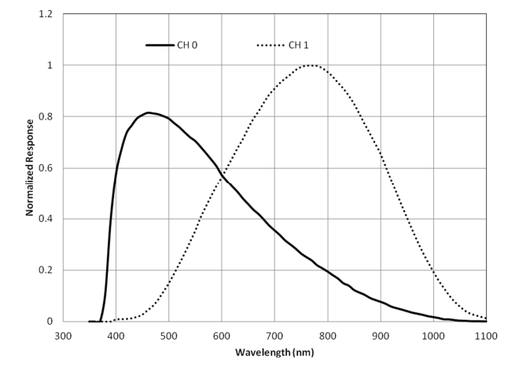

LTR303 and LTR329 Ambient Light Sensors
==================================================

.. seo::
    :description: Instructions for setting up LTR303 and LTR329 ambient light sensors
    :image: ltr303.jpg
    :keywords: LTR-329, LTR-303, LTR-329ALS, LTR-303ALS

The ``ltr303`` sensor platform allows you to use your LiteOn LTR-303ALS and LTR-329ALS ambient light sensors 
with ESPHome. The :ref:`I²C Bus <i2c>` is required to be set up in your configuration for this sensor to work.
Both devices are identical, except that LTR-303 comes with interrupt capabilities which are not supported 
by this component.

.. figure:: images/ltr303-full.jpg
    :align: center
    :width: 90.0%

Sensor platform provides a linear response over a wide dynamic range from 0.01 lux to 64k lux and is well suited 
to applications under high ambient brightness. There are altogether six gain settings (1X, 2X, 4X, 8X, 48X and 96X)
available for user to configure. Use higher gain for dimmer areas.

The LTR-303 and LTR-329 devices are available on breakout boards from a number of vendors, for example `Adafruit`_.

.. _Adafruit: http://www.adafruit.com/products/5610

Devices consists of two photodiodes: *CH0* diode that is sensitive to both visible and infrared light and 
*CH1* diode that is sensitive only to infrared light.

    CH0 and CH1 channels spectral response

Ambient light illuminance calculation
-------------------------------------

Excerpt from the datasheet:

.. code-block:: 

    RATIO = CH1/(CH0+CH1)
    IF (RATIO < 0.45)
        ALS_LUX = (1.7743 * CH0 + 1.1059 * CH1) / ALS_GAIN / ALS_INT
    ELSEIF (RATIO < 0.64 && RATIO >= 0.45)
        ALS_LUX = (4.2785 * CH0 – 1.9548 * CH1) / ALS_GAIN / ALS_INT
    ELSEIF (RATIO < 0.85 && RATIO >= 0.64)
        ALS_LUX = (0.5926 * CH0 + 0.1185 * CH1) / ALS_GAIN / ALS_INT
    ELSE
        ALS_LUX = 0
    END
  

where:

- ``CH0`` and ``CH1`` are the sensor values (measurement counts) for Visible + IR (Ch0) and IR only (Ch1) sensors respectively.
- ``ALS_GAIN`` is the gain multiplier
- ``ALS_INT`` is the integration time in ms/100

Gain levels
-----------

The table lists gain values and corresponding illuminance range:

 ========= ================================
  Gain      Illuminance range
 ========= ================================
  ``1X``    1 lux to 64k lux (default)
  ``2X``    0.5 lux to 32k lux
  ``4X``    0.25 lux to 16k lux
  ``8X``    0.125 lux to 8k lux
  ``48X``   0.02 lux to 1.3k lux
  ``96X``   0.01 lux to 600 lux
 ========= ================================

This Wikipedia `article <https://en.wikipedia.org/wiki/Lux>`__ has a table of some lux values for comparison.

Available data
--------------

This component offers 4 sensors:

- ``ambient_light`` - Calculated ambient light illuminance, close to human eye spectral response, lx.
- ``infrared`` - Raw 16 bit reading from ``CH1`` IR sensor, counts.
- ``full_spectrum`` - Raw 16 bit reading from ``CH0`` Visible+IR sensor, counts.
- ``actual_gain`` - The actual gain value used by device to do measurement, multiplier.

Example configuration
---------------------

.. code-block:: yaml

    i2c:
      # ...

    sensor:
      - platform: ltr303
        address: 0x29
        update_interval: 60s
        gain: 1x
        integration_time: 100ms
        ambient_light:
          name: "Ambient light"
        actual_gain:
          name: "Actual gain"

Configuration variables:
------------------------
- **id** (*Optional*, :ref:`config-id`): Manually specify the ID used for code generation.
- **name** (*Optional*, string): A user-friendly name for this LTR device.
- **address** (*Optional*, int): Manually specify the I²C address of the sensor. Default is ``0x29``.
- **gain** (*Optional*, string): The gain the device will use. Higher values are better in low-light conditions.
  Valid values are ``1X`` *(default)*, ``2X``, ``4X``, ``8X``, ``48X``, ``96X``.
- **integration_time** (*Optional*, :ref:`config-time`):
  The amount of time sensors are exposed. Longer means more accurate values.
  Valid values are: ``50ms`` *(default)*, ``100ms``, ``150ms``, ``200ms``, ``250ms``, ``300ms``, ``350ms``, ``400ms``.
- **glass_attenuation_factor** (*Optional*, float): The attenuation factor of glass if it's behind some glass 
  or plastic facia.  Default is ``1.0`` means ``100%`` transmissivity. ``2`` means ``50%`` transmissivity etc.
- **update_interval** (*Optional*, :ref:`config-time`): The interval for checking the sensors.
  Defaults to ``60s``.
- All other options for I²C devices described at :ref:`I²C Bus <i2c>`. 
  The sensor supports bus modes up to "fast" 400 kHz.

Sensors
.......
You can configure all or any subset of the sensors described earlier.
Each configured sensor is reported separately on each ``update_interval``.

- **ambient_light** (*Optional*): Illuminance of ambient light, close to human eye spectre, lx.

  - **name** (**Required**, string): The name for the sensor.
  - All other options from :ref:`Sensor <config-sensor>`.

- **infrared_counts** (*Optional*): Sensor counts from the IR-sensitive sensor (*CH1*), counts.

  - **name** (**Required**, string): The name for the sensor.
  - All other options from :ref:`Sensor <config-sensor>`.

- **full_spectrum_counts** (*Optional*): Sensor counts from the sensor sensitive to both visible light and IR (*CH0*), counts

  - **name** (**Required**, string): The name for the sensor.
  - All other options from :ref:`Sensor <config-sensor>`.

- **actual_gain** (*Optional*, string): Gain value used to measure data, multiplier.

  - **name** (**Required**, string): The name for the sensor.
  - All other options from :ref:`Sensor <config-sensor>`.

See Also
--------

- `LTR-329ALS datasheet <https://github.com/latonita/datasheets-storage/blob/main/sensors/LTR-329ALS-01_DS_V1.6.PDF>`__
- `LTR-303ALS datasheet <https://github.com/latonita/datasheets-storage/blob/main/sensors/LTR-303ALS-01_DS_V1.pdf>`__
- Application note `LTR-303ALS & LTR-329ALS Appendix A <https://github.com/latonita/datasheets-storage/blob/main/sensors/LTR-303%20329_Appendix%20A%20Ver_1.0_22%20Feb%202013.pdf>`__
- :apiref:`ltr303/ltr303.h`
- :ghedit:`Edit`
