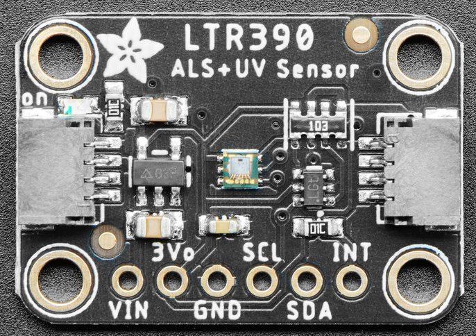

LTR390 UV and Ambient Light Sensor
==================================================

.. seo::
    :description: Instructions for setting up LTR390 UV and light sensor
    :image: ltr390.jpg

The ``ltr390`` sensor platform  allows you to use your LTR390 UV and ambient
light sensor
(`datasheet <https://optoelectronics.liteon.com/upload/download/DS86-2015-0004/LTR-390UV_Final_%20DS_V1%201.pdf>`__, `Adafruit`_) with ESPHome.

The :ref:`I²C Bus <i2c>` is required to be set up in your configuration for this sensor to work.

.. _Adafruit: https://www.adafruit.com/product/4831

.. code-block:: yaml

    sensor:
      - platform: ltr390
        gain: "X18"
        resolution: 20
        uv_index:
          name: "UV Index"
        uv:
          name: "UV Sensor Counts"
        light:
          name: "Light"
        ambient_light:
          name: "Light Sensor Counts"

Configuration variables:
------------------------

- **uv_index** (*Optional*): UV index (UVI). All options from :ref:`Sensor <config-sensor>`.
- **uv** (*Optional*): Sensor counts for the UV sensor (#). All options from :ref:`Sensor <config-sensor>`.
- **light** (*Optional*): Lux of ambient light (lx). All options from :ref:`Sensor <config-sensor>`.
- **ambient_light** (*Optional*): Sensor counts for the Ambient light sensor (#). All options from :ref:`Sensor <config-sensor>`.
- **gain** (*Optional*, string): Adjusts the sensitivity of the sensor. A larger value means higher sensitivity. See table below for details, valid options under "Gain Parameter". Default is ``"X18"``.
- **resolution** (*Optional*, int): ADC resolution. Higher resolutions require longer sensor integration times. See table below for details, valid options under "Resolution Parameter". Default is ``20``.
- **window_correction_factor** (*Optional*, float): Window correction factor. Use larger values when using under tinted windows. Default is ``1.0``, must be ``>= 1.0``.
- **address** (*Optional*, int): Manually specify the I²C address of the sensor. Default is ``0x53``.
- **update_interval** (*Optional*, :ref:`config-time`): The interval to check the
  sensor. Defaults to ``60s``. It is recommended that the update interval is at least 1 second since updates can take up to 800ms when using a high resolution value.

Lux and UVI Formulas
--------------------

.. math::

    \text{lux} = \frac{0.6 \times \text{als}}{\text{gain} \times \text{int}} \times \text{wfac}

.. math::

    \text{UVI} = \frac{\text{uv}}{\text{sensitivity}} \times \text{wfac}

where:

- ``als`` and ``uv`` are the sensor values
- ``gain`` is the amount of gain, see the table below for details
- ``int`` is the integration time in 100s of ms and is tied to the resolution, see the table below for details
- ``sensitivity`` is given by $$2300 \times \frac{\text{gain}}{18} \times \frac{\text{int}}{400}$$, where :math:`2300` is the sensor's count per UVI at ``X18`` gain and a resolution of 20 bits (integration time of 400ms)
- ``wfac`` is the window correction factor

Note that for UVI calculations it is recommended to use the defaults of ``X18`` gain and a resolution of 20 bits since
the datasheet only provides the sensor counts per UVI (sensitivity) for this configuration. When using different
configurations, the counts per UVI are scaled with respect to the default configuration.

Gain
----

.. list-table::
    :widths: 25 25
    :header-rows: 1

    * - Gain Parameter
      - gain
    * - X1
      - 1
    * - X3
      - 3
    * - X6
      - 6
    * - X9
      - 9
    * - X18
      - 18

Resolution
----------

.. list-table::
    :widths: 25 25 10
    :header-rows: 1

    * - Resolution Parameter (bits)
      - Integration Time (ms)
      - int
    * - 16
      - 25
      - 0.25
    * - 17
      - 50
      - 0.5
    * - 18
      - 100
      - 1
    * - 19
      - 200
      - 2
    * - 20
      - 400
      - 4

See Also
--------

- :doc:`/components/sensor/bh1750`
- :doc:`/components/sensor/tsl2561`
- `TEMT6000 <https://devices.esphome.io/devices/temt6000>`__
- :ref:`sensor-filters`
- :apiref:`ltr390/ltr390.h`
- :ghedit:`Edit`
