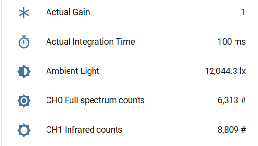

Lite-On Ambient Light & Proximity Sensors 
=========================================

.. seo::
    :description: Instructions for setting up LTR301, LTR501, LTR558 ambient light sensors/proximity sensors with ESPHome.
    :image: ltr501.jpg
    :keywords: LTR-301, LTR-501, LTR-558

.. figure:: images/ltr501-full.jpg
    :align: center
    :width: 60.0%

    LTR-501 on a breadboard from Olimex

    LTR-501 Sensor in Home Assistant UI.

The ``ltr501`` sensor platform allows you to use a range of LiteOn ambient light and proximity sensors
with ESPHome.

The supported family of sensors includes:

- Ambient Light Sensor **LTR-301ALS**
- Integrated Ambient Light and Proximity Sensors **LTR-501ALS** and **LTR-558ALS**

The LTR-501 device is available on a breakout board from `Olimex`_.

The sensors are very similar and share the same datasheet. The :ref:`I²C Bus <i2c>` is required to be set up in your 
configuration for this sensor to work. I²C address is ``0x23``. 

Proximity sensors are the same sort of sensors that you find in phones and tablets to disable the screen when you hold
the device up to your ear. They might be useful for automated turning on or off of displays and control panels. 

.. _Olimex: https://www.olimex.com/Products/Modules/Sensors/MOD-LTR-501ALS/open-source-hardware

Ambient light sensing
---------------------

These sensors have a linear response over a wide dynamic range from 0.01 lux to 64k lux and are well suited
to applications under high ambient brightness. There are two gain settings (1X, 150X) available for use. 
Use higher gain for dimmer areas.

These devices consist of two photodiodes: a *CH0* diode that is sensitive to both visible and infrared light and 
a *CH1* diode that is sensitive only to infrared light.

**Note**: These sensors do not have internal data checking and do not indicate any errors if 
data is not reliable. The sensors can be easily saturated if the gain is too high or the integration time is too long. In this
case, readings can be very strange. It's recommended to use automatic mode with a starting gain of 1X (default) and a starting
integration time of 100ms (default) or even 50ms (if the sensor is in a very bright environment). Automatic mode with starting 
gain of 150X is not recommended; use it only if you are sure brightness will never exceed 200-300 lx.

Ambient light illuminance calculation
^^^^^^^^^^^^^^^^^^^^^^^^^^^^^^^^^^^^^

Excerpt from the datasheet:

.. code-block:: 

    RATIO = CH1/(CH0+CH1)
    IF (RATIO < 0.45)
        ALS_LUX = (1.7743 * CH0 + 1.1059 * CH1) / ALS_GAIN / ALS_INT
    ELSEIF (RATIO < 0.64 && RATIO >= 0.45)
        ALS_LUX = (3.7725 * CH0 – 1.3363 * CH1) / ALS_GAIN / ALS_INT
    ELSEIF (RATIO < 0.85 && RATIO >= 0.64)
        ALS_LUX = (1.6903 * CH0 - 0.1693 * CH1) / ALS_GAIN / ALS_INT
    ELSE
        ALS_LUX = 0
    END
  

where:

- ``CH0`` and ``CH1`` are the sensor values (measurement counts) for Visible + IR (Ch0) and IR only (Ch1) sensors respectively.
- ``ALS_GAIN`` is the gain multiplier
- ``ALS_INT`` is the integration time in ms/100

ALS Gain levels
^^^^^^^^^^^^^^^

The table lists gain values and corresponding illuminance range:

 ========= ================================
  Gain      Illuminance range
 ========= ================================
  ``1X``    2 lux to 64k lux (default)
  ``150X``  0.01 lux to 320 lux
 ========= ================================

This Wikipedia `article <https://en.wikipedia.org/wiki/Lux>`__ has a table of some lux values for comparison.

The following table lists possible gain and integration time combinations:

 ================== ======== =============== ======== ======== 
  Gain / Int.time     50 ms       100 ms      200 ms   400 ms 
 ================== ======== =============== ======== ========
        ``1X``          ✓       ✓ (default)        
       ``150X``                 ✓                ✓        ✓
 ================== ======== =============== ======== ========

Proximity sensing
-----------------

The proximity sensor has a built-in emitter and detector. The sensor detects reflected IR light from the emitter and
gives a raw count value inversely proportional to the distance squared. A decrease in the count value means an object is getting
further away from the sensor (and vice-versa). Neither of the datasheets provide any information on how to convert
the raw count value to distance. The only way to do so is to test the sensor yourself and select the threshold
according to your needs and environment. Exact values will depend on the type of the object, its color and 
reflectivity.

Example configuration
---------------------

.. code-block:: yaml

    sensor:
      - platform: ltr501
        type: ALS_PS  # .. or ALS or PS
        ambient_light: "Ambient light"
        # PS only section
        ps_cooldown: 5 s
        ps_high_threshold: 500
        on_ps_high_threshold:
          then:
            - .... # do something - light up the screen for example
        ps_counts:
          name: "Proximity counts"
        

Configuration variables
-----------------------

- **id** (*Optional*, :ref:`config-id`): Manually specify the ID used for code generation.
- **address** (*Optional*, int): Manually specify the I²C address of the sensor. Default is ``0x23``.
- **type** (*Optional*, string): The type of the sensor. Valid values are ``ALS_PS`` *(default)* for 
  integrated sensors, ``ALS`` for ambient light only or ``PS`` for proximity only devices.
- **auto_mode** (*Optional*, boolean): Automatic gain and integration time selection. Defaults to True.
- **gain** (*Optional*, string): The gain the device will use. Higher values are better in low-light conditions.
  Valid values are ``1X`` *(default)*, ``150X``.
- **integration_time** (*Optional*, :ref:`config-time`):
  The amount of time sensors are exposed. Longer means more accurate values.
  Valid values are: ``50ms``, ``100ms`` *(default)*, ``200ms``, ``400ms``.
- **glass_attenuation_factor** (*Optional*, float): The attenuation factor of glass if it's behind some glass 
  or plastic facia.  Default is ``1.0`` means ``100%`` transmissivity. ``2`` means ``50%`` transmissivity etc.
- **update_interval** (*Optional*, :ref:`config-time`): The interval for checking the sensors.
  Defaults to ``60s``.
- **ps_cooldown** (*Optional*, :ref:`config-time`): The "cooldown" period after the proximity sensor is triggered. 
  Helps to avoid multiple calls.  Defaults to ``5s``.
- **ps_gain** (*Optional*, string): The gain the device will use for proximity sensor. Higher values are better in low-light conditions.
  Valid values are ``1X`` *(default)*, ``4X``, ``8X``, ``16X``.
- **ps_high_threshold** (*Optional*, int): The threshold for the proximity sensor to trigger on object getting closer. 
  Defaults to ``65535``, which implies it will never be triggered.
- **ps_low_threshold** (*Optional*, int): The threshold for the proximity sensor to trigger on object getting further away. 
  Defaults to ``0``, which implies it will never be triggered.
- **on_ps_high_threshold** (*Optional*): Actions to perform when the proximity sensor is triggered
  on object getting closer.
- **on_ps_low_threshold** (*Optional*): Actions to perform when the proximity sensor is triggered
  on object getting further away.

Sensors
^^^^^^^

This component offers five sensors for ALS-equipped devices and one sensor for PS-equipped devices.
You can configure all or any subset of these sensors. Each configured sensor is reported separately
on each ``update_interval``. Each is an ESPHome :ref:`sensor <config-sensor>` and may be configured
accordingly; if you don’t need to configure additional :ref:`sensor <config-sensor>` variables, you
may simply use the shorthand syntax for the sensor. For example: ``ambient_light: "Ambient light"``

- **ambient_light** (*Optional*): Illuminance of ambient light, close to human eye spectre, lx.
- **infrared_counts** (*Optional*): Sensor counts from the IR-sensitive sensor (*CH1*), counts.
- **full_spectrum_counts** (*Optional*): Sensor counts from the sensor sensitive to both visible light and IR (*CH0*), counts.
- **actual_gain** (*Optional*): Gain value used to measure data, multiplier. Particularly useful when "auto_mode" is selected.
- **actual_integration_time** (*Optional*): Integration time used to measure data, ms. Particularly useful when "auto_mode" is selected.
- **ps_counts** (*Optional*) - Raw 11-bit reading from proximity sensor, counts.

See Also
--------

- `LTR-501ALS datasheet <https://github.com/latonita/datasheets-storage/blob/main/sensors/LTR-501ALS-01.pdf>`__
- `LTR-558ALS datasheet <https://github.com/latonita/datasheets-storage/blob/main/sensors/ltr-558als-01%20LITE-S-A0000286415-1.pdf>`__
- `LTR-301ALS datasheet <https://github.com/latonita/datasheets-storage/blob/main/sensors/LTR-301ALS-01_PrelimDS_ver1.pdf>`__
- :apiref:`ltr501/ltr501.h`
- :ghedit:`Edit`
