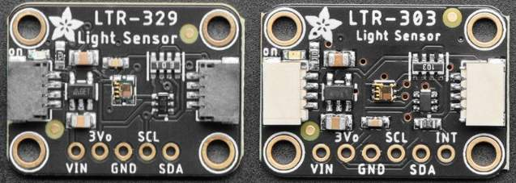

Lite-On Ambient Light & Proximity Sensors
==================================================

.. seo::
    :description: Instructions for setting up LTR303, LTR329, LTR553, LTR556, LTR559, LTR659 ambient light sensors/proximity sensors with ESPHome.
    :image: ltr303.jpg
    :keywords: LTR-329, LTR-303, LTR-553, LTR-556, LTR-559, LTR-659

The ``ltr_als_ps`` sensor platform allows you to use family of several LiteOn ambient light and proximity sensors
with ESPHome. The :ref:`I²C Bus <i2c>` is required to be set up in your configuration for this sensor to work.

    LTR-329 and LTR-303 Ambient Light Sensors.

    LTR-303 Sensor in Home Assistant UI.

Family of ALS and PS sensors
----------------------------

The family of sensors includes:

- Ambient Light Sensors **LTR-303ALS** and **LTR-329ALS**
- Integrated Ambient Light and Proximity Sensors **LTR-553ALS**, **LTR-556ALS**, **LTR-559ALS**
- Proximity Sensor **LTR-659ALS** (with PS gain control)

The sensors are very similar and share the same datasheet. First two have default I²C address ``0x29`` and the rest
have default I²C address ``0x23``. The sensors are available on breakout boards from a number of vendors, for 
example `Adafruit`_ or `Pimoroni`_.

Proximity sensors are the same sort of sensors that you find in phones and tablets to disable the screen when you hold
the device up to your ear. They might be useful for automated turning on or off of displays and control panels. Good
example is CoreS3 board from M5Stack that has LTR-559ALS sensor integrated just under the screen.

.. _Adafruit: http://www.adafruit.com/products/5610
.. _Pimoroni: https://shop.pimoroni.com/products/ltr-559-light-proximity-sensor-breakout

Ambient light sensing
---------------------

Sensor platform provides a linear response over a wide dynamic range from 0.01 lux to 64k lux and is well suited 
to applications under high ambient brightness. There are altogether six gain settings (1X, 2X, 4X, 8X, 48X and 96X)
available for user to configure. Use higher gain for dimmer areas.

Devices consists of two photodiodes: *CH0* diode that is sensitive to both visible and infrared light and 
*CH1* diode that is sensitive only to infrared light.

.. figure:: images/ltr303-spectral.png
    :align: center
    :width: 100.0%

    CH0 and CH1 channels typical spectral response

Ambient light illuminance calculation
-------------------------------------

Excerpt from the datasheet:

.. code-block:: 

    RATIO = CH1/(CH0+CH1)
    IF (RATIO < 0.45)
        ALS_LUX = (1.7743 * CH0 + 1.1059 * CH1) / ALS_GAIN / ALS_INT
    ELSEIF (RATIO < 0.64 && RATIO >= 0.45)
        ALS_LUX = (4.2785 * CH0 – 1.9548 * CH1) / ALS_GAIN / ALS_INT
    ELSEIF (RATIO < 0.85 && RATIO >= 0.64)
        ALS_LUX = (0.5926 * CH0 + 0.1185 * CH1) / ALS_GAIN / ALS_INT
    ELSE
        ALS_LUX = 0
    END
  

where:

- ``CH0`` and ``CH1`` are the sensor values (measurement counts) for Visible + IR (Ch0) and IR only (Ch1) sensors respectively.
- ``ALS_GAIN`` is the gain multiplier
- ``ALS_INT`` is the integration time in ms/100

ALS Gain levels
---------------

The table lists gain values and corresponding illuminance range:

 ========= ================================
  Gain      Illuminance range
 ========= ================================
  ``1X``    1 lux to 64k lux (default)
  ``2X``    0.5 lux to 32k lux
  ``4X``    0.25 lux to 16k lux
  ``8X``    0.125 lux to 8k lux
  ``48X``   0.02 lux to 1.3k lux
  ``96X``   0.01 lux to 600 lux
 ========= ================================

This Wikipedia `article <https://en.wikipedia.org/wiki/Lux>`__ has a table of some lux values for comparison.

Proximity sensing
-----------------

Proximity sensor has built-in emitter and detector. The sensor detects reflected IR light from the emitter and
gives a raw count value inversely exponential to the distance. Drop in the count value means an object is getting
further away from the sensor, and vice versa. Neither of the datasheets provides any information on how to convert
the raw count value to distance. The only way to do it is to test the sensor yourself and select the threshold
according to your needs and environment. Exact numbers will depend on the type of the object, its color and 
reflectivity.

Example configuration
---------------------

.. code-block:: yaml

    i2c:
      # ...

    sensor:
      - platform: ltr_als_ps
        address: 0x23
        update_interval: 60s
        type: ALS_PS  # or ALS or PS
        ambient_light:
          name: "Ambient light"
        # PS only section
        ps_cooldown: 5 s
        ps_high_threshold: 500
        on_ps_high_threshold:
          then:
            - .... # do something - light up the screen for example
        ps_counts:
          name: "Proximity counts"
        

Configuration variables:
------------------------
- **id** (*Optional*, :ref:`config-id`): Manually specify the ID used for code generation.
- **address** (*Optional*, int): Manually specify the I²C address of the sensor. Default is ``0x29``.
- **type** (*Optional*, string): The type of the sensor. Valid values are ``ALS_PS`` *(default)* for 
  integrated sensors, ``ALS`` for ambient light only or ``PS`` for proximity only devices.
- **auto_mode** (*Optional*, boolean): Automatic gain and integration time selection. Defaults to True.
- **gain** (*Optional*, string): The gain the device will use. Higher values are better in low-light conditions.
  Valid values are ``1X`` *(default)*, ``2X``, ``4X``, ``8X``, ``48X``, ``96X``.
- **integration_time** (*Optional*, :ref:`config-time`):
  The amount of time sensors are exposed. Longer means more accurate values.
  Valid values are: ``50ms`` *(default)*, ``100ms``, ``150ms``, ``200ms``, ``250ms``, ``300ms``, ``350ms``, ``400ms``.
- **glass_attenuation_factor** (*Optional*, float): The attenuation factor of glass if it's behind some glass 
  or plastic facia.  Default is ``1.0`` means ``100%`` transmissivity. ``2`` means ``50%`` transmissivity etc.
- **update_interval** (*Optional*, :ref:`config-time`): The interval for checking the sensors.
  Defaults to ``60s``.
- **ps_cooldown** (*Optional*, :ref:`config-time`): The "cooldown" period after the proximity sensor is triggered. 
  Helps to avoid multiple calls.  Defaults to ``5s``.
- **ps_gain** (*Optional*, string): The gain the device will use for proximity sensor. Higher values are better in low-light conditions.
  Valid values are ``16X`` *(default)*, ``32X``, ``64X``. Only for **LTR-659ALS**.
- **ps_high_threshold** (*Optional*, int): The threshold for the proximity sensor to trigger on object getting closer. 
  Defaults to ``65535``, which implies it will never be triggered.
- **ps_low_threshold** (*Optional*, int): The threshold for the proximity sensor to trigger on object getting further away. 
  Defaults to ``0``, which implies it will never be triggered.
- **on_ps_high_threshold** (*Optional*): Actions to perform when the proximity sensor is triggered
  on object getting closer.
- **on_ps_low_threshold** (*Optional*): Actions to perform when the proximity sensor is triggered
  on object getting further away.

Sensors
.......
This component offers five sensors for ALS-enabled devices one sensor for PS-enabled devices.
You can configure all or any subset of the sensors. Each configured sensor is reported separately 
on each ``update_interval``. **name** option is required for the sensor. All other options from 
:ref:`Sensor <config-sensor>`.

- **ambient_light** (*Optional*): Illuminance of ambient light, close to human eye spectre, lx.
- **infrared_counts** (*Optional*): Sensor counts from the IR-sensitive sensor (*CH1*), counts.
- **full_spectrum_counts** (*Optional*): Sensor counts from the sensor sensitive to both visible light and IR (*CH0*), counts.
- **actual_gain** (*Optional*): Gain value used to measure data, multiplier. Particularly useful when "auto_mode" is selected.
- **actual_integration_time** (*Optional*): Integration time used to measure data, ms. Particularly useful when "auto_mode" is selected.
- **ps_counts** (*Optional*) - Raw 11-bit reading from proximity sensor, counts.

See Also
--------

- `LTR-303ALS datasheet <https://github.com/latonita/datasheets-storage/blob/main/sensors/LTR-303ALS-01_DS_V1.pdf>`__
- Application note `LTR-303ALS & LTR-329ALS Appendix A <https://github.com/latonita/datasheets-storage/blob/main/sensors/LTR-303%20329_Appendix%20A%20Ver_1.0_22%20Feb%202013.pdf>`__
- `LTR-559ALS datasheet <https://github.com/latonita/datasheets-storage/blob/main/sensors/ltr-559als-01_ds_v1.pdf>`__
- :apiref:`ltr_als_ps/ltr_als_ps.h`
- :ghedit:`Edit`
