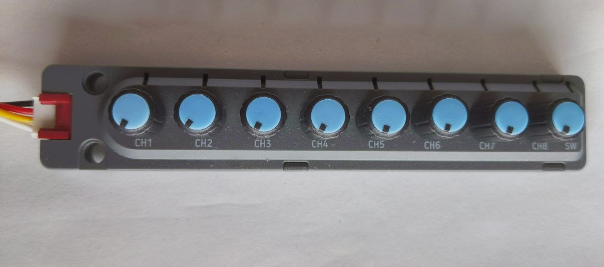

M5Stack Unit 8 Angle
====================

.. seo::
    :description: Setting up the M5Stack Unit 8 Angle input device with 8 knobs.
    :image: m5stack_8angle.png

Component/Hub
-------------

The ``m5stack_8angle`` platform allows to use the [m5angle](https://docs.m5stack.com/en/unit/UNIT%208Angle) input device with ESPHome.
It has 8 knobs, a switch and can individually drive 9 RGB LEDs.

    The m5stack_8angle unit.

The ``m5stack_8angle`` component communicates through an :ref:`I²C <i2c>` bus and uses a default address of 0x43.

.. code-block:: yaml

    # Example configuration entry
    m5stack_8angle:
        id: m5stack_8angle_base

Configuration variables:
************************

- **id** (*Optional*, :ref:`config-id`): Manually specify the ID used for code generation.
- **i2c_id** (*Optional*, :ref:`config-id`): Manually specify the ID of the :ref:`I²C Component <i2c>` if you need
- **address** (*Optional*, int): Manually specify the I²C address of the device. Defaults to ``0x43``.

Knob's position sensor
----------------------

The position of the 8 knobs can be made available as sensors with values between 0-1 (with 0 being the leftmost position).

.. code-block:: yaml

    sensor:
      - platform: m5stack_8angle
        m5stack_8angle_id: m5stack_8angle_base
        channel: 1
        name: "Knob 1"
        bit_depth: 12 bit
      - platform: m5stack_8angle
        m5stack_8angle_id: m5stack_8angle_base
        channel: 2
        name: "Knob 2"

Configuration variables:
************************

- **update_interval** (*Optional*, :ref:`config-time`): The interval to check the sensor. Defaults to ``10s``.
- **bit_depth** (*Optional*, one of ``12 bit`` or ``8 bit``) determines the precision of the analog readout, defaults to ``8bit``.
- **raw** (*Optional*, boolean) if true, the sensor returns the raw readout value of the knob.
- All other options from :ref:`Sensor <config-sensor>`.

Input switch binary sensor
--------------------------

 A binary sensor indicating the state of the switch on the device.

.. code-block:: yaml

    binary_sensor:
      - platform: m5stack_8angle
        m5stack_8angle_id: m5stack_8angle_base
        name: "Switch"

Configuration variables:
************************

- **update_interval** (*Optional*, :ref:`config-time`): The interval to check the sensor. Defaults to ``10s``.
- All other options from :ref:`Binary Sensor <config-binary_sensor>`.

Lights
------
The 9 LEDs can be used a addressable light output.

.. code-block:: yaml

    light:
      - platform: m5stack_8angle
        m5stack_8angle_id: m5stack_8angle_base
        id: m8_angle_leds
        name: "Lights"
        effects:
            - addressable_rainbow:

Configuration variables:
************************
- All options from :ref:`Light <config-light>`.
   

Read knob's positions and switch state in Lambdas
-------------------------------------------------

You can trigger the readout of the position of an individual knob through ``float value = id(...)->read_knob_pos(index);`` and of the switch through ``int value = id(...)->read_switch();``.
A negative return value indicates a failure to read the state.

.. code-block:: yaml

    # Example configuration entry for having the LEDs indicate the knobs' position
    light:
      - platform: m5stack_8angle
        m5stack_8angle_id: m5stack_8angle_base
        id: m8_angle_leds
        name: "Lights"
        effects:
            - addressable_lambda:
                name: "Indicate Values"
                update_interval: 200ms
                lambda: |-
                        ESPHSVColor hsv;
                        hsv.value = 255;
                        hsv.saturation = 240;
                        auto parent = id(m5stack_8angle_base);
                        for (int i=0; i < 8; i++) {
                          auto kpos = parent->read_knob_pos(i);
                          if (kpos >= 0){
                            hsv.hue = kpos * 200; 
                            it[i] = hsv;
                          }
                        }
                        if (parent->read_switch() > 0)
                            hsv.hue = 200;
                        else
                            hsv.hue = 0;
                        it[8] = hsv;

See Also
--------

- :ref:`sensor-filters`
- :doc:`/components/binary_sensor/index`
- :doc:`/components/light/index`
- :doc:`template`
- :apiref:`m5stack_8angle/m5stack_8angle.h`
- :ghedit:`Edit`
