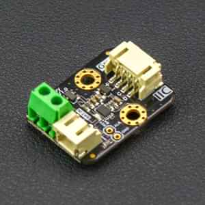

Analog Devices MAX17043 battery fuel gauge
==========================================

.. seo::
    :description: Instructions for setting up Analog Devices MAX17043 battery fuel gauge in ESPHome.
    :image: max17043.jpg

The MAX17043 platform allows you to use a MAX17043 to more accurately monitor the remaining capacity
of a LIPO battery (`datasheet <https://www.analog.com/en/products/max17043.html#documentation>`__,
`DFRobot`_) in ESPHome. It uses the :ref:`I²C Bus <i2c>` for communication (the address is fixed at 0x36).

Once configured, it uses a sophisticated Li+ battery-modeling scheme, called ModelGauge™ to track the
battery's relative state-of-charge continuously over a widely varying charge/discharge profile.
Unlike traditional fuel gauges, the ModelGauge algorithm eliminates the need for battery relearn cycles
and an external current-sense resistor.

In low power applications, it's very important to report battery levels accurately. By utilising ESPHome's ``deep_sleep``
component together with a MAX17043, projects can run for extended periods and the user can be confident of the amount of battery remaining.
This overcomes the reality that measured battery voltage does not correlate well at all with remaining battery charge.

.. note::

    See hardware design discussion below - it's important to leave the MAX17043 powered on during deep sleep.

    DFRobot DFR0563 Gravity I2C 3.7V Li battery fuel gauge.

.. _DFRobot: https://www.dfrobot.com/product-1734.html

Configuration
*************

.. code-block:: yaml

    # Example configuration entry
    sensor:
      - platform: max17043
        id: max17043_id
        i2c_id: i2c_max17043
        battery_voltage:
          name: "Battery Voltage"
        battery_level:
          name: "Battery"

Sensors
*******

- **battery_voltage** (*Optional*, float): The voltage measured at the LIPO battery.

  - All other options from :ref:`Sensor <config-sensor>`.
- **battery_level** (*Optional*, float): The percentage of battery remaining using the ModelGauge™ battery-modelling scheme.

  - All other options from :ref:`Sensor <config-sensor>`.

Hardware design considerations
******************************

It's important to realise that the relationship between battery voltage and remaining battery level
is poorly correlated as well as being non-linear.

The MAX17043 works by continually monitoring charge and discharge to assess how much battery capacity remains.
When first powered on, it makes an assumption that the measured voltage has been in a relaxed state for
30 minutes. This best first guess does not have a lasting impact because it monitors relative state-of-charge
over time.

Deep sleep cycles are most often designed so the device wakes up for short
periods to do its business and then sleeps for a much longer period. It's critical to allow the MAX17043 to maintain
state during the sleep phase.

If power is removed from the MAX17043 then each time the ESP comes out of deep sleep the MAX17043 will
have to start again from a new best guess.
It will not be able to use past charge and discharge behaviour to work its magic -
significantly diminishing the point of using a MAX17043.

Current consumption during device sleep mode is extremely low (maximum of 3µA compared to up to 75µA maximum when active).
The driver enables the user to put the device to sleep just before deep sleep commences using the `sleep_mode` action.
When the ESP comes out of deep sleep the driver clears the MAX17043 sleep bit.

For example:

.. code-block:: yaml

    on_...:
      then:
        - max17043.sleep_mode: max17043_id
        - deep_sleep.enter:
            id: deep_sleep_1
            sleep_duration: 20min

.. note::

    Once you have called the ``sleep_mode()`` action, the MAX17043 will stop recalculating the voltage and battery level.
    Hence, if you leave the ESP running it will continue to publish the sensor values with the *last* measurements.
    The only way to come of sleep mode is to restart the device (either as intended via deep sleep wake; or less ideally with a power cycle).

    So, only call ``sleep_mode()`` when you intend to send the ESP into deep sleep.

See Also
--------

- :ref:`i2c`
- :doc:`/components/deep_sleep`
- :ghedit:`Edit`
