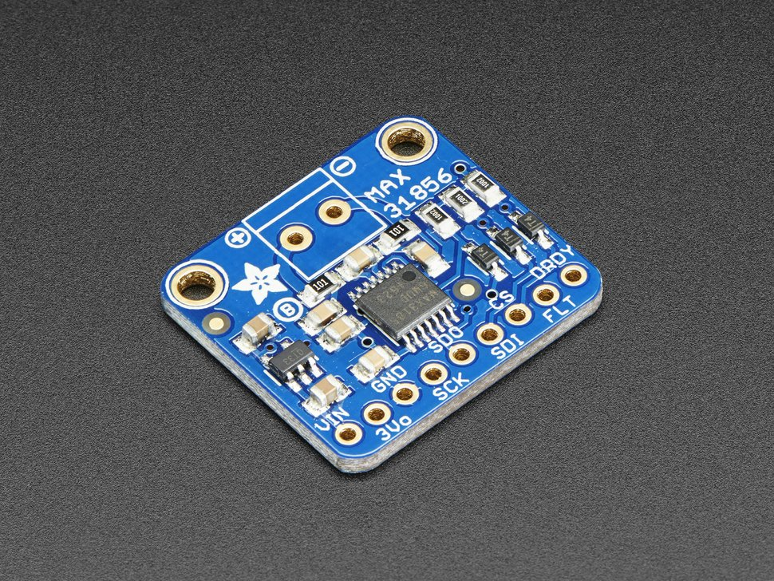

MAX31856 Thermocouple Temperature Sensor
========================================

.. seo::
    :description: Instructions for setting up MAX31856 Thermocouple temperature sensors.
    :image: max31856.jpg

The ``MAX31856`` temperature sensor allows you to use your MAX31856 Thermocouple
temperature sensor (`datasheet <https://datasheets.maximintegrated.com/en/ds/MAX31856.pdf>`__) with ESPHome.
Although the chip supports multiple thermocouple types, this component only implements the ``K`` type.

    MAX31856 Sensor. Image by `Adafruit`_

.. _Adafruit: https://www.adafruit.com/product/3263

As the communication with the MAX31856 is done using SPI, you need
to have an :ref:`spi bus <spi>` in your configuration with both **miso_pin** and **mosi_pin** set.

- ``VIN`` connects to 5V (``3V3`` will output 3.3V), or directly connect ``3V3`` to 3.3V
- ``3Vo`` not used by ESPHome
- ``GND`` connects to ground
- ``CLK`` connects to the SPI **clk_pin**
- ``SDO`` connects to the SPI **miso_pin**
- ``SDI`` connects to the SPI **mosi_pin**
- ``CS`` connects to a free GPIO pin
- ``FLT`` not used by ESPHome
- ``DRDY`` not used by ESPHome

.. code:: yaml

    # Example configuration entry
    sensor:
      - platform: max31856
        name: BBQ Temperature
        icon: mdi:hamburger
        cs_pin: GPIOXX

Configuration variables:
------------------------

- **cs_pin** (**Required**, :ref:`Pin Schema <config-pin_schema>`): The Chip Select pin of the SPI interface.
- **update_interval** (*Optional*, :ref:`config-time`): The interval to check the sensor. Defaults to ``60s``.
- **mains_filter** (*Optional*, string): The mains power frequency to reject (``50 Hz`` or ``60 Hz``). Defaults to ``60 Hz``.
- **spi_id** (*Optional*, :ref:`config-id`): Manually specify the ID of the :ref:`SPI Component <spi>` if you want to use multiple SPI buses.
- All other options from :ref:`Sensor <config-sensor>`.

See Also
--------

- :ref:`sensor-filters`
- :doc:`dallas`
- :doc:`dht`
- :doc:`adc`
- :doc:`max6675`
- :doc:`max31855`
- :doc:`max31865`
- `MAX31856 Library <https://github.com/adafruit/Adafruit_MAX31856>`__ by `Adafruit <https://www.adafruit.com/>`__
- :apiref:`MAX31856/MAX31856.h`
- :ghedit:`Edit`
